# Entity-Component-System Benchmarks

Simple Benchmarks of common ECS (Entity-Component-System) Frameworks:

* [EntityX](https://github.com/alecthomas/entityx)
* [EnTT](https://github.com/skypjack/entt)
* [Ginseng](https://github.com/apples/ginseng)
* [mustache](https://github.com/kirillochnev/mustache)
* [flecs](https://github.com/SanderMertens/flecs)
* [pico_ecs](https://github.com/empyreanx/pico_headers)
* ~~TODO: [OpenEcs](https://github.com/Gronis/OpenEcs)~~

## TL;DR Results

### Update systems (for-each entities (with mixed components) in 3 systems)

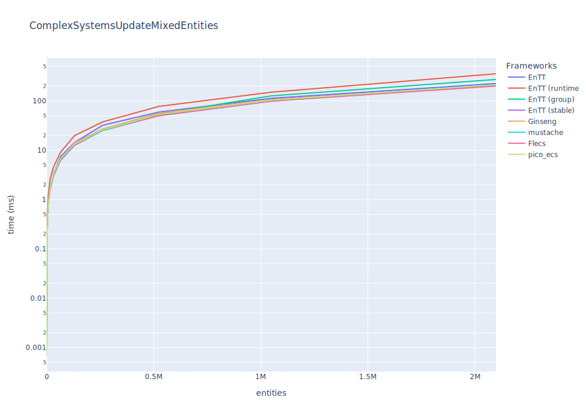

_(lower is better)_

|                                      | EnTT     | EnTT (runtime)   | EnTT (group)   | EnTT (stable)   | Ginseng   | mustache   | Flecs        | pico_ecs    |
|:-------------------------------------|:---------|:-----------------|:---------------|:----------------|:----------|:-----------|:-------------|:------------|
| Update    16 entities with 3 Systems | 1557ns   | 2293ns           | 1534ns         | 1557ns          | 1394ns    | 16269ns    | 2277ns       | **1088ns**  |
| Update    64 entities with 3 Systems | 6240ns   | 8232ns           | 6383ns         | 6603ns          | 5727ns    | 20288ns    | 6280ns       | **4284ns**  |
| Update   256 entities with 3 Systems | 27198ns  | 34881ns          | 26685ns        | 38581ns         | 24747ns   | 38027ns    | 25549ns      | **23899ns** |
| Update   ~1K entities with 3 Systems | 101964ns | 150459ns         | 117708ns       | 95259ns         | 97448ns   | 107293ns   | 104872ns     | **96481ns** |
| Update   ~4K entities with 3 Systems | 404471ns | 788225ns         | 385092ns       | 374572ns        | 381494ns  | 381719ns   | **367703ns** | 379462ns    |

|                                      | EnTT    | EnTT (runtime)   | EnTT (group) | EnTT (stable) | Ginseng | mustache | Flecs     | pico_ecs |
|:-------------------------------------|:--------|:-----------------|:-------------|:--------------|:--------|:---------|:----------|:---------|
| Update  ~16K entities with 3 Systems | **1ms** | 2ms              | **1ms**      | **1ms**       | **1ms** | **1ms**  | **1ms**   | **1ms**  |
| Update  ~65K entities with 3 Systems | 6ms     | 9ms              | 6ms          | 6ms           | 6ms     | **5ms**  | 6ms       | 6ms      |
| Update  262K entities with 3 Systems | 25ms    | 34ms             | 26ms         | 23ms          | 25ms    | 23ms     | **22ms**  | 24ms     |
| Update   ~1M entities with 3 Systems | 98ms    | 160ms            | 119ms        | 100ms         | 99ms    | **91ms** | **91ms**  | 96ms     |
| Update   ~2M entities with 3 Systems | 197ms   | 442ms            | 304ms        | 195ms         | 209ms   | 188ms    | **181ms** | 192ms    |

This is a very little Benchmark with three simple components and three small systems. In wild Entity-Component-Systems can have hundreds of components and a lot of systems and even more complex systems.
So always benchmarks YOUR special cases and systems, when needed and compare.

Some frameworks are faster in adding/removing components, others in creating or destroying entities, it always depends on what you need the most.
Always choose an ECS-Framework by features, for example EnTT has some great features like a
[resource-management](https://github.com/skypjack/entt/wiki/Crash-Course:-resource-management) or [events](https://github.com/skypjack/entt/wiki/Crash-Course:-events,-signals-and-everything-in-between),
flecs has some nice [add-ons](https://github.com/SanderMertens/flecs#addons) and EntityX has a build-in [world/system-manager](https://github.com/alecthomas/entityx#manager-tying-it-all-together=).

Pick and evaluate a framework you like and have a look at the examples and API design.

## Details

### Features

All benchmarks are located in [`benchmark/benchmarks/`](benchmark/benchmarks/) and are written with [google/benchmark](https://github.com/google/benchmark).
Each benchmark must implement the template [ECSBenchmark.h](benchmark/benchmarks/ECSBenchmark.h).

Each framework has a sub-project in [`src/`](src) and must implement certain features (see [`src/base`](src/base)).

#### Components

1. `PositionComponent` with `x` and `y` coord.
2. `VelocityComponent` with `x` and `y` for movement.
3. `DataComponent` with some nonsense data.

#### Systems

1. `MovementSystem`: updates `PositionComponent` with (const) `VelocityComponent`
2. `DataSystem`: updates `DataComponent` with nonsense
3. `MoreComplexSystem`: updates Components with random data and nonsense

## More Benchmarks

Benchmarks of more common features, like "Creating entities", "Add and remove components", etc.

### Features tested

* Create Entities
* Destroy Entities
* Get Component(s)
* Remove and add component
* Systems (for-each entities)

### Environment

* **OS:** Linux (Kernel: 6.2.12)
* **CPU:** 3.13GHz @ 12Cores
* **RAM:** 16GB
* **Compiler:** gcc (GCC) 12.2.1

---

### Create entities

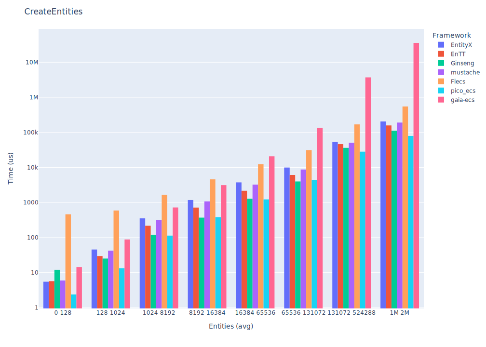

_(lower is better)_

|                                           | EntityX   | EnTT     | Ginseng   | mustache   | Flecs     | pico_ecs    |
|:------------------------------------------|:----------|:---------|:----------|:-----------|:----------|:------------|
| Create    16 entities with two Components | 2610ns    | 3094ns   | 10716ns   | 3713ns     | 480888ns  | **625ns**   |
| Create    64 entities with two Components | 6431ns    | 4782ns   | 12343ns   | 9318ns     | 480325ns  | **1066ns**  |
| Create   256 entities with two Components | 20942ns   | 10400ns  | 17134ns   | 19254ns    | 542756ns  | **2940ns**  |
| Create   ~1K entities with two Components | 82970ns   | 34246ns  | 34756ns   | 71563ns    | 640262ns  | **10449ns** |
| Create   ~4K entities with two Components | 309591ns  | 126624ns | 101425ns  | 334003ns   | 1144631ns | **47758ns** |

|                                           | EntityX   | EnTT    | Ginseng | mustache   | Flecs   | pico_ecs |
|:------------------------------------------|:----------|:--------|:--------|:-----------|:--------|:---------|
| Create  ~16K entities with two Components | 1ms       | **0ms** | **0ms** | 1ms        | 3ms     | **0ms**  |
| Create  ~65K entities with two Components | 4ms       | 2ms     | 1ms     | 6ms        | 11ms    | **0ms**  |
| Create  262K entities with two Components | 20ms      | 9ms     | 9ms     | 27ms       | 43ms    | **3ms**  |
| Create   ~1M entities with two Components | 79ms      | 58ms    | 63ms    | 166ms      | 258ms   | **40ms** |
| Create   ~2M entities with two Components | 191ms     | 117ms   | 147ms   | 370ms      | 576ms   | **63ms** |

### Destroy entities

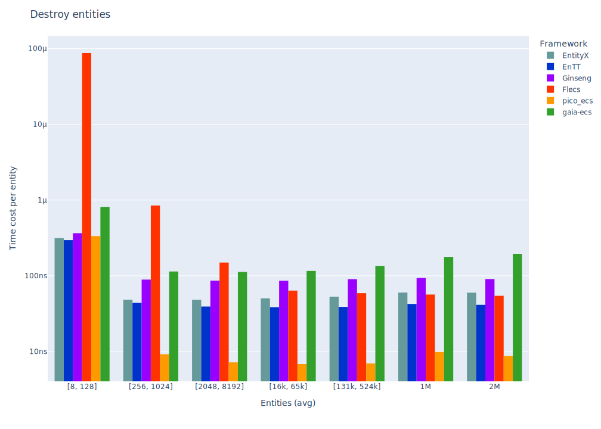

_(lower is better)_

|                                            | EntityX   | EnTT     | Ginseng   | Flecs    | pico_ecs      |
|:-------------------------------------------|:----------|:---------|:----------|:---------|:--------------|
| Destroy    16 entities with two components | 1433ns    | 1086ns   | 2266ns    | 431296ns | **530ns**     |
| Destroy    64 entities with two components | 3599ns    | 2543ns   | 6672ns    | 427290ns | **704ns**     |
| Destroy   256 entities with two components | 12677ns   | 8652ns   | 23625ns   | 435862ns | **1438ns**    |
| Destroy   ~1K entities with two components | 49252ns   | 33051ns  | 94155ns   | 464450ns | **4377ns**    |
| Destroy   ~4K entities with two components | 196305ns  | 131325ns | 360440ns  | 626717ns | **16175ns**   |

|                                            | EntityX     | EnTT     | Ginseng | Flecs | pico_ecs |
|:-------------------------------------------|:------------|:---------|:--------|:------|:---------|
| Destroy  ~16K entities with two components | **0ms**     | **0ms**  | 1ms     | 1ms   | **0ms**  |
| Destroy  ~65K entities with two components | 3ms         | 2ms      | 5ms     | 3ms   | **0ms**  |
| Destroy  262K entities with two components | 14ms        | 9ms      | 24ms    | 11ms  | **1ms**  |
| Destroy   ~1M entities with two components | 64ms        | 39ms     | 105ms   | 51ms  | **9ms**  |
| Destroy   ~2M entities with two components | 140ms       | 79ms     | 211ms   | 98ms  | **16ms** |

### Get one (non-const) component from Entity

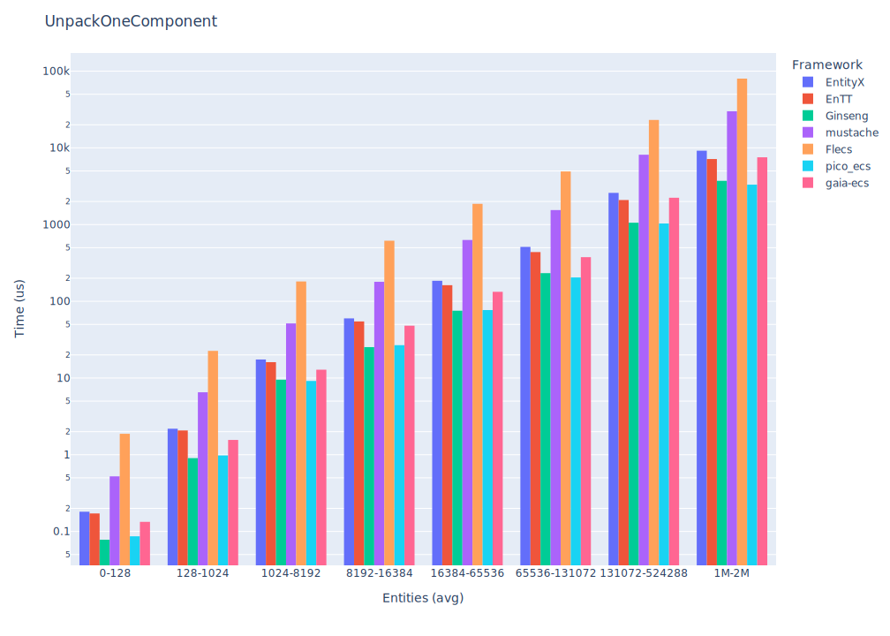

_(lower is better)_

|                                        | EntityX   | EnTT    | Ginseng   | mustache   | Flecs   | pico_ecs   |
|:---------------------------------------|:----------|:--------|:----------|:-----------|:--------|:-----------|
| Unpack one component in    16 entities | 23ns      | 47ns    | 28ns      | 208ns      | 274ns   | **10ns**   |
| Unpack one component in    64 entities | 101ns     | 194ns   | 114ns     | 834ns      | 1624ns  | **54ns**   |
| Unpack one component in   256 entities | 376ns     | 760ns   | 451ns     | 3140ns     | 6319ns  | **175ns**  |
| Unpack one component in   ~1K entities | 1529ns    | 3016ns  | 1823ns    | 11974ns    | 24433ns | **720ns**  |
| Unpack one component in   ~4K entities | 6612ns    | 12333ns | 7126ns    | 69547ns    | 66548ns | **2784ns** |

|                                        | EntityX     | EnTT     | Ginseng   | mustache  | Flecs      | pico_ecs    |
|:---------------------------------------|:------------|:---------|:----------|:----------|:-----------|:------------|
| Unpack one component in  ~16K entities | **0ms**     | **0ms**  | **0ms**   | **0ms**   | **0ms**    | **0ms**     |
| Unpack one component in  ~65K entities | **0ms**     | **0ms**  | **0ms**   | **0ms**   | 1ms        | **0ms**     |
| Unpack one component in  262K entities | **0ms**     | **0ms**  | **0ms**   | 3ms       | 5ms        | **0ms**     |
| Unpack one component in   ~1M entities | 2ms         | 3ms      | 2ms       | 13ms      | 24ms       | **0ms**     |
| Unpack one component in   ~2M entities | 4ms         | 6ms      | 4ms       | 28ms      | 32ms       | **1ms**     |

**Note:**
* Get one non-const component
   1. `PositionComponent`

### Get one (const) component from Entity

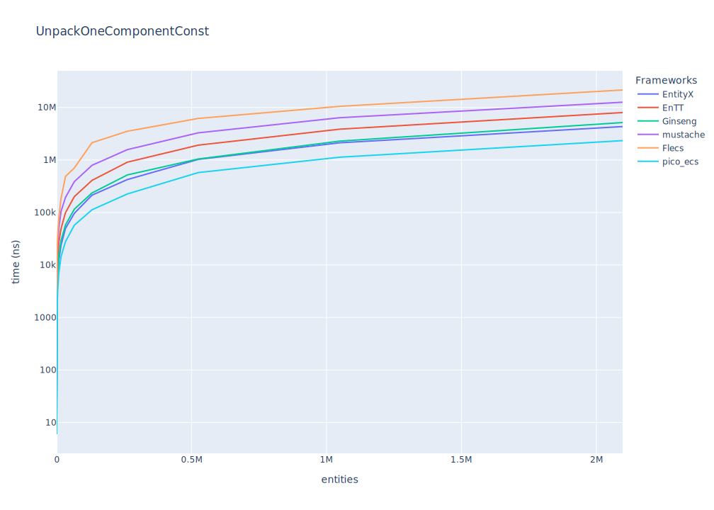

_(lower is better)_

|                                             | EntityX   | EnTT    | Ginseng   | mustache   | Flecs   | pico_ecs   |
|:--------------------------------------------|:----------|:--------|:----------|:-----------|:--------|:-----------|
| Get one (const) component in    16 entities | 25ns      | 51ns    | 27ns      | 109ns      | 161ns   | **14ns**   |
| Get one (const) component in    64 entities | 101ns     | 198ns   | 114ns     | 558ns      | 676ns   | **58ns**   |
| Get one (const) component in   256 entities | 381ns     | 809ns   | 450ns     | 1508ns     | 2572ns  | **223ns**  |
| Get one (const) component in   ~1K entities | 1509ns    | 3168ns  | 1858ns    | 6175ns     | 11148ns | **890ns**  |
| Get one (const) component in   ~4K entities | 5961ns    | 12793ns | 7193ns    | 24181ns    | 39599ns | **3481ns** |

|                                             | EntityX     | EnTT      | Ginseng     | mustache  | Flecs     | pico_ecs   |
|:--------------------------------------------|:------------|:----------|:------------|:----------|:----------|:-----------|
| Get one (const) component in  ~16K entities | **0ms**     | **0ms**   | **0ms**     | **0ms**   | **0ms**   | **0ms**    |
| Get one (const) component in  ~65K entities | **0ms**     | **0ms**   | **0ms**     | **0ms**   | **0ms**   | **0ms**    |
| Get one (const) component in  262K entities | **0ms**     | **0ms**   | **0ms**     | 1ms       | 3ms       | **0ms**    |
| Get one (const) component in   ~1M entities | 2ms         | 3ms       | 2ms         | 6ms       | 10ms      | **1ms**    |
| Get one (const) component in   ~2M entities | 4ms         | 7ms       | 5ms         | 12ms      | 21ms      | **2ms**    |

**Note:**
* Get one const component
  1. `const PositionComponent`

### Get two components from entity

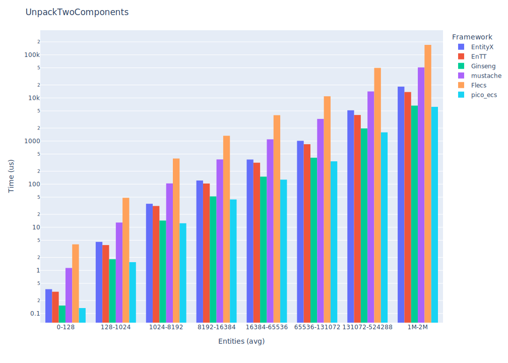

_(lower is better)_

|                                         | EntityX   | EnTT    | Ginseng   | mustache   | Flecs    | pico_ecs      |
|:----------------------------------------|:----------|:--------|:----------|:-----------|:---------|:--------------|
| Unpack two components in    16 entities | 43ns      | 116ns   | 55ns      | 271ns      | 604ns    | **24ns**      |
| Unpack two components in    64 entities | 178ns     | 452ns   | 228ns     | 1122ns     | 1740ns   | **104ns**     |
| Unpack two components in   256 entities | 727ns     | 1734ns  | 909ns     | 4272ns     | 6496ns   | **384ns**     |
| Unpack two components in   ~1K entities | 3047ns    | 8828ns  | 3888ns    | 18381ns    | 29349ns  | **1525ns**    |
| Unpack two components in   ~4K entities | 11543ns   | 42062ns | 14348ns   | 68161ns    | 107035ns | **6175ns**    |

|                                         | EntityX    | EnTT     | Ginseng    | mustache  | Flecs     | pico_ecs    |
|:----------------------------------------|:-----------|:---------|:-----------|:----------|:----------|:------------|
| Unpack two components in  ~16K entities | **0ms**    | **0ms**  | **0ms**    | **0ms**   | **0ms**   | **0ms**     |
| Unpack two components in  ~65K entities | **0ms**    | **0ms**  | **0ms**    | 1ms       | 2ms       | **0ms**     |
| Unpack two components in  262K entities | **0ms**    | 2ms      | **0ms**    | 4ms       | 7ms       | **0ms**     |
| Unpack two components in   ~1M entities | 3ms        | 9ms      | 3ms        | 19ms      | 34ms      | **1ms**     |
| Unpack two components in   ~2M entities | 6ms        | 16ms     | 7ms        | 40ms      | 53ms      | **3ms**     |

**Note:**
* Get non-const- and const-component
   1. `PositionComponent`
   2. `const VelocityComponent`

### Get three components from entity

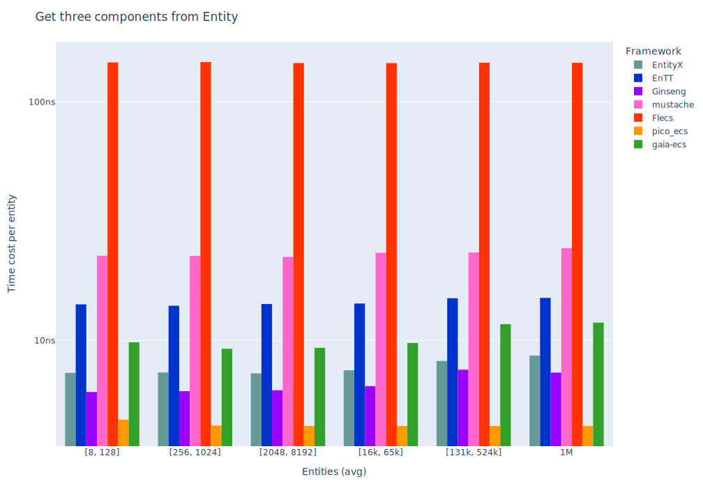

_(lower is better)_

|                                           | EntityX   | EnTT    | Ginseng   | mustache   | Flecs   | pico_ecs      |
|:------------------------------------------|:----------|:--------|:----------|:-----------|:--------|:--------------|
| Unpack three components in     8 entities | 34ns      | 102ns   | 60ns      | 145ns      | 354ns   | **17ns**      |
| Unpack three components in    32 entities | 145ns     | 417ns   | 211ns     | 606ns      | 1735ns  | **72ns**      |
| Unpack three components in   128 entities | 590ns     | 1481ns  | 822ns     | 2161ns     | 5480ns  | **284ns**     |
| Unpack three components in   512 entities | 2232ns    | 5582ns  | 3282ns    | 8752ns     | 21279ns | **1152ns**    |
| Unpack three components in   ~2K entities | 8900ns    | 23222ns | 12736ns   | 36379ns    | 90612ns | **4361ns**    |

|                                           | EntityX    | EnTT      | Ginseng    | mustache    | Flecs      | pico_ecs  |
|:------------------------------------------|:-----------|:----------|:-----------|:------------|:-----------|:----------|
| Unpack three components in   ~8K entities | **0ms**    | **0ms**   | **0ms**    | **0ms**     | **0ms**    | **0ms**   |
| Unpack three components in  ~32K entities | **0ms**    | **0ms**   | **0ms**    | **0ms**     | 1ms        | **0ms**   |
| Unpack three components in  131K entities | **0ms**    | 1ms       | 0ms        | 2ms         | 5ms        | **0ms**   |
| Unpack three components in  524K entities | 2ms        | 5ms       | 3ms        | 10ms        | 22ms       | **1ms**   |
| Unpack three components in   ~1M entities | 5ms        | 11ms      | 7ms        | 20ms        | 46ms       | **2ms**   |

**Note:**
* Not every entity has three components, some has only two
* Get two non-const- and const-component(s)
   1. `PositionComponent`
   2. `const VelocityComponent`
   3. `DataComponent` (optional)

### Remove and add component

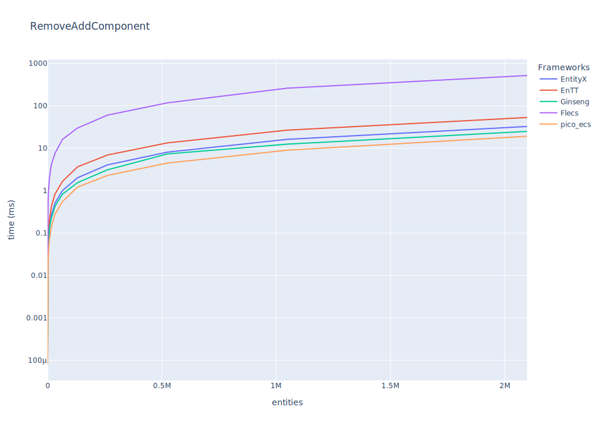

_(lower is better)_

|                                              | EntityX   | EnTT     | Ginseng   | Flecs    | pico_ecs    |
|:---------------------------------------------|:----------|:---------|:----------|:---------|:------------|
| Remove and Add a Component in    16 entities | 320ns     | 465ns    | 205ns     | 2429ns   | **101ns**   |
| Remove and Add a Component in    64 entities | 1312ns    | 1732ns   | 793ns     | 9720ns   | **390ns**   |
| Remove and Add a Component in   256 entities | 5056ns    | 7638ns   | 3285ns    | 37669ns  | **1492ns**  |
| Remove and Add a Component in   ~1K entities | 19787ns   | 33502ns  | 13068ns   | 154306ns | **6370ns**  |
| Remove and Add a Component in   ~4K entities | 78372ns   | 119935ns | 53093ns   | 605653ns | **23848ns** |

|                                              | EntityX    | EnTT    | Ginseng    | Flecs | pico_ecs    |
|:---------------------------------------------|:-----------|:--------|:-----------|:------|:------------|
| Remove and Add a Component in  ~16K entities | **0ms**    | **0ms** | **0ms**    | 2ms   | **0ms**     |
| Remove and Add a Component in  ~65K entities | 1ms        | 2ms     | **0ms**    | 9ms   | **0ms**     |
| Remove and Add a Component in  262K entities | 5ms        | 7ms     | 3ms        | 41ms  | **1ms**     |
| Remove and Add a Component in   ~1M entities | 20ms       | 28ms    | 13ms       | 155ms | **8ms**     |
| Remove and Add a Component in   ~2M entities | 40ms       | 58ms    | 26ms       | 341ms | **13ms**    |

**Note:**
* Remove and add `PositionComponent`

### Update systems (for-each entities in 2 systems)

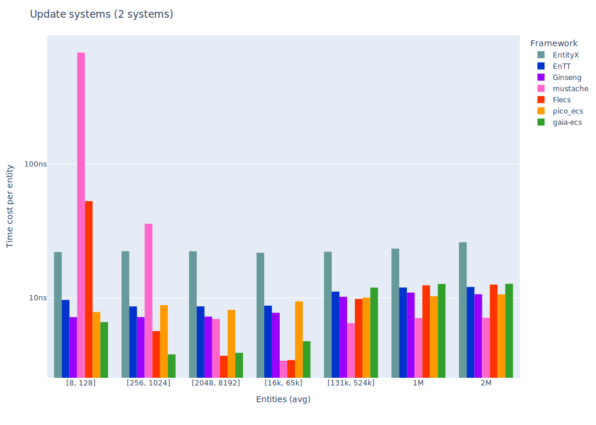

_(lower is better)_

|                                      | EntityX   | EnTT     | Ginseng   | mustache   | Flecs        | pico_ecs   |
|:-------------------------------------|:----------|:---------|:----------|:-----------|:-------------|:-----------|
| Update    16 entities with 2 systems | 1897ns    | 1761ns   | 1699ns    | 10524ns    | 2259ns       | **1498ns** |
| Update    64 entities with 2 systems | 7352ns    | 6390ns   | 6500ns    | 17198ns    | 6759ns       | **5967ns** |
| Update   256 entities with 2 systems | 28178ns   | 26636ns  | 28390ns   | 32832ns    | **24570ns**  | 25563ns    |
| Update   ~1K entities with 2 systems | 109553ns  | 102751ns | 101077ns  | 104007ns   | **94564ns**  | 123043ns   |
| Update   ~4K entities with 2 systems | 452075ns  | 454020ns | 458897ns  | 378993ns   | **368903ns** | 504147ns   |

|                                      | EntityX     | EnTT      | Ginseng | mustache | Flecs    | pico_ecs  |
|:-------------------------------------|:------------|:----------|:--------|:---------|:---------|:----------|
| Update  ~16K entities with 2 systems | **1ms**     | **1ms**   | **1ms** | **1ms**  | **1ms**  | **1ms**   |
| Update  ~65K entities with 2 systems | 6ms         | **5ms**   | **5ms** | **5ms**  | **5ms**  | **5ms**   |
| Update  262K entities with 2 systems | 29ms        | 24ms      | 23ms    | 22ms     | 23ms     | **22ms**  |
| Update   ~1M entities with 2 systems | 112ms       | 98ms      | 93ms    | 90ms     | 99ms     | **89ms**  |
| Update   ~2M entities with 2 systems | 219ms       | **191ms** | 195ms   | 193ms    | 246ms    | 330ms     |

**Note:**
* Systems used
    1. `MovementSystem`
    2. `DataSystem`

### Update systems (for-each entities (with mixed components) in 2 systems)

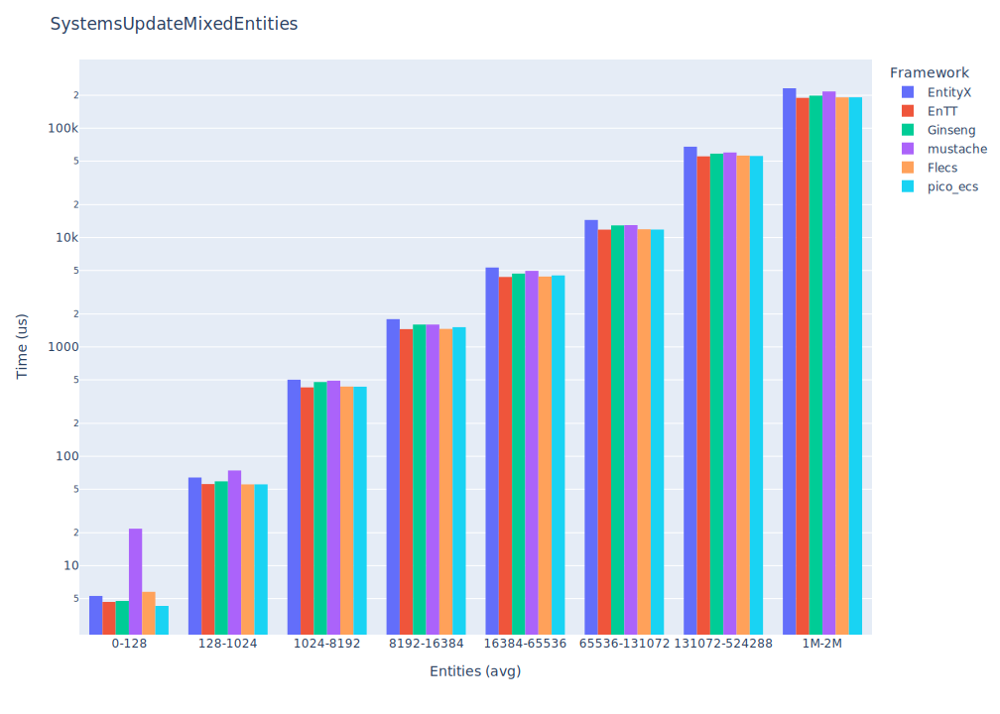

_(lower is better)_

|                                      | EntityX   | EnTT        | Ginseng   | mustache   | Flecs        | pico_ecs   |
|:-------------------------------------|:----------|:------------|:----------|:-----------|:-------------|:-----------|
| Update    16 entities with 2 systems | 1587ns    | 1565ns      | 1366ns    | 11855ns    | 2143ns       | **1210ns** |
| Update    64 entities with 2 systems | 6680ns    | 5980ns      | 5873ns    | 17111ns    | 6394ns       | **4832ns** |
| Update   256 entities with 2 systems | 28568ns   | **24338ns** | 25737ns   | 35106ns    | 24903ns      | 32547ns    |
| Update   ~1K entities with 2 systems | 116007ns  | **95030ns** | 99253ns   | 106470ns   | 98654ns      | 150685ns   |
| Update   ~4K entities with 2 systems | 417477ns  | 378727ns    | 405248ns  | 386221ns   | **373018ns** | 570561ns   |

|                                      | EntityX    | EnTT     | Ginseng    | mustache   | Flecs    | pico_ecs |
|:-------------------------------------|:-----------|:---------|:-----------|:-----------|:---------|:---------|
| Update  ~16K entities with 2 systems | **1ms**    | **1ms**  | **1ms**    | **1ms**    | **1ms**  | **1ms**  |
| Update  ~65K entities with 2 systems | 6ms        | 6ms      | 6ms        | **5ms**    | 6ms      | **5ms**  |
| Update  262K entities with 2 systems | 27ms       | 23ms     | 23ms       | **22ms**   | 26ms     | 24ms     |
| Update   ~1M entities with 2 systems | 113ms      | 102ms    | 96ms       | **90ms**   | 95ms     | 98ms     |
| Update   ~2M entities with 2 systems | 228ms      | 187ms    | 208ms      | **179ms**  | 186ms    | 241ms    |

**Note:**
* Systems used
    1. `MovementSystem`
    2. `DataSystem`
* Not every entity has all three components, some got removed

### Update systems (for-each entities in 3 systems)

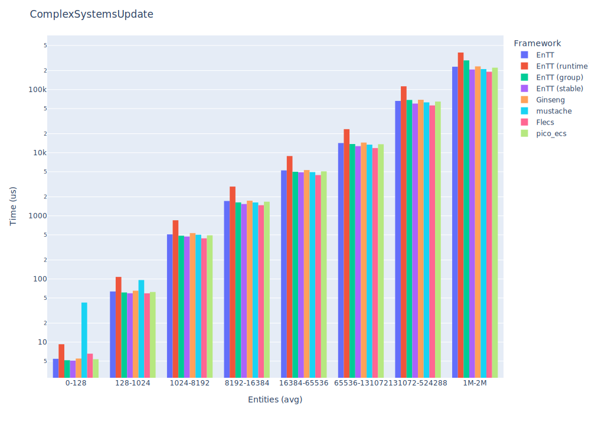

_(lower is better)_

|                                      | EnTT     | EnTT (runtime)   | EnTT (group)   | EnTT (stable) | Ginseng   | mustache   | Flecs        | pico_ecs   |
|:-------------------------------------|:---------|:-----------------|:---------------|:--------------|:----------|:-----------|:-------------|:-----------|
| Update    16 entities with 3 systems | 1787ns   | 2111ns           | 2027ns         | 1711ns        | 1618ns    | 14869ns    | 2232ns       | **1589ns** |
| Update    64 entities with 3 systems | 6736ns   | 8215ns           | 6640ns         | 6493ns        | 6203ns    | 19540ns    | 6622ns       | **6060ns** |
| Update   256 entities with 3 systems | 25873ns  | 36771ns          | 26232ns        | **23567ns**   | 24894ns   | 37636ns    | 25010ns      | 23996ns    |
| Update   ~1K entities with 3 systems | 103824ns | 221225ns         | 110732ns       | **94054ns**   | 97211ns   | 124796ns   | 94751ns      | 98308ns    |
| Update   ~4K entities with 3 systems | 422562ns | 538807ns         | 469281ns       | 382498ns      | 385221ns  | 380641ns   | **372710ns** | 396109ns   |

|                                      | EnTT      | EnTT (runtime) | EnTT (group) | EnTT (stable) | Ginseng    | mustache    | Flecs     | pico_ecs |
|:-------------------------------------|:----------|:---------------|:-------------|:--------------|:-----------|:------------|:----------|:---------|
| Update  ~16K entities with 3 systems | **1ms**   | 2ms            | **1ms**      | **1ms**       | **1ms**    | **1ms**     | **1ms**   | **1ms**  |
| Update  ~65K entities with 3 systems | 6ms       | 19ms           | 7ms          | **5ms**       | 6ms        | 5ms         | **5ms**   | 6ms      |
| Update  262K entities with 3 systems | 25ms      | 55ms           | 43ms         | 28ms          | 24ms       | **23ms**    | **23ms**  | 24ms     |
| Update   ~1M entities with 3 systems | 99ms      | 251ms          | 115ms        | 123ms         | 97ms       | 91ms        | **89ms**  | 99ms     |
| Update   ~2M entities with 3 systems | 203ms     | 431ms          | 314ms        | 221ms         | 198ms      | 184ms       | **181ms** | 194ms    |

**Note:**
* Systems used
    1. `MovementSystem`
    2. `DataSystem`
    3. `MoreComplexSystem`
* \*   EnTT iterate components via [views](https://github.com/skypjack/entt/wiki/Crash-Course:-entity-component-system#views=)
* \**  EnTT iterate components via [runtime views](https://github.com/skypjack/entt/wiki/Crash-Course:-entity-component-system#runtime-views=)
* \*** EnTT iterate components via [groups](https://github.com/skypjack/entt/wiki/Crash-Course:-entity-component-system#groups=):
   1. `DataSystem`: No Group, use `registry.view<DataComponent>`. _(Can't group a single component)_
   2. `MovementSystem`: Partial-owning group, `registry.group<PositionComponent>(entt::get<const VelocityComponent>)`
   3. `MoreComplexSystem`: Full-owning group, `registry.group<PositionComponent, VelocityComponent, DataComponent>()`
* \**** EnTT iterate components via view and uses a [stable component](https://github.com/skypjack/entt/wiki/Crash-Course:-entity-component-system#pointer-stability=) (`StablePositionComponent`)

### Update systems (for-each entities (with mixed components) in 3 systems)

_(lower is better)_

|                                      | EnTT     | EnTT (runtime)   | EnTT (group)   | EnTT (stable)   | Ginseng   | mustache   | Flecs        | pico_ecs    |
|:-------------------------------------|:---------|:-----------------|:---------------|:----------------|:----------|:-----------|:-------------|:------------|
| Update    16 entities with 3 Systems | 1557ns   | 2293ns           | 1534ns         | 1557ns          | 1394ns    | 16269ns    | 2277ns       | **1088ns**  |
| Update    64 entities with 3 Systems | 6240ns   | 8232ns           | 6383ns         | 6603ns          | 5727ns    | 20288ns    | 6280ns       | **4284ns**  |
| Update   256 entities with 3 Systems | 27198ns  | 34881ns          | 26685ns        | 38581ns         | 24747ns   | 38027ns    | 25549ns      | **23899ns** |
| Update   ~1K entities with 3 Systems | 101964ns | 150459ns         | 117708ns       | 95259ns         | 97448ns   | 107293ns   | 104872ns     | **96481ns** |
| Update   ~4K entities with 3 Systems | 404471ns | 788225ns         | 385092ns       | 374572ns        | 381494ns  | 381719ns   | **367703ns** | 379462ns    |

|                                      | EnTT     | EnTT (runtime) | EnTT (group) | EnTT (stable)  | Ginseng    | mustache    | Flecs     | pico_ecs   |
|:-------------------------------------|:---------|:---------------|:-------------|:---------------|:-----------|:------------|:----------|:-----------|
| Update  ~16K entities with 3 Systems | **1ms**  | 2ms            | **1ms**      | **1ms**        | **1ms**    | **1ms**     | **1ms**   | **1ms**    |
| Update  ~65K entities with 3 Systems | 6ms      | 9ms            | 6ms          | 6ms            | 6ms        | **5ms**     | 6ms       | 6ms        |
| Update  262K entities with 3 Systems | 25ms     | 34ms           | 26ms         | 23ms           | 25ms       | 23ms        | **22ms**  | 24ms       |
| Update   ~1M entities with 3 Systems | 98ms     | 160ms          | 119ms        | 100ms          | 99ms       | **91ms**    | **91ms**  | 96ms       |
| Update   ~2M entities with 3 Systems | 197ms    | 442ms          | 304ms        | 195ms          | 209ms      | 188ms       | **181ms** | 192ms      |

**Note:**
* Systems used
    1. `MovementSystem`
    2. `DataSystem`
    3. `MoreComplexSystem`
* Not every entity has all three components, some got removed
* \*   EnTT iterate components via [views](https://github.com/skypjack/entt/wiki/Crash-Course:-entity-component-system#views=)
* \**  EnTT iterate components via [runtime views](https://github.com/skypjack/entt/wiki/Crash-Course:-entity-component-system#runtime-views=)
* \*** EnTT iterate components via [groups](https://github.com/skypjack/entt/wiki/Crash-Course:-entity-component-system#groups=):
    1. `DataSystem`: No Group, use `registry.view<DataComponent>`. _(Can't group a single component)_
    2. `MovementSystem`: Partial-owning group, `registry.group<PositionComponent>(entt::get<const VelocityComponent>)`
    3. `MoreComplexSystem`: Full-owning group, `registry.group<PositionComponent, VelocityComponent, DataComponent>()`
* \**** EnTT iterate components via view and uses a [stable component](https://github.com/skypjack/entt/wiki/Crash-Course:-entity-component-system#pointer-stability=) (`StablePositionComponent`)

## Contributing

I try to implement the ECS-examples as good as possible for each framework, if you have any improvements, feel free to make a PR or open an issue.

You can find the frameworks example(s) in [`src/`](src/) and benchmark [`benchmarks/`](benchmarks/benchmarks/) for more details.
Also, you can write tests for the framework example :)
and add some metadata in [plot.config.json](plot.config.json).

_TODO: make more detailed "how to add framework"_

Read [CONTRIBUTING.md](CONTRIBUTING) for more details.

## Run Benchmarks

### Using [Taskfile](https://taskfile.dev/installation/)

1. `git submodule update --init --recursive`
2. Build: `task build`
3. Run (All) Benchmarks: `task benchmark`
4. Plot Graphs: `task plot:all`

You can now find the benchmark-results in [`reports/`](reports/).

_You need python (>=3.9.0) and some [dependencies](scripts/gen-benchmark-report/requirements.txt) to run [gen-benchmark-report](scripts/gen-benchmark-report) (plotting)_

### ~~Step-by-Step~~

1. Configure and build benchmarks, see [Building Details](doc/README_building.md):
   1. `git submodule update --init --recursive`
   2. `cmake -S . -B ./build`
   3. `cmake --build ./build`
2. Run benchmark(s), with [`run-benchmarks.sh`](run-benchmarks.sh) or each:
   * `./build/benchmark/benchmarks/entt/ecs-benchmark-entt` _(console output)_ _(optional)_
   * `./build/benchmark/benchmarks/entt/ecs-benchmark-entt --benchmark_format=json > ./reports/entt.json` _(write json report)_
3. Plot Reports, after generating json reports, see [`plot-results.sh`](plot-results.sh):
   1. `python3 ./scripts/gen-benchmark-report -i ./info.json gen-plot ./reports/entityx.json ./reports/entt.json ./reports/ginseng.json ./reports/mustache.json ./reports/openecs.json ./reports/flecs.json` _(generate graphs)_
   2. `python3 ./scripts/gen-benchmark-report -i ./info.json gen-results-md ./reports/entityx.json ./reports/entt.json ./reports/ginseng.json ./reports/mustache.json ./reports/openecs.json ./reports/flecs.json` _(generate full report)_

## Links and More

* [Dependency Setup](doc/README_dependencies.md)
* [Building Details](doc/README_building.md)
* Project Template, mix of: [starter_template](https://github.com/cpp-best-practices/gui_starter_template) and [ModernCppStarter](https://github.com/TheLartians/ModernCppStarter)
  * [Forked cpp_vcpkg_project](https://github.com/abeimler/cpp_vcpkg_project)
* [Google benchmark](https://github.com/google/benchmark)
* https://github.com/SanderMertens/ecs-faq
* https://github.com/jslee02/awesome-entity-component-system

### Candidates

#### EntityX by @alecthomas 

> Entity Component Systems (ECS) are a form of decomposition that completely decouples entity logic and data from the entity "objects" themselves. The Evolve your Hierarchy article provides a solid overview of EC systems and why you should use them.

Version: 1.1.2 (Dec 2021)

#### EnTT by @skypjack 

> EnTT is a header-only, tiny and easy to use library for game programming and much more written in modern C++.

Version: v3.11.1

#### Ginseng by @apples 

> Ginseng is an entity-component-system (ECS) library designed for use in games.
> 
> The main advantage over similar libraries is that the component types do not need to be listed or registered. Component types are detected dynamically.
> 
> Any function-like object can be used as a system. The function's parameters are used to determine the required components.

Version: 1.1 (Dec 2021)

#### mustache by @kirillochnev 

> A fast, modern C++ Entity Component System

Version: 0.2 (Apr 2023)

#### OpenEcs by @Gronis 

> Open Ecs is an Entity Component System that uses metaprogramming, cache coherency, and other useful tricks to maximize performance and configurability. It is written in c++11 without further dependencies.

Version: Beta (Apr 2017)

#### Flecs by @SanderMertens 

> Flecs is a fast and lightweight Entity Component System that lets you build games and simulations with millions of entities.

Version: v3.2.1

#### pico_ecs by @empyreanx 

> A collection of cross-platform single header libraries written in C. Pure and simple ECS.

Version: v2.0.0 (Apr 2023)

#### _Deprecated_

I removed [anax](https://github.com/miguelmartin75/anax) and [Artemis-Cpp](https://github.com/matachi/Artemis-Cpp), they are out-of-date and didn't receive any updates in the last time.
You can still checkout the old versions and branches.
