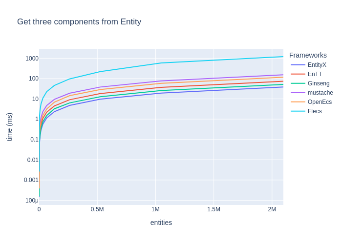

# Entity-Component-Systems Benchmark

Simple Benchmark of common Entity-Component-Systems:

* [EntityX](https://github.com/alecthomas/entityx)
* [EnTT](https://github.com/skypjack/entt)
* [flecs](https://github.com/SanderMertens/flecs)
* [Ginseng](https://github.com/apples/ginseng)
* [mustache](https://github.com/kirillochnev/mustache)
* [OpenEcs](https://github.com/Gronis/OpenEcs)

## TL;DR Results

  
_(lower is faster)_

|                                      | EntityX   | EnTT    | Ginseng   | mustache   | OpenEcs   | Flecs   |
|:-------------------------------------|:----------|:--------|:----------|:-----------|:----------|:--------|
| Update   16K entities with 2 Systems | 0.0013s   | 0.0004s | 0.0004s   | 0.0003s    | 0.0011s   | **0.0002s** |
| Update   65K entities with 2 Systems | 0.0051s   | 0.0014s | 0.0018s   | 0.0010s    | 0.0044s   | **0.0010s** |
| Update  262K entities with 2 Systems | 0.0204s   | 0.0058s | 0.0072s   | 0.0049s    | 0.0178s   | **0.0044s** |
| Update  524K entities with 2 Systems | 0.0402s   | 0.0115s | 0.0138s   | 0.0086s    | 0.0347s   | **0.0087s** |
| Update    1M entities with 2 Systems | 0.0780s   | 0.0225s | 0.0243s   | **0.0166s**    | 0.0656s   | **0.0166s** |
| Update    2M entities with 2 Systems | 0.1580s   | 0.0421s | 0.0466s   | **0.0315s**    | 0.1294s   | 0.0338s |

### Environment

* **OS:** Linux
* **CPU:** 3.10GHz @ 4Cores
* **RAM:** 8 GB

## Details

All benchmarks are located in [`benchmark/benchmarks/`](benchmark/benchmarks/) and are written with [google/benchmark](https://github.com/google/benchmark).
Each benchmark must implement the template [ECSBenchmark.h](benchmark/benchmarks/ECSBenchmark.h).

Each framework has a sub-project in [`src/`](src) and must implement certain features (see [`src/base`](src/base)).

### Components

1. PositionComponent with `x` and `y` Coord.
2. DirectionComponent with `x` and `y` for movement
3. DataComponent with some non-sense data.

### Systems

1. MovementSystem: updates PositionComponent
2. DataSystem: updates DataComponent
3. MoreComplexSystem: updates Components with random data and stuff

## More Benchmarks

### Create Entities

  
_(lower is better)_

|                                           | EntityX   | EnTT    | Ginseng   | mustache   | OpenEcs   | Flecs   |
|:------------------------------------------|:----------|:--------|:----------|:-----------|:----------|:--------|
| Create   16K entities with two Components | 0.0010s   | **0.0003s** | 0.0011s   | 0.0010s    | 0.0005s   | 0.0059s |
| Create   65K entities with two Components | 0.0042s   | **0.0012s** | 0.0050s   | 0.0038s    | 0.0021s   | 0.0222s |
| Create  262K entities with two Components | 0.0170s   | **0.0049s** | 0.0209s   | 0.0156s    | 0.0083s   | 0.0969s |
| Create  524K entities with two Components | 0.0362s   | **0.0101s** | 0.0454s   | 0.0321s    | 0.0170s   | 0.2572s |
| Create    1M entities with two Components | 0.0745s   | **0.0209s** | 0.0869s   | 0.0703s    | 0.0357s   | 0.6864s |
| Create    2M entities with two Components | 0.1752s   | **0.0469s** | 0.2019s   | 0.1691s    | 0.0814s   | 1.3725s |

### Destroy Entities

  
_(lower is faster)_

|                                            | EntityX   | EnTT    | Ginseng   | mustache   | OpenEcs   | Flecs   |
|:-------------------------------------------|:----------|:--------|:----------|:-----------|:----------|:--------|
| Destroy   16K entities with two Components | 0.0005s   | 0.0006s | 0.0018s   | 0.0007s    | **0.0003s**   | 0.0011s |
| Destroy   65K entities with two Components | 0.0020s   | 0.0025s | 0.0069s   | 0.0027s    | **0.0012s**   | 0.0045s |
| Destroy  262K entities with two Components | 0.0081s   | 0.0095s | 0.0289s   | 0.0110s    | **0.0046s**   | 0.0189s |
| Destroy  524K entities with two Components | 0.0164s   | 0.0193s | 0.0641s   | 0.0227s    | **0.0093s**   | 0.0364s |
| Destroy    1M entities with two Components | 0.0339s   | 0.0395s | 0.1519s   | 0.0452s    | **0.0186s**   | 0.0775s |
| Destroy    2M entities with two Components | 0.0720s   | 0.0853s | 0.3407s   | 0.0924s    | **0.0384s**   | 0.1841s |

### Get one component from Entity

  
_(lower is faster)_

|                                        | EntityX   | EnTT    | Ginseng   | mustache   | OpenEcs   | Flecs   |
|:---------------------------------------|:----------|:--------|:----------|:-----------|:----------|:--------|
| Unpack one Component in   16K entities | **0.0001s**   | **0.0001s** | **0.0001s**   | 0.0005s    | 0.0003s   | 0.0016s |
| Unpack one Component in   65K entities | 0.0004s   | 0.0006s | **0.0003s**   | 0.0020s    | 0.0013s   | 0.0066s |
| Unpack one Component in  262K entities | **0.0018s**   | 0.0025s | 0.0019s   | 0.0081s    | 0.0054s   | 0.0267s |
| Unpack one Component in  524K entities | **0.0035s**   | 0.0051s | 0.0040s   | 0.0162s    | 0.0113s   | 0.0534s |
| Unpack one Component in    1M entities | **0.0071s**   | 0.0103s | 0.0074s   | 0.0322s    | 0.0218s   | 0.1267s |
| Unpack one Component in    2M entities | **0.0165s**   | 0.0205s | 0.0148s   | 0.0642s    | 0.0441s   | 0.2164s |

### Get two components from Entity

  
_(lower is faster)_

|                                        | EntityX   | EnTT    | Ginseng   | mustache   | OpenEcs   | Flecs   |
|:---------------------------------------|:----------|:--------|:----------|:-----------|:----------|:--------|
| Unpack two Component in 16.4K entities | **0.0002s**   | 0.0003s | **0.0002s**   | 0.0010s    | 0.0006s   | 0.0032s |
| Unpack two Component in 65.5K entities | **0.0007s**   | 0.0011s | **0.0007s**   | 0.0040s    | 0.0025s   | 0.0160s |
| Unpack two Component in  262K entities | **0.0029s**   | 0.0048s | 0.0032s   | 0.0162s    | 0.0100s   | 0.0528s |
| Unpack two Component in  524K entities | **0.0058s**   | 0.0100s | 0.0064s   | 0.0379s    | 0.0202s   | 0.1054s |
| Unpack two Component in 1.05M entities | **0.0117s**   | 0.0188s | 0.0129s   | 0.0657s    | 0.0412s   | 0.2224s |
| Unpack two Component in  2.1M entities | **0.0235s**   | 0.0433s | 0.0259s   | 0.1309s    | 0.0809s   | 0.4178s |

### Get three components from Entity

  
_(lower is faster)_

|                                          | EntityX   | EnTT    | Ginseng   | mustache   | OpenEcs   | Flecs   |
|:-----------------------------------------|:----------|:--------|:----------|:-----------|:----------|:--------|
| Unpack three Component in   16K entities | **0.0002s**   | 0.0004s | **0.0002s**   | 0.0013s    | 0.0008s   | 0.0049s |
| Unpack three Component in   65K entities | **0.0008s**   | 0.0017s | 0.0011s   | 0.0052s    | 0.0034s   | 0.0206s |
| Unpack three Component in  262K entities | **0.0035s**   | 0.0069s | 0.0048s   | 0.0209s    | 0.0156s   | 0.0895s |
| Unpack three Component in  524K entities | **0.0070s**   | 0.0142s | 0.0098s   | 0.0522s    | 0.0311s   | 0.1955s |
| Unpack three Component in    1M entities | **0.0150s**   | 0.0282s | 0.0189s   | 0.0837s    | 0.0623s   | 0.5501s |
| Unpack three Component in    2M entities | **0.0281s**   | 0.0563s | 0.0387s   | 0.1672s    | 0.1246s   | 1.2514s |

#### Remove and add component from Entity

_(lower is faster)_

|                                              | EntityX   | EnTT    | Ginseng   | mustache   | OpenEcs   | Flecs   |
|:---------------------------------------------|:----------|:--------|:----------|:-----------|:----------|:--------|
| Remove and Add a Component in   16K entities | 0.0010s   | 0.0010s | **0.0005s**   | 0.0057s    | **0.0005s**   | 0.0124s |
| Remove and Add a Component in   65K entities | 0.0039s   | 0.0040s | **0.0021s**   | 0.0229s    | **0.0021s**   | 0.0494s |
| Remove and Add a Component in  262K entities | 0.0156s   | 0.0167s | 0.0088s   | 0.0922s    | **0.0084s**   | 0.1978s |
| Remove and Add a Component in  524K entities | 0.0319s   | 0.0328s | 0.0171s   | 0.1844s    | **0.0168s**   | 0.3955s |
| Remove and Add a Component in    1M entities | 0.0640s   | 0.0655s | 0.0357s   | 0.3685s    | **0.0338s**   | 0.7882s |
| Remove and Add a Component in    2M entities | 0.1280s   | 0.1320s | 0.0708s   | 0.7376s    | **0.0676s**   | 1.5826s |

### System Updates (for-each entities with 2 Systems)

  
_(lower is faster)_

|                                      | EntityX   | EnTT    | Ginseng   | mustache   | OpenEcs   | Flecs   |
|:-------------------------------------|:----------|:--------|:----------|:-----------|:----------|:--------|
| Update   16K entities with 2 Systems | 0.0013s   | 0.0004s | 0.0004s   | 0.0003s    | 0.0011s   | **0.0002s** |
| Update   65K entities with 2 Systems | 0.0051s   | 0.0014s | 0.0018s   | **0.0010s**    | 0.0044s   | **0.0010s** |
| Update  262K entities with 2 Systems | 0.0204s   | 0.0058s | 0.0072s   | 0.0049s    | 0.0178s   | **0.0044s** |
| Update  524K entities with 2 Systems | 0.0402s   | 0.0115s | 0.0138s   | 0.0086s    | 0.0347s   | **0.0087s** |
| Update    1M entities with 2 Systems | 0.0780s   | 0.0225s | 0.0243s   | **0.0166s**    | 0.0656s   | **0.0166s** |
| Update    2M entities with 2 Systems | 0.1580s   | 0.0421s | 0.0466s   | **0.0315s**    | 0.1294s   | 0.0338s |

### System Updates (for-each entities with 3 Systems)

  
_(lower is faster)_

|                                      | EntityX   | EnTT    | Ginseng   | mustache   | OpenEcs   | Flecs   | _OOP_     |
|:-------------------------------------|:----------|:--------|:----------|:-----------|:----------|:--------|:--------|
| Update   16K entities with 3 Systems | 0.0032s   | 0.0013s | 0.0014s   | 0.0014s    | 0.0024s   | **0.0012s** | _**0.0003s**_ |
| Update   65K entities with 3 Systems | 0.0129s   | 0.0056s | 0.0059s   | 0.0055s    | 0.0098s   | **0.0047s** | _**0.0014s**_ |
| Update  262K entities with 3 Systems | 0.0479s   | 0.0236s | 0.0240s   | 0.0195s    | 0.0402s   | **0.0197s** | _**0.0061s**_ |
| Update  524K entities with 3 Systems | 0.0909s   | 0.0527s | 0.0589s   | 0.0439s    | 0.0803s   | **0.0399s** | _**0.0130s**_ |
| Update    1M entities with 3 Systems | 0.1805s   | 0.0922s | 0.0958s   | 0.0761s    | 0.1597s   | **0.0786s** | _**0.0250s**_ |
| Update    2M entities with 3 Systems | 0.3582s   | 0.1800s | 0.1898s   | 0.1507s    | 0.3175s   | **0.1561s** | _**0.0500s**_ |

## Contributing

I try to implement the ECS-examples as good as possible for each framework, if you have any improvements, feel free to make a PR or open an issue.

You can find the frameworks example(s) in [`src/`](src/) and benchmark [`benchmarks/`](benchmarks/benchmarks/) for more details.  
Also you can write tests for the framework example :)
and add some metadata in [info.json](info.json).

_TODO: make more detailed "how to add framework"_

Read [CONTRIBUTING.md](CONTRIBUTING) for more details.

## Run Benchmarks

1. Configure and build benchmarks, see [Building Details](doc/README_building.md):
   1. `git submodule update --init --recursive` 
   2. `cmake -S . -B ./build`
   3. `cmake --build ./build`
2. Run benchmark(s), with [`run-benchmarks.sh`](run-benchmarks.sh) or each:
   * `./build/benchmark/benchmarks/entt/ecs-benchmark-entt` _(console output)_ _(optional)_
   * `./build/benchmark/benchmarks/entt/ecs-benchmark-entt --benchmark_format=json > ./reports/entt.json` _(write json report)_
3. Plot Reports, after generating json reports, see [`plot-results.sh`](plot-results.sh):
   1. `python3 ./scripts/gen-benchmark-report -i ./info.json gen-plot ./reports/entityx.json ./reports/entt.json ./reports/ginseng.json ./reports/mustache.json ./reports/openecs.json ./reports/flecs.json` _(generate graphs)_
   2. `python3 ./scripts/gen-benchmark-report -i ./info.json gen-results-md ./reports/entityx.json ./reports/entt.json ./reports/ginseng.json ./reports/mustache.json ./reports/openecs.json ./reports/flecs.json` _(generate full report)_

_You need python and some dependencies to run [gen-benchmark-report](scripts/gen-benchmark-report)_

## More Details

 * [Dependency Setup](doc/README_dependencies.md)
 * [Building Details](doc/README_building.md)
 * Project Template, mix of: [starter_template](https://github.com/cpp-best-practices/gui_starter_template) and [ModernCppStarter](https://github.com/TheLartians/ModernCppStarter)
 * [Google benchmark](https://github.com/google/benchmark)
 * https://github.com/SanderMertens/ecs-faq
