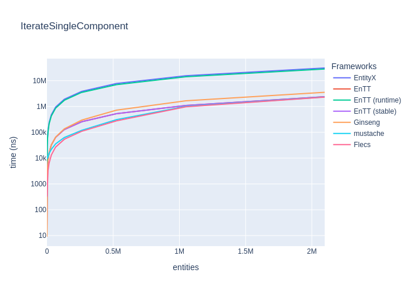
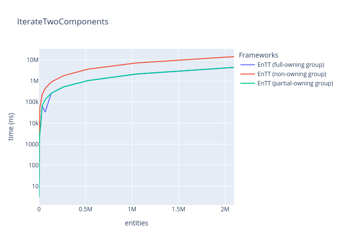
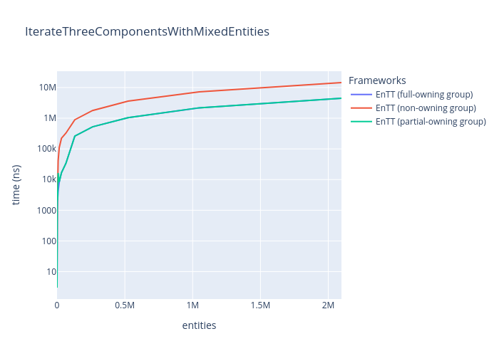

# Entity-Component-System Benchmarks

Simple Benchmarks of common ECS (Entity-Component-System) Frameworks:

* [EntityX](https://github.com/alecthomas/entityx)
* [EnTT](https://github.com/skypjack/entt)
* [flecs](https://github.com/SanderMertens/flecs)
* [Ginseng](https://github.com/apples/ginseng)
* [mustache](https://github.com/kirillochnev/mustache)
* [OpenEcs](https://github.com/Gronis/OpenEcs)

## TL;DR Results

### Update systems (3 systems with mixed entities)

_(lower is better)_

|                                      | EntityX   | EnTT     | EnTT (runtime)   | EnTT (group)   | EnTT (stable) | Ginseng   | mustache   | OpenEcs   | Flecs    |
|:-------------------------------------|:----------|:---------|:-----------------|:---------------|:--------------|:----------|:-----------|:----------|:---------|
| Update    16 entities with 3 Systems | 4274ns    | 3282ns   | 4062ns           | 3245ns         | **3154ns**    | 3209ns    | 41744ns    | 4129ns    | 5816ns   |
| Update    64 entities with 3 Systems | 17792ns   | 13568ns  | 17198ns          | 13302ns        | **13150ns**   | 13408ns   | 50824ns    | 17388ns   | 15810ns  |
| Update   256 entities with 3 Systems | 79447ns   | 59144ns  | 76381ns          | 58076ns        | **57455ns**   | 59005ns   | 93836ns    | 73503ns   | 59708ns  |
| Update   ~1K entities with 3 Systems | 319297ns  | 239432ns | 305845ns         | 233838ns       | **232607ns**  | 236416ns  | 269476ns   | 293784ns  | 233532ns |
| Update   ~4K entities with 3 Systems | 1226840ns | 930325ns | 1170713ns        | 907876ns       | **906957ns**  | 920749ns  | 958945ns   | 1263079ns | 896467ns |

|                                      | EntityX   | EnTT    | EnTT (runtime)   | EnTT (group) | EnTT (stable) | Ginseng  | mustache  | OpenEcs   | Flecs     |
|:-------------------------------------|:----------|:--------|:-----------------|:-------------|:--------------|:---------|:----------|:----------|:----------|
| Update  ~16K entities with 3 Systems | 4ms       | **3ms** | 4ms              | **3ms**      | **3ms**       | **3ms**  | **3ms**   | 5ms       | **3ms**   |
| Update  ~65K entities with 3 Systems | 20ms      | 15ms    | 19ms             | **14ms**     | **14ms**      | **14ms** | **14ms**  | 18ms      | **14ms**  |
| Update  262K entities with 3 Systems | 80ms      | 60ms    | 78ms             | 61ms         | 59ms          | 60ms     | **58ms**  | 75ms      | 59ms      |
| Update   ~1M entities with 3 Systems | 324ms     | 243ms   | 310ms            | 285ms        | 238ms         | 243ms    | 234ms     | 300ms     | **233ms** |
| Update   ~2M entities with 3 Systems | 651ms     | 486ms   | 623ms            | 692ms        | 476ms         | 490ms    | **468ms** | 602ms     | **468ms** |

This is a very little Benchmark with three simple components and three small systems. In wild Entity-Component-Systems can have hundreds of components and a lot of systems and even more complex systems.
So always benchmarks YOUR special cases and systems, when needed and compare.

Some frameworks are faster in adding/removing components, others in creating or destroying entities, it always depends on what you need the most.
Always choose an ECS-Framework by features, for example EnTT has some great features like a 
[resource-management](https://github.com/skypjack/entt/wiki/Crash-Course:-resource-management) or [events](https://github.com/skypjack/entt/wiki/Crash-Course:-events,-signals-and-everything-in-between), 
flecs has some nice [add-ons](https://github.com/SanderMertens/flecs#addons) and EntityX has a build-in [world/system-manager](https://github.com/alecthomas/entityx#manager-tying-it-all-together=).

Pick and evaluate a framework you like and have a look at the examples and API design.

## Details

### Features

All benchmarks are located in [`benchmark/benchmarks/`](benchmark/benchmarks/) and are written with [google/benchmark](https://github.com/google/benchmark).
Each benchmark must implement the template [ECSBenchmark.h](benchmark/benchmarks/ECSBenchmark.h).

Each framework has a sub-project in [`src/`](src) and must implement certain features (see [`src/base`](src/base)).

#### Components

1. `PositionComponent` with `x` and `y` coord.
2. `VelocityComponent` with `x` and `y` for movement.
3. `DataComponent` with some nonsense data.

#### Systems

1. `MovementSystem`: updates `PositionComponent` with (const) `VelocityComponent`
2. `DataSystem`: updates `DataComponent` with nonsense
3. `MoreComplexSystem`: updates Components with random data and nonsense

## More Benchmarks

Benchmarks of more common features, like "Creating entities", "Add and remove components", etc.

### Features tested

* Create Entities
* Destroy Entities
* Get Component(s)
* Remove and add component
* Systems (for-each entities)

### Environment

* **OS:** Linux
* **CPU:** 3.10GHz @ 4Cores
* **RAM:** 8 GB

Run on my old Laptop :)

### Create entities

_(lower is better)_

|                                           | EntityX   | EnTT      | Ginseng   | mustache   | OpenEcs      | Flecs     |
|:------------------------------------------|:----------|:----------|:----------|:-----------|:-------------|:----------|
| Create    16 entities with two Components | 13919ns   | 11302ns   | 24235ns   | 13262ns    | **1621ns**   | 649481ns  |
| Create    64 entities with two Components | 46918ns   | 38903ns   | 50100ns   | 44407ns    | **3653ns**   | 677302ns  |
| Create   256 entities with two Components | 179018ns  | 148982ns  | 160061ns  | 168635ns   | **11951ns**  | 791177ns  |
| Create   ~1K entities with two Components | 708318ns  | 590356ns  | 600614ns  | 663253ns   | **44587ns**  | 1248612ns |
| Create   ~4K entities with two Components | 2822313ns | 2364613ns | 2362153ns | 2735906ns  | **174945ns** | 3083582ns |

|                                           | EntityX   | EnTT   | Ginseng   | mustache   | OpenEcs   | Flecs   |
|:------------------------------------------|:----------|:-------|:----------|:-----------|:----------|:--------|
| Create  ~16K entities with two Components | 11ms      | 9ms    | 9ms       | 10ms       | **0ms**   | 10ms    |
| Create  ~65K entities with two Components | 45ms      | 37ms   | 37ms      | 43ms       | **3ms**   | 39ms    |
| Create  262K entities with two Components | 184ms     | 151ms  | 151ms     | 173ms      | **13ms**  | 157ms   |
| Create   ~1M entities with two Components | 739ms     | 606ms  | 607ms     | 698ms      | **57ms**  | 630ms   |
| Create   ~2M entities with two Components | 1480ms    | 1212ms | 1216ms    | 1396ms     | **116ms** | 1251ms  |

### Destroy entities

_(lower is better)_

|                                            | EntityX   | EnTT      | Ginseng   | mustache      | Flecs     |
|:-------------------------------------------|:----------|:----------|:----------|:--------------|:----------|
| Destroy    16 entities with two components | 11638ns   | 11204ns   | 11369ns   | **10597ns**   | 635739ns  |
| Destroy    64 entities with two components | 41243ns   | 38576ns   | 38923ns   | **38024ns**   | 661900ns  |
| Destroy   256 entities with two components | 159754ns  | 147788ns  | 149181ns  | **147871ns**  | 778528ns  |
| Destroy   ~1K entities with two components | 634945ns  | 584661ns  | 589152ns  | **586676ns**  | 1221695ns |
| Destroy   ~4K entities with two components | 2539944ns | 2332564ns | 2350744ns | **2341885ns** | 3009417ns |

|                                            | EntityX   | EnTT       | Ginseng  | mustache  | Flecs   |
|:-------------------------------------------|:----------|:-----------|:---------|:----------|:--------|
| Destroy  ~16K entities with two components | 10ms      | **9ms**    | **9ms**  | **9ms**   | 10ms    |
| Destroy  ~65K entities with two components | 41ms      | **37ms**   | **37ms** | 37ms      | 38ms    |
| Destroy  262K entities with two components | 164ms     | **149ms**  | 150ms    | **149ms** | 150ms   |
| Destroy   ~1M entities with two components | 664ms     | **601ms**  | 610ms    | 603ms     | 606ms   |
| Destroy   ~2M entities with two components | 1332ms    | **1202ms** | 1217ms   | 1205ms    | 1217ms  |

### Get one (non-const) component from Entity

_(lower is better)_

|                                        | EntityX       | EnTT      | Ginseng   | mustache   | Flecs     |
|:---------------------------------------|:--------------|:----------|:----------|:-----------|:----------|
| Unpack one component in    16 entities | **10305ns**   | 10734ns   | 10614ns   | 10786ns    | 11817ns   |
| Unpack one component in    64 entities | **37810ns**   | 39362ns   | 39021ns   | 39637ns    | 43498ns   |
| Unpack one component in   256 entities | **147952ns**  | 154519ns  | 152646ns  | 155335ns   | 171063ns  |
| Unpack one component in   ~1K entities | **586569ns**  | 614978ns  | 607748ns  | 620660ns   | 680071ns  |
| Unpack one component in   ~4K entities | **2347617ns** | 2463321ns | 2429126ns | 2482790ns  | 2733253ns |

|                                        | EntityX    | EnTT    | Ginseng | mustache | Flecs   |
|:---------------------------------------|:-----------|:--------|:--------|:---------|:--------|
| Unpack one component in  ~16K entities | **9ms**    | **9ms** | **9ms** | **9ms**  | 10ms    |
| Unpack one component in  ~65K entities | **37ms**   | 39ms    | 38ms    | 39ms     | 43ms    |
| Unpack one component in  262K entities | **150ms**  | 159ms   | 155ms   | 159ms    | 172ms   |
| Unpack one component in   ~1M entities | **600ms**  | 633ms   | 621ms   | 637ms    | 696ms   |
| Unpack one component in   ~2M entities | **1200ms** | 1266ms  | 1246ms  | 1269ms   | 1395ms  |

**Note:**
* Get one non-const component
   1. `PositionComponent`

### Get one (const) component from Entity

_(lower is better)_

|                                             | EntityX       | EnTT      | Ginseng   | mustache   | Flecs     |
|:--------------------------------------------|:--------------|:----------|:----------|:-----------|:----------|
| Get one (const) component in    16 entities | **10335ns**   | 10735ns   | 10579ns   | 10710ns    | 11540ns   |
| Get one (const) component in    64 entities | **37803ns**   | 39157ns   | 38778ns   | 39481ns    | 42897ns   |
| Get one (const) component in   256 entities | **148004ns**  | 153322ns  | 152469ns  | 154377ns   | 166226ns  |
| Get one (const) component in   ~1K entities | **587645ns**  | 609628ns  | 604958ns  | 614991ns   | 662006ns  |
| Get one (const) component in   ~4K entities | **2346169ns** | 2447390ns | 2416922ns | 2472758ns  | 2671755ns |

|                                             | EntityX  | EnTT    | Ginseng    | mustache | Flecs   |
|:--------------------------------------------|:---------|:--------|:-----------|:---------|:--------|
| Get one (const) component in  ~16K entities | **9ms**  | **9ms** | **9ms**    | **9ms**  | 10ms    |
| Get one (const) component in  ~65K entities | **37ms** | 39ms    | 38ms       | 39ms     | 42ms    |
| Get one (const) component in  262K entities | 156ms    | 157ms   | **155ms**  | 158ms    | 170ms   |
| Get one (const) component in   ~1M entities | 665ms    | 629ms   | **622ms**  | 634ms    | 677ms   |
| Get one (const) component in   ~2M entities | 1250ms   | 1260ms  | **1239ms** | 1270ms   | 1355ms  |

**Note:**
* Get one const component
  1. `const PositionComponent`

### Get two components from entity

_(lower is better)_

|                                         | EntityX       | EnTT      | Ginseng   | mustache   | Flecs     |
|:----------------------------------------|:--------------|:----------|:----------|:-----------|:----------|
| Unpack two components in    16 entities | **10356ns**   | 10763ns   | 10664ns   | 10927ns    | 12674ns   |
| Unpack two components in    64 entities | **37941ns**   | 39496ns   | 39243ns   | 40217ns    | 46844ns   |
| Unpack two components in   256 entities | **148237ns**  | 154188ns  | 153401ns  | 157160ns   | 182601ns  |
| Unpack two components in   ~1K entities | **590308ns**  | 613959ns  | 611197ns  | 625335ns   | 729631ns  |
| Unpack two components in   ~4K entities | **2360328ns** | 2464637ns | 2440950ns | 2498859ns  | 2911928ns |

|                                         | EntityX    | EnTT    | Ginseng | mustache | Flecs   |
|:----------------------------------------|:-----------|:--------|:--------|:---------|:--------|
| Unpack two components in  ~16K entities | **9ms**    | **9ms** | **9ms** | **9ms**  | 11ms    |
| Unpack two components in  ~65K entities | **37ms**   | 39ms    | 39ms    | 39ms     | 46ms    |
| Unpack two components in  262K entities | **150ms**  | 158ms   | 156ms   | 160ms    | 186ms   |
| Unpack two components in   ~1M entities | **604ms**  | 635ms   | 625ms   | 643ms    | 745ms   |
| Unpack two components in   ~2M entities | **1207ms** | 1270ms  | 1258ms  | 1280ms   | 1501ms  |

**Note:**
* Get non-const- and const-component
   1. `PositionComponent`
   2. `const VelocityComponent`

### Get three components from entity

_(lower is better)_

|                                           | EntityX       | EnTT      | Ginseng   | mustache   | Flecs     |
|:------------------------------------------|:--------------|:----------|:----------|:-----------|:----------|
| Unpack three components in     8 entities | **5802ns**    | 6027ns    | 6154ns    | 6035ns     | 7616ns    |
| Unpack three components in    32 entities | **19710ns**   | 20448ns   | 20929ns   | 20623ns    | 26366ns   |
| Unpack three components in   128 entities | **75339ns**   | 78210ns   | 79140ns   | 78894ns    | 101274ns  |
| Unpack three components in   512 entities | **297517ns**  | 314218ns  | 319254ns  | 313672ns   | 402923ns  |
| Unpack three components in   ~2K entities | **1186992ns** | 1239589ns | 1293945ns | 1254241ns  | 1599918ns |

|                                           | EntityX   | EnTT    | Ginseng   | mustache   | Flecs   |
|:------------------------------------------|:----------|:--------|:----------|:-----------|:--------|
| Unpack three components in   ~8K entities | **4ms**   | **4ms** | 5ms       | 5ms        | 6ms     |
| Unpack three components in  ~32K entities | **18ms**  | 19ms    | 19ms      | 20ms       | 25ms    |
| Unpack three components in  131K entities | **75ms**  | 80ms    | 79ms      | 80ms       | 102ms   |
| Unpack three components in  524K entities | **303ms** | 320ms   | 316ms     | 322ms      | 408ms   |
| Unpack three components in   ~1M entities | **607ms** | 641ms   | 633ms     | 645ms      | 820ms   |

**Note:**
* Not every entity has three components, some has only two
* Get two non-const- and const-component(s)
   1. `PositionComponent`
   2. `const VelocityComponent`
   3. `DataComponent` (optional)

### Remove and add component

_(lower is better)_

|                                              | EntityX   | EnTT      | Ginseng       | mustache   | Flecs     |
|:---------------------------------------------|:----------|:----------|:--------------|:-----------|:----------|
| Remove and Add a Component in    16 entities | 10896ns   | 11150ns   | **10812ns**   | 11810ns    | 17211ns   |
| Remove and Add a Component in    64 entities | 40065ns   | 40672ns   | **39677ns**   | 43543ns    | 64170ns   |
| Remove and Add a Component in   256 entities | 157284ns  | 159642ns  | **155798ns**  | 171682ns   | 251848ns  |
| Remove and Add a Component in   ~1K entities | 627263ns  | 639819ns  | **619643ns**  | 679089ns   | 1002562ns |
| Remove and Add a Component in   ~4K entities | 2513417ns | 2554435ns | **2465479ns** | 2715617ns  | 4010144ns |

|                                              | EntityX   | EnTT   | Ginseng    | mustache   | Flecs   |
|:---------------------------------------------|:----------|:-------|:-----------|:-----------|:--------|
| Remove and Add a Component in  ~16K entities | 10ms      | 10ms   | **9ms**    | 10ms       | 16ms    |
| Remove and Add a Component in  ~65K entities | 40ms      | 40ms   | **39ms**   | 43ms       | 64ms    |
| Remove and Add a Component in  262K entities | 160ms     | 164ms  | **158ms**  | 177ms      | 257ms   |
| Remove and Add a Component in   ~1M entities | 639ms     | 657ms  | **634ms**  | 746ms      | 1030ms  |
| Remove and Add a Component in   ~2M entities | 1286ms    | 1319ms | **1270ms** | 1491ms     | 2058ms  |

**Note:**
* Remove and add `PositionComponent`

### Update systems (for-each entities in 2 systems)

_(lower is better)_

|                                      | EntityX   | EnTT     | Ginseng      | mustache   | Flecs    |
|:-------------------------------------|:----------|:---------|:-------------|:-----------|:---------|
| Update    16 entities with 2 systems | 4324ns    | 3627ns   | **3545ns**   | 29655ns    | 5573ns   |
| Update    64 entities with 2 systems | 17044ns   | 14449ns  | **14119ns**  | 38810ns    | 16092ns  |
| Update   256 entities with 2 systems | 69008ns   | 58120ns  | **56787ns**  | 79995ns    | 58476ns  |
| Update   ~1K entities with 2 systems | 276459ns  | 234939ns | **229230ns** | 249265ns   | 229374ns |
| Update   ~4K entities with 2 systems | 1064466ns | 916344ns | **891636ns** | 967513ns   | 886033ns |

|                                      | EntityX   | EnTT    | Ginseng  | mustache  | Flecs    |
|:-------------------------------------|:----------|:--------|:---------|:----------|:---------|
| Update  ~16K entities with 2 systems | 4ms       | **3ms** | **3ms**  | **3ms**   | **3ms**  |
| Update  ~65K entities with 2 systems | 17ms      | 14ms    | **14ms** | **14ms**  | **14ms** |
| Update  262K entities with 2 systems | 70ms      | 60ms    | 58ms     | **57ms**  | **57ms** |
| Update   ~1M entities with 2 systems | 282ms     | 241ms   | 237ms    | **229ms** | 230ms    |
| Update   ~2M entities with 2 systems | 568ms     | 482ms   | 469ms    | **459ms** | 461ms    |

**Note:**
* Systems used
    1. `MovementSystem`
    2. `DataSystem`

### Update systems (for-each entities (with mixed components) in 2 systems)

_(lower is better)_

|                                      | EntityX   | EnTT     | Ginseng      | mustache   | Flecs    |
|:-------------------------------------|:----------|:---------|:-------------|:-----------|:---------|
| Update    16 entities with 2 systems | 3729ns    | 3163ns   | **3100ns**   | 26587ns    | 5405ns   |
| Update    64 entities with 2 systems | 15438ns   | 13300ns  | **13099ns**  | 33517ns    | 15250ns  |
| Update   256 entities with 2 systems | 68250ns   | 57977ns  | **56766ns**  | 80712ns    | 58618ns  |
| Update   ~1K entities with 2 systems | 275555ns  | 234603ns | **228666ns** | 249298ns   | 229416ns |
| Update   ~4K entities with 2 systems | 1061039ns | 914749ns | **890603ns** | 964630ns   | 885982ns |

|                                      | EntityX   | EnTT     | Ginseng  | mustache  | Flecs    |
|:-------------------------------------|:----------|:---------|:---------|:----------|:---------|
| Update  ~16K entities with 2 systems | 4ms       | **3ms**  | **3ms**  | **3ms**   | **3ms**  |
| Update  ~65K entities with 2 systems | 17ms      | **14ms** | **14ms** | **14ms**  | **14ms** |
| Update  262K entities with 2 systems | 70ms      | 59ms     | 58ms     | **57ms**  | **57ms** |
| Update   ~1M entities with 2 systems | 282ms     | 240ms    | 233ms    | **228ms** | 230ms    |
| Update   ~2M entities with 2 systems | 566ms     | 481ms    | 468ms    | **459ms** | 460ms    |

**Note:**
* Systems used
    1. `MovementSystem`
    2. `DataSystem`
* Not every entity has all three components, some got removed

### Update systems (for-each entities in 3 systems)

_(lower is better)_

|                                      | EntityX   | EnTT     | EnTT (runtime)   | EnTT (group)   | EnTT (stable) | Ginseng   | mustache   | OpenEcs   | Flecs    |
|:-------------------------------------|:----------|:---------|:-----------------|:---------------|:--------------|:----------|:-----------|:----------|:---------|
| Update    16 entities with 3 systems | 5061ns    | 3770ns   | 4818ns           | 3706ns         | **3611ns**    | 3684ns    | 40947ns    | 4566ns    | 6045ns   |
| Update    64 entities with 3 systems | 19986ns   | 14868ns  | 19384ns          | 14509ns        | **14283ns**   | 14663ns   | 51807ns    | 18235ns   | 16732ns  |
| Update   256 entities with 3 systems | 79578ns   | 59175ns  | 77042ns          | 57971ns        | **57430ns**   | 59032ns   | 94673ns    | 73033ns   | 59560ns  |
| Update   ~1K entities with 3 systems | 319687ns  | 240287ns | 306767ns         | 234663ns       | **233339ns**  | 238407ns  | 264001ns   | 292525ns  | 232612ns |
| Update   ~4K entities with 3 systems | 1229669ns | 932327ns | 1172747ns        | 913084ns       | **907653ns**  | 931217ns  | 951734ns   | 1127371ns | 897724ns |

|                                      | EntityX   | EnTT    | EnTT (runtime)   | EnTT (group) | EnTT (stable) | Ginseng  | mustache | OpenEcs   | Flecs     |
|:-------------------------------------|:----------|:--------|:-----------------|:-------------|:--------------|:---------|:---------|:----------|:----------|
| Update  ~16K entities with 3 systems | 5ms       | **3ms** | 4ms              | **3ms**      | **3ms**       | **3ms**  | **3ms**  | 4ms       | **3ms**   |
| Update  ~65K entities with 3 systems | 20ms      | 15ms    | 19ms             | **14ms**     | **14ms**      | **14ms** | **14ms** | 18ms      | **14ms**  |
| Update  262K entities with 3 systems | 83ms      | 61ms    | 78ms             | 61ms         | 59ms          | 60ms     | **58ms** | 74ms      | **58ms**  |
| Update   ~1M entities with 3 systems | 324ms     | 244ms   | 311ms            | 279ms        | 238ms         | 243ms    | 234ms    | 300ms     | **236ms** |
| Update   ~2M entities with 3 systems | 653ms     | 487ms   | 625ms            | 643ms        | 478ms         | 490ms    | 469ms    | 603ms     | **473ms** |

**Note:**
* Systems used
    1. `MovementSystem`
    2. `DataSystem`
    3. `MoreComplexSystem`
* \*   EnTT iterate components via [views](https://github.com/skypjack/entt/wiki/Crash-Course:-entity-component-system#views=)
* \**  EnTT iterate components via [runtime views](https://github.com/skypjack/entt/wiki/Crash-Course:-entity-component-system#runtime-views=)
* \*** EnTT iterate components via [groups](https://github.com/skypjack/entt/wiki/Crash-Course:-entity-component-system#groups=):
   1. `DataSystem`: No Group, use `registry.view<DataComponent>`. _(Can't group a single component)_
   2. `MovementSystem`: Partial-owning group, `registry.group<PositionComponent>(entt::get<const VelocityComponent>)`
   3. `MoreComplexSystem`: Full-owning group, `registry.group<PositionComponent, VelocityComponent, DataComponent>()`
* \**** EnTT iterate components via view and uses a [stable component](https://github.com/skypjack/entt/wiki/Crash-Course:-entity-component-system#pointer-stability=) (`StablePositionComponent`)

### Update systems (for-each entities (with mixed components) in 3 systems)

_(lower is better)_

|                                      | EntityX   | EnTT     | EnTT (runtime)   | EnTT (group)   | EnTT (stable) | Ginseng   | mustache   | OpenEcs   | Flecs    |
|:-------------------------------------|:----------|:---------|:-----------------|:---------------|:--------------|:----------|:-----------|:----------|:---------|
| Update    16 entities with 3 Systems | 4274ns    | 3282ns   | 4062ns           | 3245ns         | **3154ns**    | 3209ns    | 41744ns    | 4129ns    | 5816ns   |
| Update    64 entities with 3 Systems | 17792ns   | 13568ns  | 17198ns          | 13302ns        | **13150ns**   | 13408ns   | 50824ns    | 17388ns   | 15810ns  |
| Update   256 entities with 3 Systems | 79447ns   | 59144ns  | 76381ns          | 58076ns        | **57455ns**   | 59005ns   | 93836ns    | 73503ns   | 59708ns  |
| Update   ~1K entities with 3 Systems | 319297ns  | 239432ns | 305845ns         | 233838ns       | **232607ns**  | 236416ns  | 269476ns   | 293784ns  | 233532ns |
| Update   ~4K entities with 3 Systems | 1226840ns | 930325ns | 1170713ns        | 907876ns       | **906957ns**  | 920749ns  | 958945ns   | 1263079ns | 896467ns |

|                                      | EntityX   | EnTT    | EnTT (runtime)   | EnTT (group) | EnTT (stable) | Ginseng  | mustache  | OpenEcs   | Flecs     |
|:-------------------------------------|:----------|:--------|:-----------------|:-------------|:--------------|:---------|:----------|:----------|:----------|
| Update  ~16K entities with 3 Systems | 4ms       | **3ms** | 4ms              | **3ms**      | **3ms**       | **3ms**  | **3ms**   | 5ms       | **3ms**   |
| Update  ~65K entities with 3 Systems | 20ms      | 15ms    | 19ms             | **14ms**     | **14ms**      | **14ms** | **14ms**  | 18ms      | **14ms**  |
| Update  262K entities with 3 Systems | 80ms      | 60ms    | 78ms             | 61ms         | 59ms          | 60ms     | **58ms**  | 75ms      | 59ms      |
| Update   ~1M entities with 3 Systems | 324ms     | 243ms   | 310ms            | 285ms        | 238ms         | 243ms    | 234ms     | 300ms     | **233ms** |
| Update   ~2M entities with 3 Systems | 651ms     | 486ms   | 623ms            | 692ms        | 476ms         | 490ms    | **468ms** | 602ms     | **468ms** |

**Note:**
* Systems used
    1. `MovementSystem`
    2. `DataSystem`
    3. `MoreComplexSystem`
* Not every entity has all three components, some got removed
* \*   EnTT iterate components via [views](https://github.com/skypjack/entt/wiki/Crash-Course:-entity-component-system#views=)
* \**  EnTT iterate components via [runtime views](https://github.com/skypjack/entt/wiki/Crash-Course:-entity-component-system#runtime-views=)
* \*** EnTT iterate components via [groups](https://github.com/skypjack/entt/wiki/Crash-Course:-entity-component-system#groups=):
    1. `DataSystem`: No Group, use `registry.view<DataComponent>`. _(Can't group a single component)_
    2. `MovementSystem`: Partial-owning group, `registry.group<PositionComponent>(entt::get<const VelocityComponent>)`
    3. `MoreComplexSystem`: Full-owning group, `registry.group<PositionComponent, VelocityComponent, DataComponent>()`
* \**** EnTT iterate components via view and uses a [stable component](https://github.com/skypjack/entt/wiki/Crash-Course:-entity-component-system#pointer-stability=) (`StablePositionComponent`)

### Iterate over entities with one component

_(lower is better)_

|                                                | EntityX   | EnTT   | EnTT (runtime)   | EnTT (stable)\* | Ginseng    | mustache   | Flecs\**   |
|:-----------------------------------------------|:----------|:-------|:-----------------|:----------------|:-----------|:-----------|:-----------|
| Iterate over    16 entities with one component | 248ns     | 20ns   | 221ns            | 19ns            | **17ns**   | 11652ns    | 321ns      |
| Iterate over    64 entities with one component | 939ns     | 67ns   | 846ns            | 66ns            | **63ns**   | 11979ns    | 335ns      |
| Iterate over   256 entities with one component | 3730ns    | 261ns  | 3353ns           | **259ns**       | **259ns**  | 12178ns    | 415ns      |
| Iterate over   ~1K entities with one component | 15071ns   | 1007ns | 13379ns          | 1007ns          | **1005ns** | 12073ns    | 665ns      |
| Iterate over   ~4K entities with one component | 59668ns   | 4108ns | 53459ns          | **3996ns**      | 3997ns     | 9635ns     | 1861ns     |

|                                                | EntityX   | EnTT    | EnTT (runtime)   | EnTT (stable)\* | Ginseng | mustache | Flecs\**   |
|:-----------------------------------------------|:----------|:--------|:-----------------|:----------------|:--------|:---------|:-----------|
| Iterate over  262K entities with one component | 3ms       | **0ms** | 3ms              | **0ms**         | **0ms** | **0ms**  | **0ms**    |
| Iterate over   ~1M entities with one component | 15ms      | 1ms     | 14ms             | 1ms             | 1ms     | 1ms      | **0ms**    |
| Iterate over   ~2M entities with one component | 31ms      | 2ms     | 28ms             | **2ms**         | 3ms     | **2ms**  | **2ms**    |

**Notes:**
* pre create views/query when possible 
* \* EnTT uses `registry.view` and a [stable component](https://github.com/skypjack/entt/wiki/Crash-Course:-entity-component-system#pointer-stability=) (`StablePositionComponent`)
* \** flecs [queries](https://github.com/SanderMertens/flecs/blob/master/docs/Queries.md)

### Iterate over entities with two components

_(lower is better)_

|                                                 | EntityX   | EnTT   | EnTT (runtime)   | EnTT (full-owning group)\* | EnTT (non-owning group)\**   | EnTT (partial-owning group)\*** | EnTT (stable)\****   | Ginseng   | mustache   | Flecs\*****      |
|:------------------------------------------------|:----------|:-------|:-----------------|:---------------------------|:-----------------------------|:--------------------------------|:---------------------|:----------|:-----------|:-----------------|
| Iterate over    16 entities with two components | 439ns     | 33ns   | 315ns            | 13ns                       | 21ns                         | **11ns**                        | 33ns                 | 29ns      | 11862ns    | 345ns            |
| Iterate over    64 entities with two components | 1693ns    | 133ns  | 1226ns           | 45ns                       | 87ns                         | **42ns**                        | 133ns                | 119ns     | 12003ns    | 362ns            |
| Iterate over   256 entities with two components | 6720ns    | 506ns  | 4870ns           | **173ns**                  | 342ns                        | 174ns                           | 506ns                | 445ns     | 12321ns    | 444ns            |
| Iterate over   ~1K entities with two components | 26809ns   | 1998ns | 19194ns          | **671ns**                  | 1355ns                       | 752ns                           | 1998ns               | 1794ns    | 12204ns    | 683ns            |
| Iterate over   ~4K entities with two components | 107923ns  | 7965ns | 76891ns          | 2661ns                     | 5660ns                       | 2743ns                          | 7966ns               | 7005ns    | 9972ns     | **1937ns**       |

|                                                 | EntityX   | EnTT    | EnTT (runtime)   | EnTT (full-owning group)\* | EnTT (non-owning group)\** | EnTT (partial-owning group)\*** | EnTT (stable)\**** | Ginseng | mustache | Flecs\*****   |
|:------------------------------------------------|:----------|:--------|:-----------------|:---------------------------|:---------------------------|:--------------------------------|:-------------------|:--------|:---------|:--------------|
| Iterate over  262K entities with two components | 6ms       | **0ms** | 5ms              | **0ms**                    | **0ms**                    | **0ms**                         | **0ms**            | **0ms** | **0ms**  | **0ms**       |
| Iterate over   ~1M entities with two components | 27ms      | 2ms     | 20ms             | 1ms                        | 2ms                        | 1ms                             | 2ms                | 3ms     | 1ms      | **0ms**       |
| Iterate over   ~2M entities with two components | 55ms      | 5ms     | 40ms             | **2ms**                    | 5ms                        | **2ms**                         | 5ms                | 7ms     | **2ms**  | **2ms**       |

**Notes:**
* pre create views/query when possible
* \* EnTT Full-owning group, `registry.group<PositionComponent, VelocityComponent>()`
* \** EnTT Non-owning group, `registry.group(entt::get<<PositionComponent, VelocityComponent>>)`
* \*** EnTT Partial-owning group, `registry.group<PositionComponent>(entt::get<VelocityComponent>)`
* \**** EnTT uses `registry.view` and a [stable component](https://github.com/skypjack/entt/wiki/Crash-Course:-entity-component-system#pointer-stability=) (`StablePositionComponent`)
* \***** flecs Frameworks, iterate components via [queries](https://github.com/SanderMertens/flecs/blob/master/docs/Queries.md)

### Iterate over entities with three components

_(lower is better)_

|                                                   | EntityX   | EnTT    | EnTT (runtime)   | EnTT (full-owning group)\* | EnTT (non-owning group)\**   | EnTT (partial-owning group)\*** | EnTT (stable)\****   | Ginseng   | mustache   | Flecs\*****      |
|:--------------------------------------------------|:----------|:--------|:-----------------|:---------------------------|:-----------------------------|:--------------------------------|:---------------------|:----------|:-----------|:-----------------|
| Iterate over    16 entities with three components | 424ns     | 33ns    | 270ns            | **10ns**                   | 16ns                         | **10ns**                        | 33ns                 | 42ns      | 12064ns    | 360ns            |
| Iterate over    64 entities with three components | 1789ns    | 134ns   | 1169ns           | **33ns**                   | 59ns                         | **33ns**                        | 134ns                | 158ns     | 12379ns    | 377ns            |
| Iterate over   256 entities with three components | 9510ns    | 671ns   | 5481ns           | **174ns**                  | 340ns                        | **174ns**                       | 670ns                | 775ns     | 12433ns    | 457ns            |
| Iterate over   ~1K entities with three components | 38032ns   | 2835ns  | 21787ns          | **669ns**                  | 1345ns                       | 748ns                           | 2690ns               | 3038ns    | 10458ns    | 703ns            |
| Iterate over   ~4K entities with three components | 151512ns  | 10813ns | 87567ns          | 2643ns                     | 5710ns                       | 2803ns                          | 10768ns              | 12145ns   | 10962ns    | **1884ns**       |

|                                                   | EntityX   | EnTT    | EnTT (runtime)   | EnTT (full-owning group)\* | EnTT (non-owning group)\** | EnTT (partial-owning group)\*** | EnTT (stable)\**** | Ginseng | mustache | Flecs\*****   |
|:--------------------------------------------------|:----------|:--------|:-----------------|:---------------------------|:---------------------------|:--------------------------------|:-------------------|:--------|:---------|:--------------|
| Iterate over  ~65K entities with three components | 2ms       | **0ms** | 1ms              | **0ms**                    | **0ms**                    | **0ms**                         | **0ms**            | **0ms** | **0ms**  | **0ms**       |
| Iterate over  262K entities with three components | 9ms       | **0ms** | 5ms              | **0ms**                    | **0ms**                    | **0ms**                         | **0ms**            | **0ms** | **0ms**  | **0ms**       |
| Iterate over   ~1M entities with three components | 39ms      | 3ms     | 22ms             | 1ms                        | 2ms                        | 1ms                             | 3ms                | 3ms     | 1ms      | **0ms**       |
| Iterate over   ~2M entities with three components | 78ms      | 7ms     | 45ms             | **2ms**                    | 5ms                        | **2ms**                         | 7ms                | 7ms     | **2ms**  | **2ms**       |

**Notes:**
* Not every entity has all three components, some got removed
* pre create views/query when possible
* \* EnTT Full-owning group, `registry.group<PositionComponent, VelocityComponent, DataComponent>()`
* \** EnTT Non-owning group, `registry.group(entt::get<<PositionComponent, VelocityComponent, DataComponent>>)`
* \*** EnTT Partial-owning group, `registry.group<PositionComponent, VelocityComponent>(entt::get<DataComponent>)`
* \**** EnTT uses `registry.view` and a [stable component](https://github.com/skypjack/entt/wiki/Crash-Course:-entity-component-system#pointer-stability=) (`StablePositionComponent`)
* \***** flecs Frameworks, iterate components via [queries](https://github.com/SanderMertens/flecs/blob/master/docs/Queries.md)

## Contributing

I try to implement the ECS-examples as good as possible for each framework, if you have any improvements, feel free to make a PR or open an issue.

You can find the frameworks example(s) in [`src/`](src/) and benchmark [`benchmarks/`](benchmarks/benchmarks/) for more details.  
Also you can write tests for the framework example :)
and add some metadata in [info.json](info.json).

_TODO: make more detailed "how to add framework"_

Read [CONTRIBUTING.md](CONTRIBUTING) for more details.

## Run Benchmarks

1. Configure and build benchmarks, see [Building Details](doc/README_building.md):
   1. `git submodule update --init --recursive` 
   2. `cmake -S . -B ./build`
   3. `cmake --build ./build`
2. Run benchmark(s), with [`run-benchmarks.sh`](run-benchmarks.sh) or each:
   * `./build/benchmark/benchmarks/entt/ecs-benchmark-entt` _(console output)_ _(optional)_
   * `./build/benchmark/benchmarks/entt/ecs-benchmark-entt --benchmark_format=json > ./reports/entt.json` _(write json report)_
3. Plot Reports, after generating json reports, see [`plot-results.sh`](plot-results.sh):
   1. `python3 ./scripts/gen-benchmark-report -i ./info.json gen-plot ./reports/entityx.json ./reports/entt.json ./reports/ginseng.json ./reports/mustache.json ./reports/openecs.json ./reports/flecs.json` _(generate graphs)_
   2. `python3 ./scripts/gen-benchmark-report -i ./info.json gen-results-md ./reports/entityx.json ./reports/entt.json ./reports/ginseng.json ./reports/mustache.json ./reports/openecs.json ./reports/flecs.json` _(generate full report)_

_You need python and some dependencies to run [gen-benchmark-report](scripts/gen-benchmark-report)_

## Links and More

* [Dependency Setup](doc/README_dependencies.md)
* [Building Details](doc/README_building.md)
* Project Template, mix of: [starter_template](https://github.com/cpp-best-practices/gui_starter_template) and [ModernCppStarter](https://github.com/TheLartians/ModernCppStarter)
* [Google benchmark](https://github.com/google/benchmark)
* https://github.com/SanderMertens/ecs-faq
* https://github.com/jslee02/awesome-entity-component-system

### Candidates

#### EntityX by @alecthomas

> Entity Component Systems (ECS) are a form of decomposition that completely decouples entity logic and data from the entity "objects" themselves. The Evolve your Hierarchy article provides a solid overview of EC systems and why you should use them.

Version: 1.1.2 (Dec 2021)

#### EnTT by @skypjack

> EnTT is a header-only, tiny and easy to use library for game programming and much more written in modern C++.

Version: 3.10.1

#### Ginseng by @apples

> Ginseng is an entity-component-system (ECS) library designed for use in games.  
> The main advantage over similar libraries is that the component types do not need to be listed or registered. Component types are detected dynamically.  
> Any function-like object can be used as a system. The function's parameters are used to determine the required components.

Version: 1.1 (Dec 2021)

#### mustache by @kirillochnev

> A fast, modern C++ Entity Component System

Version: 0.2 (Feb 2022)

#### OpenEcs by @Gronis

> Open Ecs is an Entity Component System that uses metaprogramming, cache coherency, and other useful tricks to maximize performance and configurability. It is written in c++11 without further dependencies.

Version: Beta (Apr 2017)

#### Flecs by @SanderMertens

> Flecs is a fast and lightweight Entity Component System that lets you build games and simulations with millions of entities.

Version: v2.4.8 (Mai 2022)

#### _Deprecated_

I removed [anax](https://github.com/miguelmartin75/anax) and [Artemis-Cpp](https://github.com/matachi/Artemis-Cpp), they are out-of-date and didn't receive any updates in the last time.  
You can still checkout the old versions and branches.
