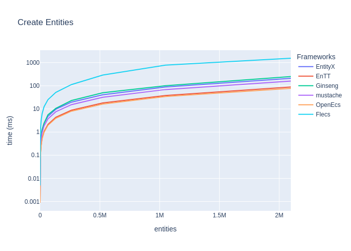
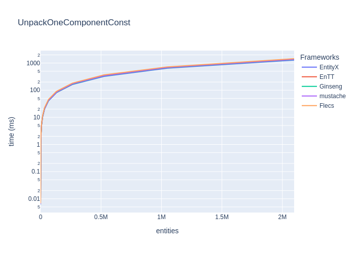
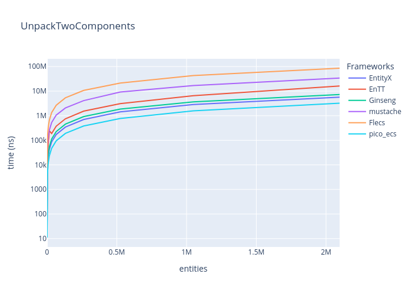
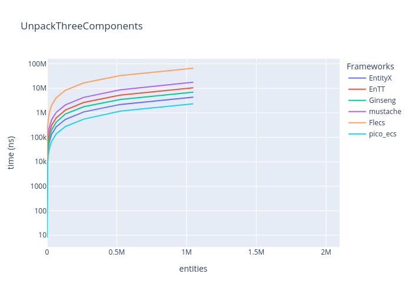
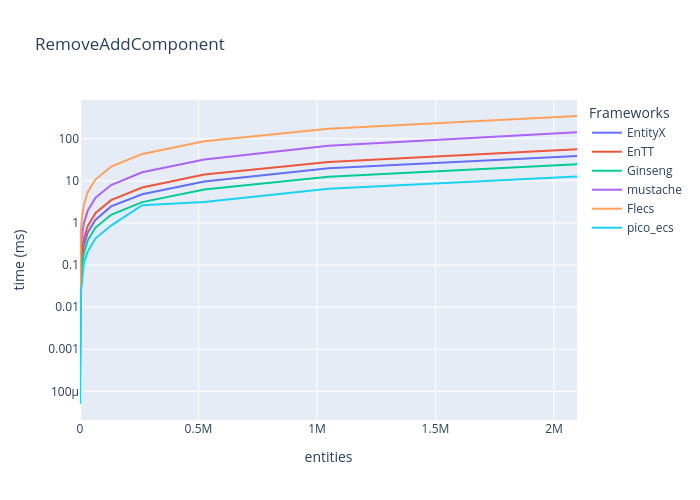
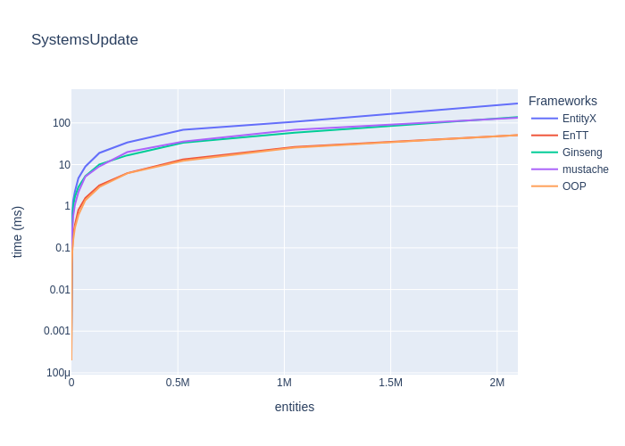
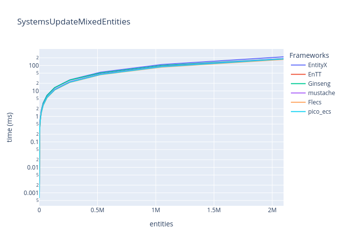
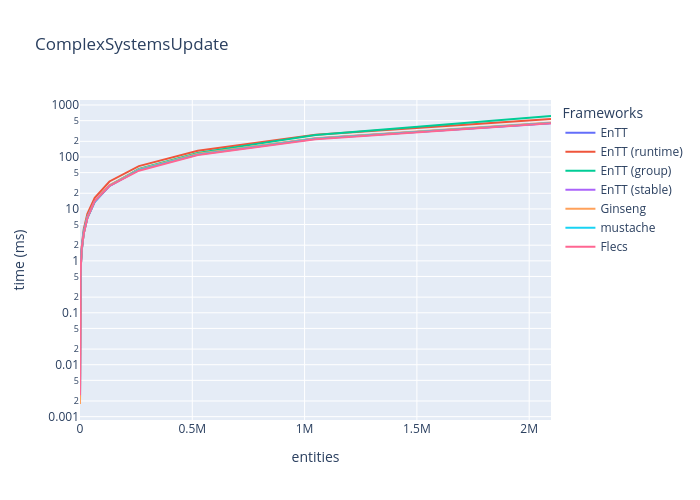

# Entity-Component-System Benchmarks

Simple Benchmarks of common ECS (Entity-Component-System) Frameworks:

* [EntityX](https://github.com/alecthomas/entityx)
* [EnTT](https://github.com/skypjack/entt)
* [Ginseng](https://github.com/apples/ginseng)
* [mustache](https://github.com/kirillochnev/mustache)
* [flecs](https://github.com/SanderMertens/flecs)
* [pico_ecs](https://github.com/empyreanx/pico_headers)
* ~~TODO: [OpenEcs](https://github.com/Gronis/OpenEcs)~~

## TL;DR Results

### Update systems (for-each entities (with mixed components) in 3 systems)

_(lower is better)_

|                                      | EnTT     | EnTT (runtime)   | EnTT (group)   | EnTT (stable)   | Ginseng   | mustache   | Flecs    | pico_ecs     |
|:-------------------------------------|:---------|:-----------------|:---------------|:----------------|:----------|:-----------|:---------|:-------------|
| Update    16 entities with 3 Systems | 1417ns   | 1774ns           | 1410ns         | 1368ns          | 1376ns    | 110999ns   | 2269ns   | **1089ns**   |
| Update    64 entities with 3 Systems | 5776ns   | 7327ns           | 5711ns         | 5598ns          | 5760ns    | 116551ns   | 6389ns   | **4242ns**   |
| Update   256 entities with 3 Systems | 24819ns  | 31658ns          | 24524ns        | 24134ns         | 24997ns   | 132026ns   | 24520ns  | **23187ns**  |
| Update   ~1K entities with 3 Systems | 97019ns  | 123249ns         | 95867ns        | 93090ns         | 98772ns   | 195609ns   | 94390ns  | **91430ns**  |
| Update   ~4K entities with 3 Systems | 380871ns | 483542ns         | 372168ns       | 363223ns        | 387269ns  | 474364ns   | 371016ns | **360973ns** |

|                                      | EnTT    | EnTT (runtime) | EnTT (group) | EnTT (stable) | Ginseng | mustache | Flecs   | pico_ecs |
|:-------------------------------------|:--------|:---------------|:-------------|:--------------|:--------|:---------|:--------|:---------|
| Update  ~16K entities with 3 Systems | **1ms** | **1ms**        | **1ms**      | **1ms**       | **1ms** | **1ms**  | **1ms** | **1ms**  |
| Update  ~65K entities with 3 Systems | **5ms** | 7ms            | 6ms          | **5ms**       | **5ms** | **5ms**  | **5ms** | **5ms**  |
| Update  262K entities with 3 Systems | 24ms    | 30ms           | 25ms         | **22ms**      | 24ms    | 24ms     | 24ms    | 23ms     |
| Update   ~1M entities with 3 Systems | 97ms    | 120ms          | 113ms        | **89ms**      | 95ms    | 95ms     | 92ms    | 91ms     |
| Update   ~2M entities with 3 Systems | 193ms   | 241ms          | 288ms        | **179ms**     | 192ms   | 189ms    | 188ms   | 184ms    |

This is a very little Benchmark with three simple components and three small systems. In wild Entity-Component-Systems can have hundreds of components and a lot of systems and even more complex systems.
So always benchmarks YOUR special cases and systems, when needed and compare.

Some frameworks are faster in adding/removing components, others in creating or destroying entities, it always depends on what you need the most.
Always choose an ECS-Framework by features, for example EnTT has some great features like a
[resource-management](https://github.com/skypjack/entt/wiki/Crash-Course:-resource-management) or [events](https://github.com/skypjack/entt/wiki/Crash-Course:-events,-signals-and-everything-in-between),
flecs has some nice [add-ons](https://github.com/SanderMertens/flecs#addons) and EntityX has a build-in [world/system-manager](https://github.com/alecthomas/entityx#manager-tying-it-all-together=).

Pick and evaluate a framework you like and have a look at the examples and API design.

## Details

### Features

All benchmarks are located in [`benchmark/benchmarks/`](benchmark/benchmarks/) and are written with [google/benchmark](https://github.com/google/benchmark).
Each benchmark must implement the template [ECSBenchmark.h](benchmark/benchmarks/ECSBenchmark.h).

Each framework has a sub-project in [`src/`](src) and must implement certain features (see [`src/base`](src/base)).

#### Components

1. `PositionComponent` with `x` and `y` coord.
2. `VelocityComponent` with `x` and `y` for movement.
3. `DataComponent` with some nonsense data.

#### Systems

1. `MovementSystem`: updates `PositionComponent` with (const) `VelocityComponent`
2. `DataSystem`: updates `DataComponent` with nonsense
3. `MoreComplexSystem`: updates Components with random data and nonsense

## More Benchmarks

Benchmarks of more common features, like "Creating entities", "Add and remove components", etc.

### Features tested

* Create Entities
* Destroy Entities
* Get Component(s)
* Remove and add component
* Systems (for-each entities)

### Environment

* **OS:** Linux (Kernel: 6.1.3)
* **CPU:** 3.13GHz @ 12Cores
* **RAM:** 16GB
* **Compiler:** gcc (GCC) 12.2.0

---

### Create entities

_(lower is better)_

|                                           | EntityX   | EnTT     | Ginseng   | mustache   | Flecs     | pico_ecs   |
|:------------------------------------------|:----------|:---------|:----------|:-----------|:----------|:-----------|
| Create    16 entities with two Components | 2636ns    | 2780ns   | 10248ns   | 3030ns     | 460941ns  | 588ns      |
| Create    64 entities with two Components | 6097ns    | 4386ns   | 11678ns   | 6103ns     | 469460ns  | 1022ns     |
| Create   256 entities with two Components | 19692ns   | 10341ns  | 16187ns   | 18355ns    | 499871ns  | 2768ns     |
| Create   ~1K entities with two Components | 74274ns   | 33126ns  | 32131ns   | 64359ns    | 625556ns  | 9703ns     |
| Create   ~4K entities with two Components | 287639ns  | 128252ns | 95974ns   | 248819ns   | 1133866ns | 48584ns    |

|                                           | EntityX   | EnTT   | Ginseng   | mustache   | Flecs   | pico_ecs   |
|:------------------------------------------|:----------|:-------|:----------|:-----------|:--------|:-----------|
| Create  ~16K entities with two Components | 1ms       | 0ms    | 0ms       | 0ms        | 3ms     | 0ms        |
| Create  ~65K entities with two Components | 4ms       | 1ms    | 1ms       | 3ms        | 11ms    | 0ms        |
| Create  262K entities with two Components | 18ms      | 8ms    | 8ms       | 16ms       | 45ms    | 3ms        |
| Create   ~1M entities with two Components | 82ms      | 48ms   | 50ms      | 76ms       | 194ms   | 28ms       |
| Create   ~2M entities with two Components | 165ms     | 92ms   | 95ms      | 150ms      | 394ms   | 43ms       |

### Destroy entities

_(lower is better)_

|                                            | EntityX   | EnTT     | Ginseng   | mustache   | Flecs    | pico_ecs   |
|:-------------------------------------------|:----------|:---------|:----------|:-----------|:---------|:-----------|
| Destroy    16 entities with two components | 1425ns    | 1083ns   | 1994ns    | 671ns      | 400325ns | 522ns      |
| Destroy    64 entities with two components | 3520ns    | 2560ns   | 5474ns    | 800ns      | 401655ns | 704ns      |
| Destroy   256 entities with two components | 12065ns   | 8500ns   | 19179ns   | 1262ns     | 408020ns | 1412ns     |
| Destroy   ~1K entities with two components | 48202ns   | 32271ns  | 73785ns   | 2849ns     | 434044ns | 4273ns     |
| Destroy   ~4K entities with two components | 199045ns  | 127795ns | 289765ns  | 9287ns     | 537355ns | 15706ns    |

|                                            | EntityX   | EnTT   | Ginseng   | mustache   | Flecs   | pico_ecs   |
|:-------------------------------------------|:----------|:-------|:----------|:-----------|:--------|:-----------|
| Destroy  ~16K entities with two components | 0ms       | 0ms    | 1ms       | 0ms        | 0ms     | 0ms        |
| Destroy  ~65K entities with two components | 3ms       | 2ms    | 4ms       | 0ms        | 2ms     | 0ms        |
| Destroy  262K entities with two components | 14ms      | 8ms    | 19ms      | 0ms        | 9ms     | 1ms        |
| Destroy   ~1M entities with two components | 63ms      | 35ms   | 79ms      | 4ms        | 41ms    | 4ms        |
| Destroy   ~2M entities with two components | 127ms     | 73ms   | 158ms     | 8ms        | 78ms    | 10ms       |

### Get one (non-const) component from Entity

_(lower is better)_

|                                        | EntityX   | EnTT    | Ginseng   | mustache   | Flecs   | pico_ecs   |
|:---------------------------------------|:----------|:--------|:----------|:-----------|:--------|:-----------|
| Unpack one component in    16 entities | 22ns      | 45ns    | 27ns      | 194ns      | 353ns   | 12ns       |
| Unpack one component in    64 entities | 95ns      | 183ns   | 111ns     | 669ns      | 1385ns  | 53ns       |
| Unpack one component in   256 entities | 366ns     | 725ns   | 439ns     | 2557ns     | 5523ns  | 202ns      |
| Unpack one component in   ~1K entities | 1451ns    | 2897ns  | 1744ns    | 10066ns    | 22124ns | 795ns      |
| Unpack one component in   ~4K entities | 5807ns    | 11545ns | 6988ns    | 50753ns    | 88404ns | 3168ns     |

|                                        | EntityX   | EnTT   | Ginseng   | mustache   | Flecs   | pico_ecs   |
|:---------------------------------------|:----------|:-------|:----------|:-----------|:--------|:-----------|
| Unpack one component in  ~16K entities | 0ms       | 0ms    | 0ms       | 0ms        | 0ms     | 0ms        |
| Unpack one component in  ~65K entities | 0ms       | 0ms    | 0ms       | 0ms        | 1ms     | 0ms        |
| Unpack one component in  262K entities | 0ms       | 0ms    | 0ms       | 3ms        | 5ms     | 0ms        |
| Unpack one component in   ~1M entities | 1ms       | 3ms    | 2ms       | 12ms       | 22ms    | 0ms        |
| Unpack one component in   ~2M entities | 3ms       | 6ms    | 3ms       | 22ms       | 45ms    | 1ms        |

**Note:**
* Get one non-const component
   1. `PositionComponent`

### Get one (const) component from Entity

_(lower is better)_

|                                             | EntityX   | EnTT    | Ginseng   | mustache   | Flecs   | pico_ecs   |
|:--------------------------------------------|:----------|:--------|:----------|:-----------|:--------|:-----------|
| Get one (const) component in    16 entities | 60ns      | 47ns    | 27ns      | 93ns       | 252ns   | 13ns       |
| Get one (const) component in    64 entities | 96ns      | 190ns   | 113ns     | 359ns      | 988ns   | 56ns       |
| Get one (const) component in   256 entities | 372ns     | 750ns   | 436ns     | 1418ns     | 3933ns  | 212ns      |
| Get one (const) component in   ~1K entities | 1452ns    | 2989ns  | 1741ns    | 5656ns     | 15799ns | 839ns      |
| Get one (const) component in   ~4K entities | 5811ns    | 11985ns | 6971ns    | 22843ns    | 62738ns | 3345ns     |

|                                             | EntityX   | EnTT   | Ginseng   | mustache   | Flecs   | pico_ecs   |
|:--------------------------------------------|:----------|:-------|:----------|:-----------|:--------|:-----------|
| Get one (const) component in  ~16K entities | 0ms       | 0ms    | 0ms       | 0ms        | 0ms     | 0ms        |
| Get one (const) component in  ~65K entities | 0ms       | 0ms    | 0ms       | 0ms        | 1ms     | 0ms        |
| Get one (const) component in  262K entities | 0ms       | 0ms    | 0ms       | 1ms        | 4ms     | 0ms        |
| Get one (const) component in   ~1M entities | 1ms       | 3ms    | 2ms       | 5ms        | 16ms    | 0ms        |
| Get one (const) component in   ~2M entities | 3ms       | 6ms    | 3ms       | 11ms       | 32ms    | 1ms        |

**Note:**
* Get one const component
  1. `const PositionComponent`

### Get two components from entity

_(lower is better)_

|                                         | EntityX   | EnTT    | Ginseng   | mustache   | Flecs    | pico_ecs   |
|:----------------------------------------|:----------|:--------|:----------|:-----------|:---------|:-----------|
| Unpack two components in    16 entities | 42ns      | 93ns    | 54ns      | 257ns      | 662ns    | 26ns       |
| Unpack two components in    64 entities | 173ns     | 550ns   | 221ns     | 1025ns     | 2615ns   | 95ns       |
| Unpack two components in   256 entities | 672ns     | 1454ns  | 875ns     | 4091ns     | 10415ns  | 373ns      |
| Unpack two components in   ~1K entities | 2675ns    | 5827ns  | 3483ns    | 16336ns    | 41810ns  | 1477ns     |
| Unpack two components in   ~4K entities | 10667ns   | 23233ns | 13940ns   | 67300ns    | 166257ns | 5889ns     |

|                                         | EntityX   | EnTT   | Ginseng   | mustache   | Flecs   | pico_ecs   |
|:----------------------------------------|:----------|:-------|:----------|:-----------|:--------|:-----------|
| Unpack two components in  ~16K entities | 0ms       | 0ms    | 0ms       | 0ms        | 0ms     | 0ms        |
| Unpack two components in  ~65K entities | 0ms       | 0ms    | 0ms       | 1ms        | 2ms     | 0ms        |
| Unpack two components in  262K entities | 0ms       | 1ms    | 0ms       | 4ms        | 10ms    | 0ms        |
| Unpack two components in   ~1M entities | 2ms       | 6ms    | 3ms       | 16ms       | 42ms    | 1ms        |
| Unpack two components in   ~2M entities | 5ms       | 16ms   | 7ms       | 34ms       | 85ms    | 3ms        |

**Note:**
* Get non-const- and const-component
   1. `PositionComponent`
   2. `const VelocityComponent`

### Get three components from entity

_(lower is better)_

|                                           | EntityX   | EnTT    | Ginseng   | mustache   | Flecs    | pico_ecs   |
|:------------------------------------------|:----------|:--------|:----------|:-----------|:---------|:-----------|
| Unpack three components in     8 entities | 32ns      | 77ns    | 48ns      | 128ns      | 509ns    | 16ns       |
| Unpack three components in    32 entities | 135ns     | 299ns   | 197ns     | 505ns      | 2016ns   | 71ns       |
| Unpack three components in   128 entities | 525ns     | 1192ns  | 782ns     | 2024ns     | 8036ns   | 271ns      |
| Unpack three components in   512 entities | 2077ns    | 4773ns  | 3115ns    | 8050ns     | 32063ns  | 1072ns     |
| Unpack three components in   ~2K entities | 8387ns    | 19036ns | 12437ns   | 32230ns    | 128442ns | 4284ns     |

|                                           | EntityX   | EnTT   | Ginseng   | mustache   | Flecs   | pico_ecs   |
|:------------------------------------------|:----------|:-------|:----------|:-----------|:--------|:-----------|
| Unpack three components in   ~8K entities | 0ms       | 0ms    | 0ms       | 0ms        | 0ms     | 0ms        |
| Unpack three components in  ~32K entities | 0ms       | 0ms    | 0ms       | 0ms        | 2ms     | 0ms        |
| Unpack three components in  131K entities | 0ms       | 1ms    | 0ms       | 2ms        | 8ms     | 0ms        |
| Unpack three components in  524K entities | 2ms       | 5ms    | 3ms       | 8ms        | 33ms    | 1ms        |
| Unpack three components in   ~1M entities | 4ms       | 10ms   | 6ms       | 17ms       | 66ms    | 2ms        |

**Note:**
* Not every entity has three components, some has only two
* Get two non-const- and const-component(s)
   1. `PositionComponent`
   2. `const VelocityComponent`
   3. `DataComponent` (optional)

### Remove and add component

_(lower is better)_

|                                              | EntityX   | EnTT     | Ginseng   | mustache   | Flecs    | pico_ecs   |
|:---------------------------------------------|:----------|:---------|:----------|:-----------|:---------|:-----------|
| Remove and Add a Component in    16 entities | 298ns     | 427ns    | 189ns     | 974ns      | 2639ns   | 95ns       |
| Remove and Add a Component in    64 entities | 1179ns    | 1680ns   | 741ns     | 3866ns     | 10559ns  | 359ns      |
| Remove and Add a Component in   256 entities | 4783ns    | 6707ns   | 2959ns    | 15445ns    | 42399ns  | 1434ns     |
| Remove and Add a Component in   ~1K entities | 19163ns   | 26827ns  | 12018ns   | 61730ns    | 170129ns | 5753ns     |
| Remove and Add a Component in   ~4K entities | 77092ns   | 107944ns | 48410ns   | 246924ns   | 678341ns | 22790ns    |

|                                              | EntityX   | EnTT   | Ginseng   | mustache   | Flecs   | pico_ecs   |
|:---------------------------------------------|:----------|:-------|:----------|:-----------|:--------|:-----------|
| Remove and Add a Component in  ~16K entities | 0ms       | 0ms    | 0ms       | 0ms        | 2ms     | 0ms        |
| Remove and Add a Component in  ~65K entities | 1ms       | 1ms    | 0ms       | 3ms        | 10ms    | 0ms        |
| Remove and Add a Component in  262K entities | 4ms       | 6ms    | 3ms       | 15ms       | 43ms    | 2ms        |
| Remove and Add a Component in   ~1M entities | 19ms      | 27ms   | 12ms      | 68ms       | 173ms   | 6ms        |
| Remove and Add a Component in   ~2M entities | 38ms      | 56ms   | 24ms      | 142ms      | 347ms   | 12ms       |

**Note:**
* Remove and add `PositionComponent`

### Update systems (for-each entities in 2 systems)

_(lower is better)_

|                                      | EntityX   | EnTT     | Ginseng   | mustache   | Flecs    | pico_ecs   |
|:-------------------------------------|:----------|:---------|:----------|:-----------|:---------|:-----------|
| Update    16 entities with 2 systems | 1736ns    | 1555ns   | 1502ns    | 71816ns    | 2061ns   | 1499ns     |
| Update    64 entities with 2 systems | 7030ns    | 6056ns   | 5936ns    | 72046ns    | 6361ns   | 6016ns     |
| Update   256 entities with 2 systems | 26799ns   | 23805ns  | 23814ns   | 88825ns    | 23291ns  | 23874ns    |
| Update   ~1K entities with 2 systems | 106546ns  | 93473ns  | 93157ns   | 161510ns   | 89761ns  | 92518ns    |
| Update   ~4K entities with 2 systems | 415953ns  | 369379ns | 359280ns  | 422757ns   | 352333ns | 369637ns   |

|                                      | EntityX   | EnTT   | Ginseng   | mustache   | Flecs   | pico_ecs   |
|:-------------------------------------|:----------|:-------|:----------|:-----------|:--------|:-----------|
| Update  ~16K entities with 2 systems | 1ms       | 1ms    | 1ms       | 1ms        | 1ms     | 1ms        |
| Update  ~65K entities with 2 systems | 6ms       | 5ms    | 5ms       | 5ms        | 5ms     | 5ms        |
| Update  262K entities with 2 systems | 26ms      | 22ms   | 22ms      | 23ms       | 21ms    | 22ms       |
| Update   ~1M entities with 2 systems | 107ms     | 89ms   | 87ms      | 94ms       | 85ms    | 89ms       |
| Update   ~2M entities with 2 systems | 213ms     | 180ms  | 175ms     | 189ms      | 169ms   | 186ms      |

**Note:**
* Systems used
    1. `MovementSystem`
    2. `DataSystem`

### Update systems (for-each entities (with mixed components) in 2 systems)

_(lower is better)_

|                                      | EntityX   | EnTT     | Ginseng   | mustache   | Flecs    | pico_ecs   |
|:-------------------------------------|:----------|:---------|:----------|:-----------|:---------|:-----------|
| Update    16 entities with 2 systems | 1514ns    | 1372ns   | 1316ns    | 68173ns    | 2033ns   | 1066ns     |
| Update    64 entities with 2 systems | 6234ns    | 5624ns   | 5466ns    | 72617ns    | 5923ns   | 4238ns     |
| Update   256 entities with 2 systems | 27034ns   | 23881ns  | 23695ns   | 87705ns    | 23261ns  | 23761ns    |
| Update   ~1K entities with 2 systems | 105957ns  | 94563ns  | 95048ns   | 157803ns   | 90156ns  | 91611ns    |
| Update   ~4K entities with 2 systems | 418543ns  | 366898ns | 361204ns  | 427871ns   | 349159ns | 361202ns   |

|                                      | EntityX   | EnTT   | Ginseng   | mustache   | Flecs   | pico_ecs   |
|:-------------------------------------|:----------|:-------|:----------|:-----------|:--------|:-----------|
| Update  ~16K entities with 2 systems | 1ms       | 1ms    | 1ms       | 1ms        | 1ms     | 1ms        |
| Update  ~65K entities with 2 systems | 6ms       | 5ms    | 5ms       | 5ms        | 5ms     | 5ms        |
| Update  262K entities with 2 systems | 26ms      | 22ms   | 21ms      | 23ms       | 21ms    | 22ms       |
| Update   ~1M entities with 2 systems | 106ms     | 89ms   | 87ms      | 95ms       | 85ms    | 89ms       |
| Update   ~2M entities with 2 systems | 212ms     | 178ms  | 174ms     | 189ms      | 171ms   | 180ms      |

**Note:**
* Systems used
    1. `MovementSystem`
    2. `DataSystem`
* Not every entity has all three components, some got removed

### Update systems (for-each entities in 3 systems)

_(lower is better)_

|                                      | EnTT     | EnTT (runtime)   | EnTT (group)   | EnTT (stable)   | Ginseng   | mustache   | Flecs    | pico_ecs   |
|:-------------------------------------|:---------|:-----------------|:---------------|:----------------|:----------|:-----------|:---------|:-----------|
| Update    16 entities with 3 systems | 1621ns   | 2072ns           | 1623ns         | 1566ns          | 1578ns    | 98099ns    | 2371ns   | 1542ns     |
| Update    64 entities with 3 systems | 6231ns   | 8079ns           | 6249ns         | 6085ns          | 6247ns    | 102382ns   | 6760ns   | 5979ns     |
| Update   256 entities with 3 systems | 24597ns  | 31787ns          | 24557ns        | 24299ns         | 25007ns   | 130105ns   | 24418ns  | 23374ns    |
| Update   ~1K entities with 3 systems | 97515ns  | 123919ns         | 95791ns        | 96649ns         | 98839ns   | 204704ns   | 94474ns  | 91970ns    |
| Update   ~4K entities with 3 systems | 382427ns | 484582ns         | 373767ns       | 367522ns        | 388102ns  | 478713ns   | 373044ns | 364224ns   |

|                                      | EnTT   | EnTT (runtime)   | EnTT (group)   | EnTT (stable)   | Ginseng   | mustache   | Flecs   | pico_ecs   |
|:-------------------------------------|:-------|:-----------------|:---------------|:----------------|:----------|:-----------|:--------|:-----------|
| Update  ~16K entities with 3 systems | 1ms    | 1ms              | 1ms            | 1ms             | 1ms       | 1ms        | 1ms     | 1ms        |
| Update  ~65K entities with 3 systems | 6ms    | 7ms              | 6ms            | 5ms             | 5ms       | 5ms        | 5ms     | 5ms        |
| Update  262K entities with 3 systems | 24ms   | 30ms             | 25ms           | 22ms            | 24ms      | 24ms       | 24ms    | 23ms       |
| Update   ~1M entities with 3 systems | 97ms   | 120ms            | 111ms          | 90ms            | 96ms      | 95ms       | 94ms    | 92ms       |
| Update   ~2M entities with 3 systems | 193ms  | 241ms            | 273ms          | 180ms           | 192ms     | 190ms      | 190ms   | 186ms      |

**Note:**
* Systems used
    1. `MovementSystem`
    2. `DataSystem`
    3. `MoreComplexSystem`
* \*   EnTT iterate components via [views](https://github.com/skypjack/entt/wiki/Crash-Course:-entity-component-system#views=)
* \**  EnTT iterate components via [runtime views](https://github.com/skypjack/entt/wiki/Crash-Course:-entity-component-system#runtime-views=)
* \*** EnTT iterate components via [groups](https://github.com/skypjack/entt/wiki/Crash-Course:-entity-component-system#groups=):
   1. `DataSystem`: No Group, use `registry.view<DataComponent>`. _(Can't group a single component)_
   2. `MovementSystem`: Partial-owning group, `registry.group<PositionComponent>(entt::get<const VelocityComponent>)`
   3. `MoreComplexSystem`: Full-owning group, `registry.group<PositionComponent, VelocityComponent, DataComponent>()`
* \**** EnTT iterate components via view and uses a [stable component](https://github.com/skypjack/entt/wiki/Crash-Course:-entity-component-system#pointer-stability=) (`StablePositionComponent`)

### Update systems (for-each entities (with mixed components) in 3 systems)

_(lower is better)_

|                                      | EnTT     | EnTT (runtime)   | EnTT (group)   | EnTT (stable)   | Ginseng   | mustache   | Flecs    | pico_ecs   |
|:-------------------------------------|:---------|:-----------------|:---------------|:----------------|:----------|:-----------|:---------|:-----------|
| Update    16 entities with 3 Systems | 1417ns   | 1774ns           | 1410ns         | 1368ns          | 1376ns    | 110999ns   | 2269ns   | 1089ns     |
| Update    64 entities with 3 Systems | 5776ns   | 7327ns           | 5711ns         | 5598ns          | 5760ns    | 116551ns   | 6389ns   | 4242ns     |
| Update   256 entities with 3 Systems | 24819ns  | 31658ns          | 24524ns        | 24134ns         | 24997ns   | 132026ns   | 24520ns  | 23187ns    |
| Update   ~1K entities with 3 Systems | 97019ns  | 123249ns         | 95867ns        | 93090ns         | 98772ns   | 195609ns   | 94390ns  | 91430ns    |
| Update   ~4K entities with 3 Systems | 380871ns | 483542ns         | 372168ns       | 363223ns        | 387269ns  | 474364ns   | 371016ns | 360973ns   |

|                                      | EnTT   | EnTT (runtime)   | EnTT (group)   | EnTT (stable)   | Ginseng   | mustache   | Flecs   | pico_ecs   |
|:-------------------------------------|:-------|:-----------------|:---------------|:----------------|:----------|:-----------|:--------|:-----------|
| Update  ~16K entities with 3 Systems | 1ms    | 1ms              | 1ms            | 1ms             | 1ms       | 1ms        | 1ms     | 1ms        |
| Update  ~65K entities with 3 Systems | 5ms    | 7ms              | 6ms            | 5ms             | 5ms       | 5ms        | 5ms     | 5ms        |
| Update  262K entities with 3 Systems | 24ms   | 30ms             | 25ms           | 22ms            | 24ms      | 24ms       | 24ms    | 23ms       |
| Update   ~1M entities with 3 Systems | 97ms   | 120ms            | 113ms          | 89ms            | 95ms      | 95ms       | 92ms    | 91ms       |
| Update   ~2M entities with 3 Systems | 193ms  | 241ms            | 288ms          | 179ms           | 192ms     | 189ms      | 188ms   | 184ms      |

**Note:**
* Systems used
    1. `MovementSystem`
    2. `DataSystem`
    3. `MoreComplexSystem`
* Not every entity has all three components, some got removed
* \*   EnTT iterate components via [views](https://github.com/skypjack/entt/wiki/Crash-Course:-entity-component-system#views=)
* \**  EnTT iterate components via [runtime views](https://github.com/skypjack/entt/wiki/Crash-Course:-entity-component-system#runtime-views=)
* \*** EnTT iterate components via [groups](https://github.com/skypjack/entt/wiki/Crash-Course:-entity-component-system#groups=):
    1. `DataSystem`: No Group, use `registry.view<DataComponent>`. _(Can't group a single component)_
    2. `MovementSystem`: Partial-owning group, `registry.group<PositionComponent>(entt::get<const VelocityComponent>)`
    3. `MoreComplexSystem`: Full-owning group, `registry.group<PositionComponent, VelocityComponent, DataComponent>()`
* \**** EnTT iterate components via view and uses a [stable component](https://github.com/skypjack/entt/wiki/Crash-Course:-entity-component-system#pointer-stability=) (`StablePositionComponent`)

## Contributing

I try to implement the ECS-examples as good as possible for each framework, if you have any improvements, feel free to make a PR or open an issue.

You can find the frameworks example(s) in [`src/`](src/) and benchmark [`benchmarks/`](benchmarks/benchmarks/) for more details.
Also you can write tests for the framework example :)
and add some metadata in [plot.config.json](plot.config.json).

_TODO: make more detailed "how to add framework"_

Read [CONTRIBUTING.md](CONTRIBUTING) for more details.

## Run Benchmarks

### Using [Taskfile](https://taskfile.dev/installation/)

1. `git submodule update --init --recursive`
2. Build: `task build`
3. Run (All) Benchmarks: `task benchmark`
4. Plot Graphs: `task plot:all`

You can now find the benchmark results in [`reports/`](reports/).

_You need python (>=3.9.0) and some [dependencies](scripts/gen-benchmark-report/requirements.txt) to run [gen-benchmark-report](scripts/gen-benchmark-report) (plotting)_

### ~~Step-by-Step~~

1. Configure and build benchmarks, see [Building Details](doc/README_building.md):
   1. `git submodule update --init --recursive`
   2. `cmake -S . -B ./build`
   3. `cmake --build ./build`
2. Run benchmark(s):
   * `./build/benchmark/benchmarks/entt/ecs-benchmark-entt` _(console output)_ _(optional)_
   * `./build/benchmark/benchmarks/entt/ecs-benchmark-entt --benchmark_format=json > ./reports/entt.json` _(write json report)_
3. Plot Reports, after generating json reports:
   1. `python3 ./scripts/gen-benchmark-report -i ./info.json gen-plot ./reports/entityx.json ./reports/entt.json ./reports/ginseng.json ./reports/mustache.json ./reports/openecs.json ./reports/flecs.json` _(generate graphs)_
   2. `python3 ./scripts/gen-benchmark-report -i ./info.json gen-results-md ./reports/entityx.json ./reports/entt.json ./reports/ginseng.json ./reports/mustache.json ./reports/openecs.json ./reports/flecs.json` _(generate full report)_

## Links and More

* [Dependency Setup](doc/README_dependencies.md)
* [Building Details](doc/README_building.md)
* Project Template, mix of: [starter_template](https://github.com/cpp-best-practices/gui_starter_template) and [ModernCppStarter](https://github.com/TheLartians/ModernCppStarter)
  * [Forked cpp_vcpkg_project](https://github.com/abeimler/cpp_vcpkg_project)
* [Google benchmark](https://github.com/google/benchmark)
* https://github.com/SanderMertens/ecs-faq
* https://github.com/jslee02/awesome-entity-component-system

### Candidates

#### EntityX by @alecthomas 

> Entity Component Systems (ECS) are a form of decomposition that completely decouples entity logic and data from the entity "objects" themselves. The Evolve your Hierarchy article provides a solid overview of EC systems and why you should use them.

Version: 1.1.2 (Dec 2021)

#### EnTT by @skypjack 

> EnTT is a header-only, tiny and easy to use library for game programming and much more written in modern C++.

Version: v3.11.1

#### Ginseng by @apples 

> Ginseng is an entity-component-system (ECS) library designed for use in games.
> 
> The main advantage over similar libraries is that the component types do not need to be listed or registered. Component types are detected dynamically.
> 
> Any function-like object can be used as a system. The function's parameters are used to determine the required components.

Version: 1.1 (Dec 2021)

#### mustache by @kirillochnev 

> A fast, modern C++ Entity Component System

Version: 0.2 (Aug 2022)

#### OpenEcs by @Gronis 

> Open Ecs is an Entity Component System that uses metaprogramming, cache coherency, and other useful tricks to maximize performance and configurability. 
> It is written in c++11 without further dependencies.

Version: Beta (Apr 2017)

#### Flecs by @SanderMertens 

> Flecs is a fast and lightweight Entity Component System that lets you build games and simulations with millions of entities.

Version: v3.1.3

#### pico_ecs by @empyreanx 

> A collection of cross-platform single header libraries written in C.  
> Pure and simple ECS.

Version: v2.0.0

#### _Deprecated_

I removed [anax](https://github.com/miguelmartin75/anax) and [Artemis-Cpp](https://github.com/matachi/Artemis-Cpp), they are out-of-date and didn't receive any updates in the last time.
You can still checkout the old versions and branches.
