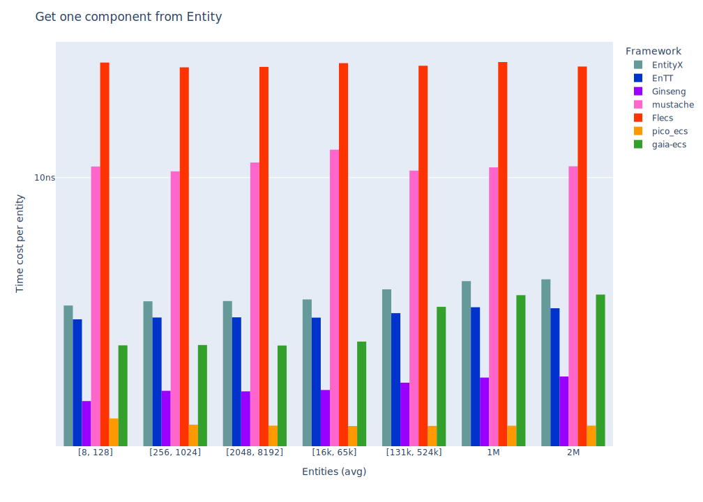
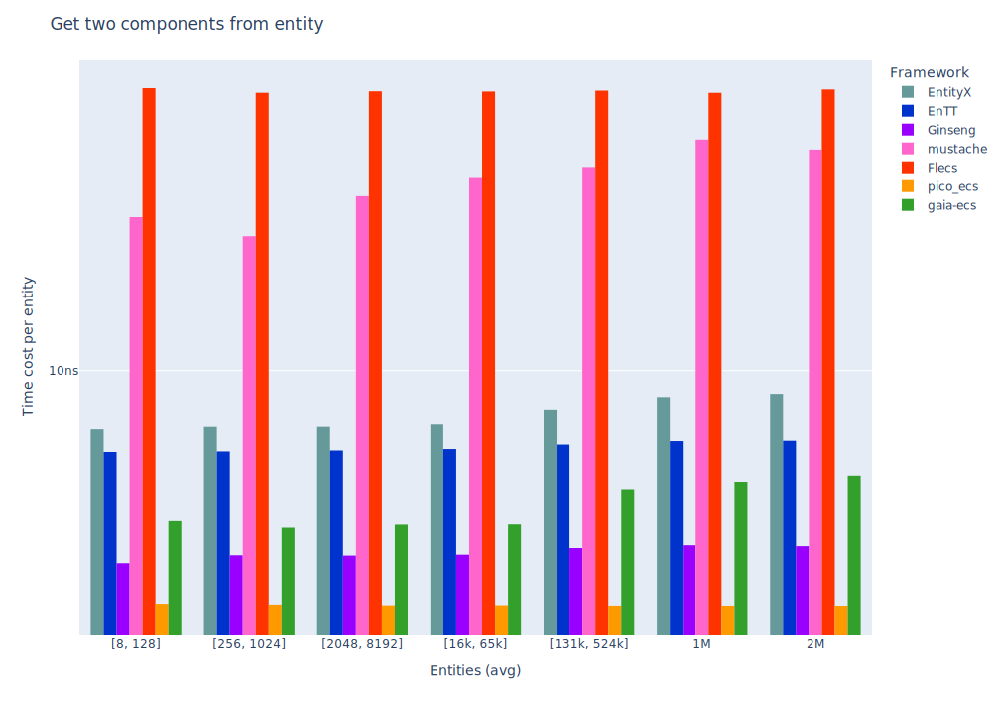

# Entity-Component-System Benchmarks

[](https://github.com/abeimler/ecs_benchmark/actions)


This repository contains a collection of benchmarks for popular Entity-Component-System (ECS) frameworks.
The benchmarks cover different aspects of ECS frameworks, such as update systems, component additions/removals, and entity creation/destruction.
It's important to note that different ECS frameworks have different strengths and weaknesses.
For example, some frameworks might excel in adding/removing components, while others might be better at creating/destroying entities.
Therefore, it's crucial to choose an ECS framework based on your specific requirements.

ECS (Entity-Component-System) Frameworks:

* [EntityX](https://github.com/alecthomas/entityx)
* [EnTT](https://github.com/skypjack/entt)
* [Ginseng](https://github.com/apples/ginseng)
* [mustache](https://github.com/kirillochnev/mustache)
* [flecs](https://github.com/SanderMertens/flecs)
* [pico_ecs](https://github.com/empyreanx/pico_headers)

## TL;DR Results

The benchmark results are displayed in tables and charts,
allowing you to quickly compare the performance of different ECS frameworks in different scenarios.
When using ECS frameworks, it's important to benchmark your specific use case and compare the results.
Therefore, the results of these benchmarks should be used as a starting point for your own benchmarking efforts.


### Update systems (for-each entities (with mixed components) in 5 systems)


_(lower is better)_

|                                      | EnTT    | EnTT (runtime)  | EnTT (group)      | EnTT (stable)            | Ginseng      | mustache | Flecs     | pico_ecs     |
|:-------------------------------------|:--------|:----------------|:------------------|:-------------------------|:-------------|:---------|:----------|:-------------|
| Update    16 entities with 5 Systems | **1us** | 2us             | **1us**           | **1us**                  | **1us**      | 42us     | 3us       | **1us**      |
| Update    64 entities with 5 Systems | 6us     | 9us             | 6us               | **5us**                  | 6us          | 48us     | 7us       | **5us**      |
| Update   256 entities with 5 Systems | 26us    | 41us            | 26us              | **25us**                 | 27us         | 64us     | 26us      | 26us         |
| Update   ~1K entities with 5 Systems | 105us   | 163us           | 101us             | **97us**                 | 111us        | 141us    | 101us     | 103us        |
| Update   ~4K entities with 5 Systems | 420us   | 673us           | 402us             | 381us                    | 434us        | 442us    | **372us** | 414us        |

|                                      | EnTT      | EnTT (runtime) | EnTT (group)     | EnTT (stable)       | Ginseng      | mustache    | Flecs                  | pico_ecs      |
|:-------------------------------------|:----------|:---------------|:-----------------|:--------------------|:-------------|:------------|:-----------------------|:--------------|
| Update  ~16K entities with 5 Systems | **1ms**   | 2ms            | **1ms**          | **1ms**             | **1ms**      | **1ms**     | **1ms**                | **1ms**       |
| Update  ~65K entities with 5 Systems | 6ms       | 10ms           | 6ms              | **5ms**             | 6ms          | 6ms         | **5ms**                | 6ms           |
| Update  262K entities with 5 Systems | 27ms      | 42ms           | 26ms             | 24ms                | 29ms         | 26ms        | **23ms**               | 26ms          |
| Update   ~1M entities with 5 Systems | 108ms     | 166ms          | 115ms            | 96ms                | 111ms        | 105ms       | **92ms**               | 109ms         |
| Update   ~2M entities with 5 Systems | 216ms     | 332ms          | 263ms            | 196ms               | 224ms        | 207ms       | **191ms**              | 219ms         |


While this benchmark only includes up to 5 simple components and 5 small systems,
it's important to note that Entity-Component-Systems can become much more complex in the wild,
with hundreds of components and systems.
Therefore, it's crucial to always benchmark your specific cases and systems when necessary and compare results.
Choose an ECS framework based on its features,
for example, EnTT offers [resource management](https://github.com/skypjack/entt/wiki/Crash-Course:-resource-management) and [event handling](https://github.com/skypjack/entt/wiki/Crash-Course:-events,-signals-and-everything-in-between),
while flecs provides useful [add-ons](https://github.com/SanderMertens/flecs#addons),
and EntityX includes a built-in [world/system manager](https://github.com/alecthomas/entityx#manager-tying-it-all-together=).

To evaluate a framework, look at its examples and API design, and pick the one that suits your needs the best.


## Details

### Features

All benchmarks are located in the [`benchmark/benchmarks/`](benchmark/benchmarks/) directory and are implemented with the [google/benchmark](https://github.com/google/benchmark) library.
Each benchmark must implement the `ECSBenchmark.h` template.

Each framework has its own sub-project in the [`src/`](src) directory and must implement specific features (see [`src/base`](src/base)).

#### Components

1. `PositionComponent`: includes `x` and `y` coordinates.
2. `VelocityComponent`: includes `x` and `y` coordinates for movement.
3. `DataComponent`: includes some arbitrary data.
4. `HealthComponent`: Hero/Monster data includes HP/MaxHP and status.
5. `DamageComponent`: Hero/Monster data includes damage.

#### Systems

1. `MovementSystem`: updates the `PositionComponent` with a constant `VelocityComponent`.
2. `DataSystem`: updates the `DataComponent` with arbitrary data.
3. `MoreComplexSystem`: updates components with random data and arbitrary information.
4. `HealthSystem`: update Hero/Monster health (update HP and status).
5. `DamageSystem`: update Hero/Monster health by taking damage.


## Additional Benchmarks

Benchmarks for more common features, such as "Creating entities", "Adding and removing components", and others.

### Features tested

* Entity Creation
* Entity Destruction
* Component Retrieval
* Adding and Removing Components
* Systems (for iterating through entities)


### Environment

* **OS:** Linux 64-Bit (Kernel: 6.6.7)
* **CPU:** 3.13GHz @ 12Cores
* **RAM:** 47GB
* **Compiler:** gcc (GCC) 13.2.1


---

### Create entities


_(lower is better)_

|                                           | EntityX   | EnTT   | Ginseng   | mustache   | Flecs   | pico_ecs   |
|:------------------------------------------|:----------|:-------|:----------|:-----------|:--------|:-----------|
| Create    16 entities with two Components | 2us       | 3us    | 10us      | 3us        | 482us   | 1us        |
| Create    64 entities with two Components | 6us       | 5us    | 12us      | 6us        | 497us   | 2us        |
| Create   256 entities with two Components | 20us      | 12us   | 17us      | 20us       | 551us   | 6us        |
| Create   ~1K entities with two Components | 75us      | 37us   | 35us      | 71us       | 746us   | 20us       |
| Create   ~4K entities with two Components | 302us     | 139us  | 104us     | 286us      | 1514us  | 89us       |

|                                           | EntityX   | EnTT   | Ginseng   | mustache   | Flecs   | pico_ecs   |
|:------------------------------------------|:----------|:-------|:----------|:-----------|:--------|:-----------|
| Create  ~16K entities with two Components | 1ms       | 0ms    | 0ms       | 1ms        | 4ms     | 0ms        |
| Create  ~65K entities with two Components | 4ms       | 2ms    | 1ms       | 4ms        | 17ms    | 1ms        |
| Create  262K entities with two Components | 19ms      | 10ms   | 9ms       | 18ms       | 65ms    | 7ms        |
| Create   ~1M entities with two Components | 104ms     | 76ms   | 61ms      | 103ms      | 295ms   | 45ms       |
| Create   ~2M entities with two Components | 205ms     | 143ms  | 116ms     | 195ms      | 577ms   | 76ms       |


### Destroy entities


_(lower is better)_

|                                            | EntityX   | EnTT   | Ginseng   | Flecs   | pico_ecs   |
|:-------------------------------------------|:----------|:-------|:----------|:--------|:-----------|
| Destroy    16 entities with two components | 1us       | 1us    | 2us       | 443us   | 1us        |
| Destroy    64 entities with two components | 3us       | 2us    | 6us       | 451us   | 1us        |
| Destroy   256 entities with two components | 13us      | 8us    | 21us      | 461us   | 2us        |
| Destroy   ~1K entities with two components | 51us      | 31us   | 81us      | 495us   | 7us        |
| Destroy   ~4K entities with two components | 208us     | 124us  | 323us     | 662us   | 29us       |

|                                            | EntityX   | EnTT   | Ginseng   | Flecs   | pico_ecs   |
|:-------------------------------------------|:----------|:-------|:----------|:--------|:-----------|
| Destroy  ~16K entities with two components | 0ms       | 0ms    | 1ms       | 1ms     | 0ms        |
| Destroy  ~65K entities with two components | 3ms       | 1ms    | 5ms       | 4ms     | 0ms        |
| Destroy  262K entities with two components | 14ms      | 8ms    | 20ms      | 14ms    | 1ms        |
| Destroy   ~1M entities with two components | 67ms      | 37ms   | 92ms      | 61ms    | 9ms        |
| Destroy   ~2M entities with two components | 130ms     | 76ms   | 170ms     | 120ms   | 17ms       |


### Get one component from Entity




_(lower is better)_

|                                        | EntityX   | EnTT   | Ginseng   | mustache   | Flecs   | pico_ecs   |
|:---------------------------------------|:----------|:-------|:----------|:-----------|:--------|:-----------|
| Unpack one component in    16 entities | 0us       | 0us    | 0us       | 0us        | 0us     | 0us        |
| Unpack one component in    64 entities | 0us       | 0us    | 0us       | 0us        | 2us     | 0us        |
| Unpack one component in   256 entities | 0us       | 0us    | 0us       | 2us        | 9us     | 0us        |
| Unpack one component in   ~1K entities | 3us       | 3us    | 1us       | 11us       | 39us    | 1us        |
| Unpack one component in   ~4K entities | 15us      | 13us   | 6us       | 44us       | 156us   | 5us        |

|                                        | EntityX   | EnTT   | Ginseng   | mustache   | Flecs   | pico_ecs   |
|:---------------------------------------|:----------|:-------|:----------|:-----------|:--------|:-----------|
| Unpack one component in  ~16K entities | 0ms       | 0ms    | 0ms       | 0ms        | 0ms     | 0ms        |
| Unpack one component in  ~65K entities | 0ms       | 0ms    | 0ms       | 0ms        | 2ms     | 0ms        |
| Unpack one component in  262K entities | 1ms       | 0ms    | 0ms       | 3ms        | 10ms    | 0ms        |
| Unpack one component in   ~1M entities | 4ms       | 3ms    | 1ms       | 15ms       | 39ms    | 1ms        |
| Unpack one component in   ~2M entities | 9ms       | 7ms    | 3ms       | 28ms       | 78ms    | 2ms        |


**Note:**
* Get one non-const component
   1. `PositionComponent`


### Get two components from entity




_(lower is better)_

|                                         | EntityX   | EnTT   | Ginseng   | mustache   | Flecs   | pico_ecs   |
|:----------------------------------------|:----------|:-------|:----------|:-----------|:--------|:-----------|
| Unpack two components in    16 entities | 0us       | 0us    | 0us       | 0us        | 1us     | 0us        |
| Unpack two components in    64 entities | 0us       | 0us    | 0us       | 1us        | 5us     | 0us        |
| Unpack two components in   256 entities | 1us       | 1us    | 0us       | 5us        | 20us    | 0us        |
| Unpack two components in   ~1K entities | 8us       | 6us    | 3us       | 22us       | 82us    | 2us        |
| Unpack two components in   ~4K entities | 29us      | 26us   | 12us      | 88us       | 330us   | 10us       |

|                                         | EntityX   | EnTT   | Ginseng   | mustache   | Flecs   | pico_ecs   |
|:----------------------------------------|:----------|:-------|:----------|:-----------|:--------|:-----------|
| Unpack two components in  ~16K entities | 0ms       | 0ms    | 0ms       | 0ms        | 1ms     | 0ms        |
| Unpack two components in  ~65K entities | 0ms       | 0ms    | 0ms       | 1ms        | 5ms     | 0ms        |
| Unpack two components in  262K entities | 2ms       | 1ms    | 0ms       | 6ms        | 21ms    | 0ms        |
| Unpack two components in   ~1M entities | 8ms       | 6ms    | 3ms       | 24ms       | 85ms    | 2ms        |
| Unpack two components in   ~2M entities | 18ms      | 13ms   | 6ms       | 51ms       | 170ms   | 6ms        |


**Note:**
* Get non-const- and const-component
   1. `PositionComponent`
   2. `const VelocityComponent`


### Get three components from entity


_(lower is better)_

|                                           | EntityX   | EnTT   | Ginseng   | mustache   | Flecs   | pico_ecs   |
|:------------------------------------------|:----------|:-------|:----------|:-----------|:--------|:-----------|
| Unpack three components in     8 entities | 0us       | 0us    | 0us       | 0us        | 0us     | 0us        |
| Unpack three components in    32 entities | 0us       | 0us    | 0us       | 0us        | 3us     | 0us        |
| Unpack three components in   128 entities | 0us       | 1us    | 0us       | 2us        | 14us    | 0us        |
| Unpack three components in   512 entities | 3us       | 7us    | 2us       | 11us       | 58us    | 2us        |
| Unpack three components in   ~2K entities | 15us      | 29us   | 11us      | 44us       | 238us   | 7us        |

|                                           | EntityX   | EnTT   | Ginseng   | mustache   | Flecs   | pico_ecs   |
|:------------------------------------------|:----------|:-------|:----------|:-----------|:--------|:-----------|
| Unpack three components in   ~8K entities | 0ms       | 0ms    | 0ms       | 0ms        | 0ms     | 0ms        |
| Unpack three components in  ~32K entities | 0ms       | 0ms    | 0ms       | 0ms        | 3ms     | 0ms        |
| Unpack three components in  131K entities | 1ms       | 2ms    | 0ms       | 3ms        | 14ms    | 0ms        |
| Unpack three components in  524K entities | 4ms       | 7ms    | 3ms       | 12ms       | 60ms    | 2ms        |
| Unpack three components in   ~1M entities | 9ms       | 15ms   | 6ms       | 24ms       | 121ms   | 4ms        |


**Note:**
* Not every entity has three components, some has only two
* Get two non-const- and const-component(s)
   1. `PositionComponent`
   2. `const VelocityComponent`
   3. `DataComponent` (optional)


### Remove and add component


_(lower is better)_

|                                              | EntityX   | EnTT   | Ginseng   | Flecs   | pico_ecs   |
|:---------------------------------------------|:----------|:-------|:----------|:--------|:-----------|
| Remove and Add a Component in    16 entities | 0us       | 0us    | 0us       | 3us     | 0us        |
| Remove and Add a Component in    64 entities | 0us       | 1us    | 0us       | 14us    | 0us        |
| Remove and Add a Component in   256 entities | 3us       | 6us    | 2us       | 57us    | 2us        |
| Remove and Add a Component in   ~1K entities | 15us      | 27us   | 12us      | 230us   | 8us        |
| Remove and Add a Component in   ~4K entities | 63us      | 112us  | 53us      | 915us   | 34us       |

|                                              | EntityX   | EnTT   | Ginseng   | Flecs   | pico_ecs   |
|:---------------------------------------------|:----------|:-------|:----------|:--------|:-----------|
| Remove and Add a Component in  ~16K entities | 0ms       | 0ms    | 0ms       | 3ms     | 0ms        |
| Remove and Add a Component in  ~65K entities | 1ms       | 1ms    | 0ms       | 14ms    | 0ms        |
| Remove and Add a Component in  262K entities | 4ms       | 7ms    | 3ms       | 58ms    | 2ms        |
| Remove and Add a Component in   ~1M entities | 16ms      | 28ms   | 12ms      | 231ms   | 8ms        |
| Remove and Add a Component in   ~2M entities | 33ms      | 57ms   | 25ms      | 465ms   | 17ms       |


**Note:**
* Remove and add `PositionComponent`


### Update systems (for-each entities in 2 systems)


_(lower is better)_

|                                      | EntityX   | EnTT   | Ginseng   | mustache   | Flecs   | pico_ecs   |
|:-------------------------------------|:----------|:-------|:----------|:-----------|:--------|:-----------|
| Update    16 entities with 2 systems | 1us       | 1us    | 1us       | 16us       | 2us     | 1us        |
| Update    64 entities with 2 systems | 7us       | 6us    | 6us       | 21us       | 7us     | 6us        |
| Update   256 entities with 2 systems | 27us      | 25us   | 25us      | 40us       | 24us    | 24us       |
| Update   ~1K entities with 2 systems | 109us     | 93us   | 96us      | 113us      | 94us    | 93us       |
| Update   ~4K entities with 2 systems | 441us     | 377us  | 393us     | 409us      | 368us   | 370us      |

|                                      | EntityX   | EnTT   | Ginseng   | mustache   | Flecs   | pico_ecs   |
|:-------------------------------------|:----------|:-------|:----------|:-----------|:--------|:-----------|
| Update  ~16K entities with 2 systems | 1ms       | 1ms    | 1ms       | 1ms        | 1ms     | 1ms        |
| Update  ~65K entities with 2 systems | 7ms       | 5ms    | 6ms       | 6ms        | 5ms     | 5ms        |
| Update  262K entities with 2 systems | 29ms      | 23ms   | 25ms      | 26ms       | 24ms    | 23ms       |
| Update   ~1M entities with 2 systems | 115ms     | 97ms   | 102ms     | 105ms      | 95ms    | 95ms       |
| Update   ~2M entities with 2 systems | 238ms     | 189ms  | 205ms     | 206ms      | 192ms   | 191ms      |


**Note:**
* Systems used
    1. `MovementSystem`
    2. `DataSystem`


### Update systems (for-each entities (with mixed components) in 2 systems)


_(lower is better)_

|                                      | EntityX   | EnTT   | Ginseng   | mustache   | Flecs   | pico_ecs   |
|:-------------------------------------|:----------|:-------|:----------|:-----------|:--------|:-----------|
| Update    16 entities with 2 systems | 1us       | 1us    | 1us       | 18us       | 2us     | 1us        |
| Update    64 entities with 2 systems | 6us       | 5us    | 5us       | 24us       | 7us     | 4us        |
| Update   256 entities with 2 systems | 28us      | 24us   | 25us      | 41us       | 25us    | 24us       |
| Update   ~1K entities with 2 systems | 108us     | 94us   | 99us      | 115us      | 93us    | 93us       |
| Update   ~4K entities with 2 systems | 432us     | 367us  | 399us     | 453us      | 382us   | 373us      |

|                                      | EntityX   | EnTT   | Ginseng   | mustache   | Flecs   | pico_ecs   |
|:-------------------------------------|:----------|:-------|:----------|:-----------|:--------|:-----------|
| Update  ~16K entities with 2 systems | 1ms       | 1ms    | 1ms       | 1ms        | 1ms     | 1ms        |
| Update  ~65K entities with 2 systems | 7ms       | 5ms    | 6ms       | 6ms        | 5ms     | 5ms        |
| Update  262K entities with 2 systems | 29ms      | 23ms   | 25ms      | 25ms       | 23ms    | 23ms       |
| Update   ~1M entities with 2 systems | 115ms     | 94ms   | 99ms      | 102ms      | 96ms    | 95ms       |
| Update   ~2M entities with 2 systems | 231ms     | 189ms  | 198ms     | 216ms      | 191ms   | 191ms      |


**Note:**
* Systems used
    1. `MovementSystem`
    2. `DataSystem`
* Not every entity has all three components, some got removed


### Update systems (for-each entities in 5 systems)


_(lower is better)_

|                                      | EnTT   | EnTT (runtime)   | EnTT (group)   | EnTT (stable)   | Ginseng   | mustache   | Flecs   | pico_ecs   |
|:-------------------------------------|:-------|:-----------------|:---------------|:----------------|:----------|:-----------|:--------|:-----------|
| Update    16 entities with 5 systems | 1us    | 2us              | 1us            | 1us             | 1us       | 38us       | 3us     | 1us        |
| Update    64 entities with 5 systems | 7us    | 11us             | 6us            | 6us             | 7us       | 42us       | 7us     | 6us        |
| Update   256 entities with 5 systems | 27us   | 48us             | 26us           | 25us            | 28us      | 63us       | 26us    | 27us       |
| Update   ~1K entities with 5 systems | 107us  | 184us            | 103us          | 100us           | 111us     | 137us      | 100us   | 106us      |
| Update   ~4K entities with 5 systems | 443us  | 727us            | 409us          | 401us           | 445us     | 435us      | 381us   | 425us      |

|                                      | EnTT   | EnTT (runtime)   | EnTT (group)   | EnTT (stable)   | Ginseng   | mustache   | Flecs   | pico_ecs   |
|:-------------------------------------|:-------|:-----------------|:---------------|:----------------|:----------|:-----------|:--------|:-----------|
| Update  ~16K entities with 5 systems | 1ms    | 2ms              | 1ms            | 1ms             | 1ms       | 1ms        | 1ms     | 1ms        |
| Update  ~65K entities with 5 systems | 6ms    | 11ms             | 6ms            | 6ms             | 7ms       | 6ms        | 5ms     | 6ms        |
| Update  262K entities with 5 systems | 28ms   | 47ms             | 27ms           | 25ms            | 29ms      | 26ms       | 24ms    | 27ms       |
| Update   ~1M entities with 5 systems | 113ms  | 197ms            | 119ms          | 102ms           | 118ms     | 105ms      | 96ms    | 111ms      |
| Update   ~2M entities with 5 systems | 230ms  | 386ms            | 290ms          | 207ms           | 233ms     | 211ms      | 191ms   | 222ms      |


**Note:**
* Systems used
    1. `MovementSystem`
    2. `DataSystem`
    3. `MoreComplexSystem`
    4. `HealthSystem`
    5. `DamageSystem`
* \*   EnTT iterate components via [views](https://github.com/skypjack/entt/wiki/Crash-Course:-entity-component-system#views=)
* \**  EnTT iterate components via [runtime views](https://github.com/skypjack/entt/wiki/Crash-Course:-entity-component-system#runtime-views=)
* \*** EnTT iterate components via [groups](https://github.com/skypjack/entt/wiki/Crash-Course:-entity-component-system#groups=):
   1. `DataSystem`: No Group, use `registry.view<DataComponent>`. _(Can't group a single component)_
   2. `MovementSystem`: Partial-owning group, `registry.group<PositionComponent>(entt::get<const VelocityComponent>)`
   3. `MoreComplexSystem`: Full-owning group, `registry.group<PositionComponent, VelocityComponent, DataComponent>()`
* \**** EnTT iterate components via view and uses a [stable component](https://github.com/skypjack/entt/wiki/Crash-Course:-entity-component-system#pointer-stability=) (`StablePositionComponent`)


### Update systems (for-each entities (with mixed components) in 5 systems)


_(lower is better)_

|                                      | EnTT   | EnTT (runtime)   | EnTT (group)   | EnTT (stable)   | Ginseng   | mustache   | Flecs   | pico_ecs   |
|:-------------------------------------|:-------|:-----------------|:---------------|:----------------|:----------|:-----------|:--------|:-----------|
| Update    16 entities with 5 Systems | 1us    | 2us              | 1us            | 1us             | 1us       | 42us       | 3us     | 1us        |
| Update    64 entities with 5 Systems | 6us    | 9us              | 6us            | 5us             | 6us       | 48us       | 7us     | 5us        |
| Update   256 entities with 5 Systems | 26us   | 41us             | 26us           | 25us            | 27us      | 64us       | 26us    | 26us       |
| Update   ~1K entities with 5 Systems | 105us  | 163us            | 101us          | 97us            | 111us     | 141us      | 101us   | 103us      |
| Update   ~4K entities with 5 Systems | 420us  | 673us            | 402us          | 381us           | 434us     | 442us      | 372us   | 414us      |

|                                      | EnTT   | EnTT (runtime)   | EnTT (group)   | EnTT (stable)   | Ginseng   | mustache   | Flecs   | pico_ecs   |
|:-------------------------------------|:-------|:-----------------|:---------------|:----------------|:----------|:-----------|:--------|:-----------|
| Update  ~16K entities with 5 Systems | 1ms    | 2ms              | 1ms            | 1ms             | 1ms       | 1ms        | 1ms     | 1ms        |
| Update  ~65K entities with 5 Systems | 6ms    | 10ms             | 6ms            | 5ms             | 6ms       | 6ms        | 5ms     | 6ms        |
| Update  262K entities with 5 Systems | 27ms   | 42ms             | 26ms           | 24ms            | 29ms      | 26ms       | 23ms    | 26ms       |
| Update   ~1M entities with 5 Systems | 108ms  | 166ms            | 115ms          | 96ms            | 111ms     | 105ms      | 92ms    | 109ms      |
| Update   ~2M entities with 5 Systems | 216ms  | 332ms            | 263ms          | 196ms           | 224ms     | 207ms      | 191ms   | 219ms      |


**Note:**
* Systems used
    1. `MovementSystem`
    2. `DataSystem`
    3. `MoreComplexSystem`
    4. `HealthSystem`
    5. `DamageSystem`
* Not every entity has all three components, some got removed
* \*   EnTT iterate components via [views](https://github.com/skypjack/entt/wiki/Crash-Course:-entity-component-system#views=)
* \**  EnTT iterate components via [runtime views](https://github.com/skypjack/entt/wiki/Crash-Course:-entity-component-system#runtime-views=)
* \*** EnTT iterate components via [groups](https://github.com/skypjack/entt/wiki/Crash-Course:-entity-component-system#groups=):
    1. `DataSystem`: No Group, use `registry.view<DataComponent>`. _(Can't group a single component)_
    2. `MovementSystem`: Partial-owning group, `registry.group<PositionComponent>(entt::get<const VelocityComponent>)`
    3. `MoreComplexSystem`: Full-owning group, `registry.group<PositionComponent, VelocityComponent, DataComponent>()`
* \**** EnTT iterate components via view and uses a [stable component](https://github.com/skypjack/entt/wiki/Crash-Course:-entity-component-system#pointer-stability=) (`StablePositionComponent`)


## Contributing

If you have any improvements to the ECS-examples for any of the frameworks,
feel free to make a pull request or open an issue.
The example(s) for each framework can be found in [`src/`](src/), and benchmarks are located in [`benchmarks/benchmarks/`](benchmarks/benchmarks/) for more details.

Additionally, you can write tests for the framework example and add some metadata to the [plot.config.json](plot.config.json) file.
Any contributions are greatly appreciated!

_TODO: make more detailed "how to add framework"_

Read [CONTRIBUTING.md](CONTRIBUTING) for more details.

## Run Benchmarks

### Using [Taskfile](https://taskfile.dev/installation/)

1. `git submodule update --init --recursive`
2. Build: `task build`
3. Run (All) Benchmarks: `task benchmark`
4. Plot Graphs: `task plot:all`

You can now find the benchmark-results in [`reports/`](reports/).

_You need python (>=3.9.0) and some [dependencies](scripts/gen-benchmark-report/requirements.txt) to run [gen-benchmark-report](scripts/gen-benchmark-report) (plotting)_

```bash
pip install -r ./scripts/gen-benchmark-report/requirements.txt
```

### ~~Step-by-Step~~

1. Configure and build benchmarks, see [Building Details](doc/README_building.md):
   1. `git submodule update --init --recursive`
   2. `cmake -S . -B ./build`
   3. `cmake --build ./build`
2. Run benchmark(s), with [`run-benchmarks.sh`](run-benchmarks.sh) or each:
   * `./build/benchmark/benchmarks/entt/ecs-benchmark-entt` _(console output)_ _(optional)_
   * `./build/benchmark/benchmarks/entt/ecs-benchmark-entt --benchmark_format=json > ./reports/entt.json` _(write json report)_
3. Plot Reports, after generating json reports, see [`plot-results.sh`](plot-results.sh):
   1. `python3 ./scripts/gen-benchmark-report -i ./info.json gen-plot ./reports/entityx.json ./reports/entt.json ./reports/ginseng.json ./reports/mustache.json ./reports/openecs.json ./reports/flecs.json` _(generate graphs)_
   2. `python3 ./scripts/gen-benchmark-report -i ./info.json gen-results-md ./reports/entityx.json ./reports/entt.json ./reports/ginseng.json ./reports/mustache.json ./reports/openecs.json ./reports/flecs.json` _(generate full report)_


## Links and More

* [Dependency Setup](doc/README_dependencies.md)
* [Building Details](doc/README_building.md)
* Project Template, mix of: [starter_template](https://github.com/cpp-best-practices/gui_starter_template) and [ModernCppStarter](https://github.com/TheLartians/ModernCppStarter)
  * [Forked cpp_vcpkg_project](https://github.com/abeimler/cpp_vcpkg_project)
* [Google benchmark](https://github.com/google/benchmark)
* https://github.com/SanderMertens/ecs-faq
* https://github.com/jslee02/awesome-entity-component-system


### Candidates

#### EntityX by @alecthomas 

> Entity Component Systems (ECS) are a form of decomposition that completely decouples entity logic and data from the entity "objects" themselves. The Evolve your Hierarchy article provides a solid overview of EC systems and why you should use them.

Version: 1.1.2 (Apr 2023)

#### EnTT by @skypjack 

> EnTT is a header-only, tiny and easy to use library for game programming and much more written in modern C++.

Version: v3.12.2

#### Ginseng by @apples 

> Ginseng is an entity-component-system (ECS) library designed for use in games.
> 
> The main advantage over similar libraries is that the component types do not need to be listed or registered. Component types are detected dynamically.
> 
> Any function-like object can be used as a system. The function's parameters are used to determine the required components.

Version: 1.1 (Dec 2021)

#### mustache by @kirillochnev 

> A fast, modern C++ Entity Component System

Version: 0.2 (Apr 2023)

#### OpenEcs by @Gronis 

> Open Ecs is an Entity Component System that uses metaprogramming, cache coherency, and other useful tricks to maximize performance and configurability. It is written in c++11 without further dependencies.

Version: 0.1.101 (Apr 2017)

#### Flecs by @SanderMertens 

> Flecs is a fast and lightweight Entity Component System that lets you build games and simulations with millions of entities.

Version: v3.2.10

#### pico_ecs by @empyreanx 

> A collection of cross-platform single header libraries written in C. Pure and simple ECS.

Version: 2.3 (Sep 2023)

