# Results

## TL;DR Results

_(lower is faster)_

None

None

## Benchmarks

### Create No entities

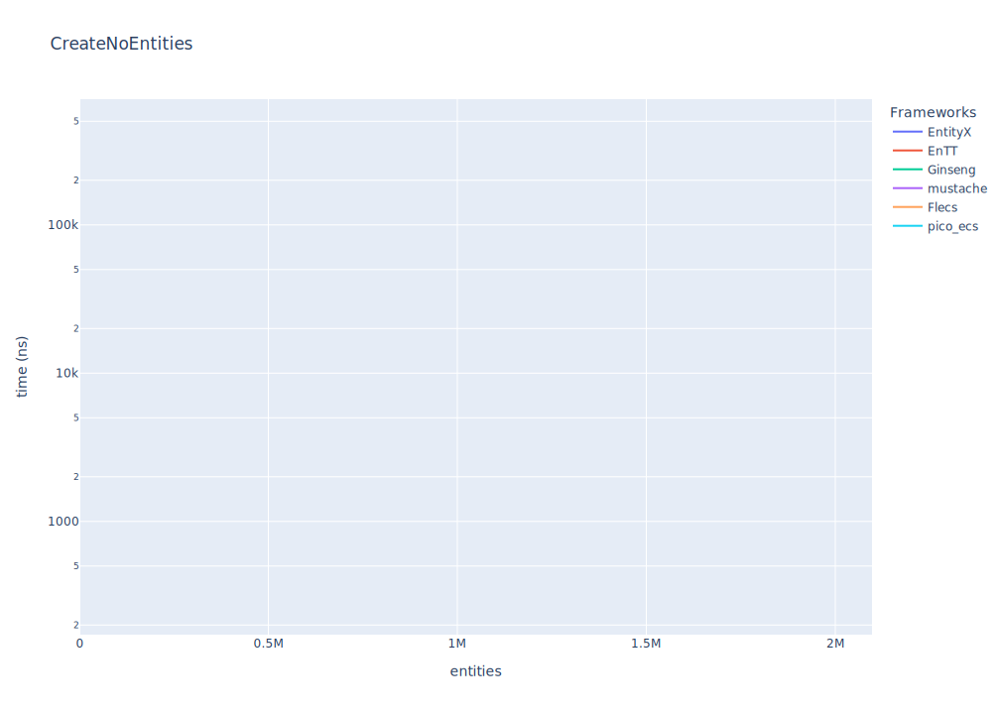

_(lower is better)_

|                    | EntityX   | EnTT   | Ginseng   | mustache   | Flecs    | pico_ecs   |
|:-------------------|:----------|:-------|:----------|:-----------|:---------|:-----------|
| Create No entities | 286ns     | 310ns  | 261ns     | 317ns      | 465062ns | 937ns      |

### Create empty entities

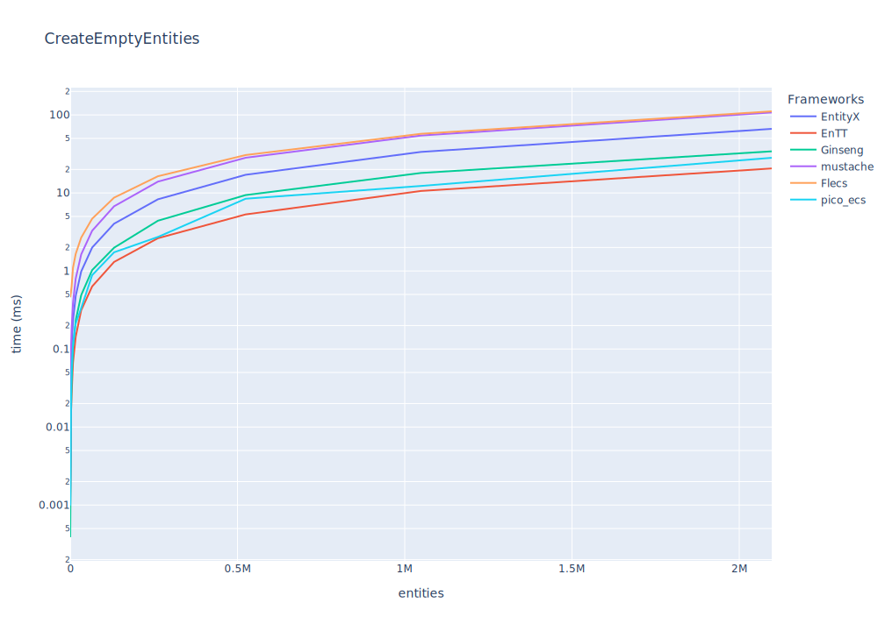

_(lower is better)_

|                               | EntityX   | EnTT    | Ginseng   | mustache   | Flecs    | pico_ecs   |
|:------------------------------|:----------|:--------|:----------|:-----------|:---------|:-----------|
| Create    16 (empty) entities | 1149ns    | 1161ns  | 464ns     | 1909ns     | 472108ns | 1079ns     |
| Create    64 (empty) entities | 2605ns    | 1506ns  | 874ns     | 4099ns     | 460690ns | 1447ns     |
| Create   256 (empty) entities | 7903ns    | 2779ns  | 2118ns    | 12875ns    | 465570ns | 3077ns     |
| Create   ~1K (empty) entities | 28556ns   | 7552ns  | 6435ns    | 46868ns    | 495406ns | 9548ns     |
| Create   ~4K (empty) entities | 110605ns  | 26126ns | 39544ns   | 181483ns   | 631648ns | 53853ns    |

|                               | EntityX   | EnTT   | Ginseng   | mustache   | Flecs   | pico_ecs   |
|:------------------------------|:----------|:-------|:----------|:-----------|:--------|:-----------|
| Create  ~16K (empty) entities | 0ms       | 0ms    | 0ms       | 0ms        | 1ms     | 0ms        |
| Create  ~65K (empty) entities | 1ms       | 0ms    | 1ms       | 3ms        | 4ms     | 0ms        |
| Create  262K (empty) entities | 8ms       | 2ms    | 4ms       | 13ms       | 16ms    | 2ms        |
| Create   ~1M (empty) entities | 33ms      | 10ms   | 18ms      | 54ms       | 57ms    | 12ms       |
| Create   ~2M (empty) entities | 66ms      | 20ms   | 34ms      | 107ms      | 111ms   | 28ms       |

### Get No component from Entity

_(lower is better)_

|                                    | EntityX   | EnTT   | Ginseng   | mustache   | Flecs    | pico_ecs   |
|:-----------------------------------|:----------|:-------|:----------|:-----------|:---------|:-----------|
| Get No component in    16 entities | 3ns       | 43ns   | 32ns      | 9ns        | 605ns    | 3ns        |
| Get No component in    64 entities | 10ns      | 149ns  | 108ns     | 44ns       | 2396ns   | 15ns       |
| Get No component in   256 entities | 45ns      | 569ns  | 412ns     | 146ns      | 9639ns   | 46ns       |
| Get No component in   ~1K entities | 145ns     | 2258ns | 1602ns    | 541ns      | 38696ns  | 150ns      |
| Get No component in   ~4K entities | 541ns     | 8987ns | 6387ns    | 2124ns     | 153077ns | 550ns      |

|                                    | EntityX   | EnTT   | Ginseng   | mustache   | Flecs   | pico_ecs   |
|:-----------------------------------|:----------|:-------|:----------|:-----------|:--------|:-----------|
| Get No component in  ~16K entities | 0ms       | 0ms    | 0ms       | 0ms        | 0ms     | 0ms        |
| Get No component in  ~65K entities | 0ms       | 0ms    | 0ms       | 0ms        | 2ms     | 0ms        |
| Get No component in  262K entities | 0ms       | 0ms    | 0ms       | 0ms        | 10ms    | 0ms        |
| Get No component in   ~1M entities | 0ms       | 2ms    | 2ms       | 0ms        | 43ms    | 0ms        |
| Get No component in   ~2M entities | 0ms       | 4ms    | 4ms       | 1ms        | 110ms   | 0ms        |

### Create entities

_(lower is better)_

|                                           | EntityX   | EnTT     | Ginseng   | mustache   | Flecs     | pico_ecs   |
|:------------------------------------------|:----------|:---------|:----------|:-----------|:----------|:-----------|
| Create    16 entities with two Components | 2676ns    | 3495ns   | 10426ns   | 3097ns     | 522925ns  | 1191ns     |
| Create    64 entities with two Components | 6668ns    | 5233ns   | 11974ns   | 6492ns     | 534176ns  | 2084ns     |
| Create   256 entities with two Components | 21379ns   | 12007ns  | 16886ns   | 19764ns    | 589483ns  | 5725ns     |
| Create   ~1K entities with two Components | 84588ns   | 37302ns  | 34845ns   | 72389ns    | 780777ns  | 19864ns    |
| Create   ~4K entities with two Components | 316231ns  | 139040ns | 104352ns  | 280658ns   | 1584845ns | 84775ns    |

|                                           | EntityX   | EnTT   | Ginseng   | mustache   | Flecs   | pico_ecs   |
|:------------------------------------------|:----------|:-------|:----------|:-----------|:--------|:-----------|
| Create  ~16K entities with two Components | 1ms       | 0ms    | 0ms       | 1ms        | 4ms     | 0ms        |
| Create  ~65K entities with two Components | 4ms       | 2ms    | 1ms       | 4ms        | 17ms    | 1ms        |
| Create  262K entities with two Components | 20ms      | 9ms    | 8ms       | 17ms       | 66ms    | 6ms        |
| Create   ~1M entities with two Components | 93ms      | 54ms   | 52ms      | 82ms       | 292ms   | 33ms       |
| Create   ~2M entities with two Components | 179ms     | 106ms  | 100ms     | 167ms      | 567ms   | 66ms       |

### Get one (non-const) component from Entity

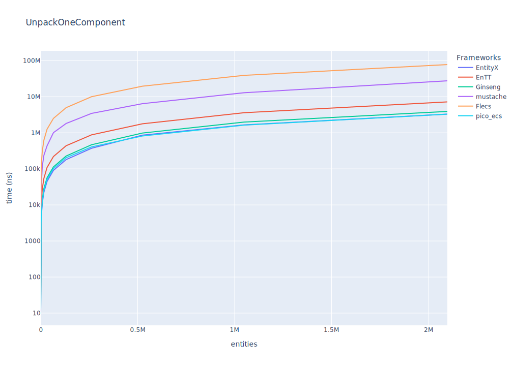

_(lower is better)_

|                                        | EntityX   | EnTT    | Ginseng   | mustache   | Flecs    | pico_ecs   |
|:---------------------------------------|:----------|:--------|:----------|:-----------|:---------|:-----------|
| Unpack one component in    16 entities | 22ns      | 57ns    | 30ns      | 194ns      | 611ns    | 30ns       |
| Unpack one component in    64 entities | 92ns      | 217ns   | 114ns     | 798ns      | 2431ns   | 105ns      |
| Unpack one component in   256 entities | 372ns     | 861ns   | 444ns     | 3164ns     | 9841ns   | 407ns      |
| Unpack one component in   ~1K entities | 1403ns    | 3419ns  | 1769ns    | 11481ns    | 39123ns  | 1597ns     |
| Unpack one component in   ~4K entities | 5584ns    | 13705ns | 7077ns    | 45996ns    | 155260ns | 6348ns     |

|                                        | EntityX   | EnTT   | Ginseng   | mustache   | Flecs   | pico_ecs   |
|:---------------------------------------|:----------|:-------|:----------|:-----------|:--------|:-----------|
| Unpack one component in  ~16K entities | 0ms       | 0ms    | 0ms       | 0ms        | 0ms     | 0ms        |
| Unpack one component in  ~65K entities | 0ms       | 0ms    | 0ms       | 1ms        | 2ms     | 0ms        |
| Unpack one component in  262K entities | 0ms       | 0ms    | 0ms       | 3ms        | 10ms    | 0ms        |
| Unpack one component in   ~1M entities | 1ms       | 3ms    | 1ms       | 12ms       | 39ms    | 1ms        |
| Unpack one component in   ~2M entities | 3ms       | 7ms    | 3ms       | 27ms       | 78ms    | 3ms        |

### Get component from No Entity

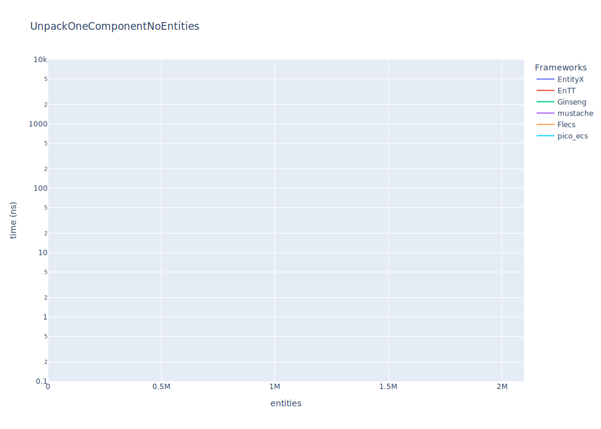

_(lower is better)_

|                                     | EntityX   | EnTT   | Ginseng   | mustache   | Flecs   | pico_ecs   |
|:------------------------------------|:----------|:-------|:----------|:-----------|:--------|:-----------|
| Unpack No entities (empty entities) | 0ns       | 0ns    | 0ns       | 0ns        | 0ns     | 0ns        |

### Get two components from entity

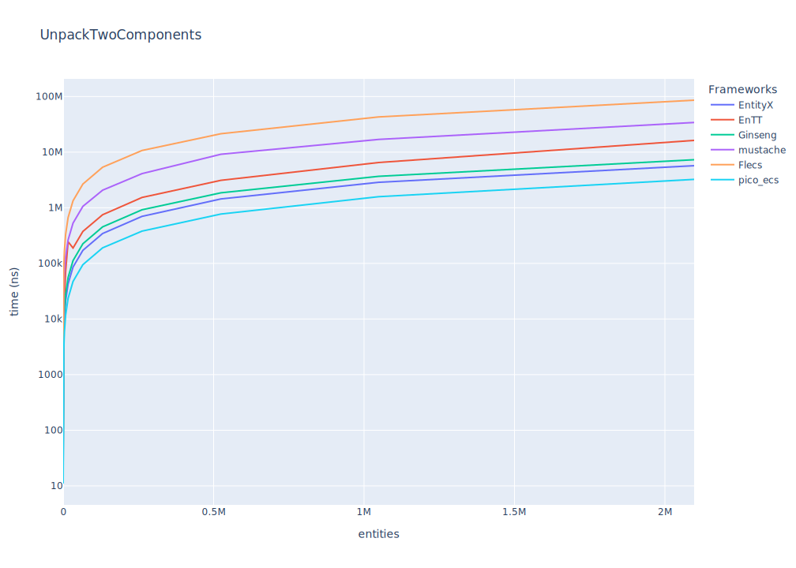

_(lower is better)_

|                                         | EntityX   | EnTT    | Ginseng   | mustache   | Flecs    | pico_ecs   |
|:----------------------------------------|:----------|:--------|:----------|:-----------|:---------|:-----------|
| Unpack two components in    16 entities | 42ns      | 108ns   | 55ns      | 366ns      | 1227ns   | 48ns       |
| Unpack two components in    64 entities | 176ns     | 421ns   | 223ns     | 1394ns     | 4877ns   | 173ns      |
| Unpack two components in   256 entities | 678ns     | 1673ns  | 886ns     | 5575ns     | 19454ns  | 705ns      |
| Unpack two components in   ~1K entities | 2693ns    | 6666ns  | 3516ns    | 22236ns    | 78088ns  | 2699ns     |
| Unpack two components in   ~4K entities | 10704ns   | 26649ns | 14130ns   | 88406ns    | 310513ns | 10651ns    |

|                                         | EntityX   | EnTT   | Ginseng   | mustache   | Flecs   | pico_ecs   |
|:----------------------------------------|:----------|:-------|:----------|:-----------|:--------|:-----------|
| Unpack two components in  ~16K entities | 0ms       | 0ms    | 0ms       | 0ms        | 1ms     | 0ms        |
| Unpack two components in  ~65K entities | 0ms       | 0ms    | 0ms       | 1ms        | 4ms     | 0ms        |
| Unpack two components in  262K entities | 0ms       | 1ms    | 0ms       | 6ms        | 19ms    | 0ms        |
| Unpack two components in   ~1M entities | 2ms       | 7ms    | 3ms       | 27ms       | 78ms    | 2ms        |
| Unpack two components in   ~2M entities | 5ms       | 13ms   | 7ms       | 51ms       | 156ms   | 5ms        |

### Get three components from entity

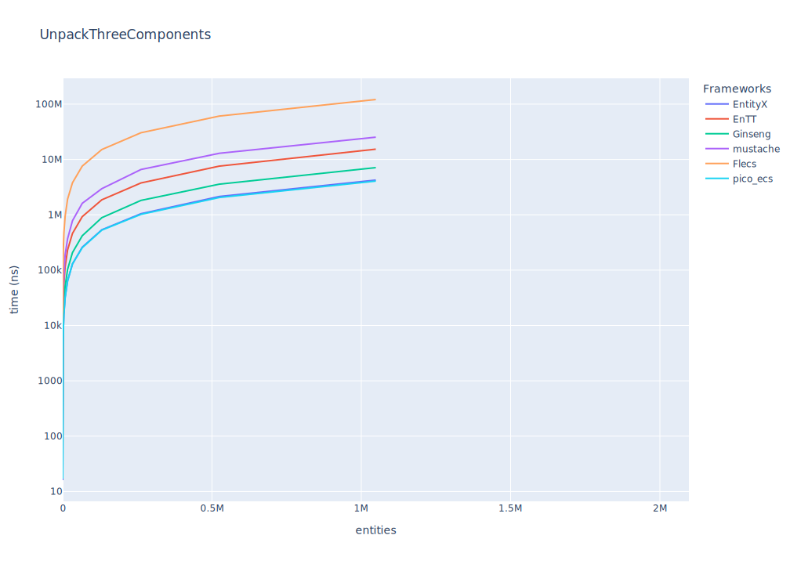

_(lower is better)_

|                                           | EntityX   | EnTT    | Ginseng   | mustache   | Flecs    | pico_ecs   |
|:------------------------------------------|:----------|:--------|:----------|:-----------|:---------|:-----------|
| Unpack three components in     8 entities | 31ns      | 120ns   | 49ns      | 178ns      | 935ns    | 36ns       |
| Unpack three components in    32 entities | 127ns     | 452ns   | 200ns     | 702ns      | 3917ns   | 130ns      |
| Unpack three components in   128 entities | 515ns     | 1799ns  | 790ns     | 2795ns     | 14862ns  | 502ns      |
| Unpack three components in   512 entities | 2008ns    | 7189ns  | 3163ns    | 11180ns    | 59584ns  | 1989ns     |
| Unpack three components in   ~2K entities | 8042ns    | 28643ns | 12660ns   | 46010ns    | 236976ns | 8032ns     |

|                                           | EntityX   | EnTT   | Ginseng   | mustache   | Flecs   | pico_ecs   |
|:------------------------------------------|:----------|:-------|:----------|:-----------|:--------|:-----------|
| Unpack three components in   ~8K entities | 0ms       | 0ms    | 0ms       | 0ms        | 0ms     | 0ms        |
| Unpack three components in  ~32K entities | 0ms       | 0ms    | 0ms       | 0ms        | 3ms     | 0ms        |
| Unpack three components in  131K entities | 0ms       | 1ms    | 0ms       | 2ms        | 15ms    | 0ms        |
| Unpack three components in  524K entities | 2ms       | 7ms    | 3ms       | 12ms       | 60ms    | 2ms        |
| Unpack three components in   ~1M entities | 4ms       | 15ms   | 7ms       | 25ms       | 121ms   | 4ms        |

### Remove and add component

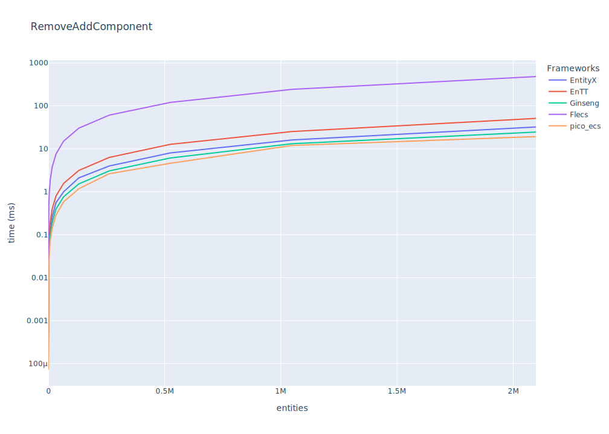

_(lower is better)_

|                                              | EntityX   | EnTT    | Ginseng   | Flecs    | pico_ecs   |
|:---------------------------------------------|:----------|:--------|:----------|:---------|:-----------|
| Remove and Add a Component in    16 entities | 245ns     | 390ns   | 187ns     | 3687ns   | 141ns      |
| Remove and Add a Component in    64 entities | 957ns     | 1537ns  | 725ns     | 14797ns  | 550ns      |
| Remove and Add a Component in   256 entities | 3813ns    | 6150ns  | 2883ns    | 59815ns  | 2194ns     |
| Remove and Add a Component in   ~1K entities | 15300ns   | 24607ns | 11711ns   | 247079ns | 8794ns     |
| Remove and Add a Component in   ~4K entities | 61311ns   | 97870ns | 46932ns   | 944265ns | 35081ns    |

|                                              | EntityX   | EnTT   | Ginseng   | Flecs   | pico_ecs   |
|:---------------------------------------------|:----------|:-------|:----------|:--------|:-----------|
| Remove and Add a Component in  ~16K entities | 0ms       | 0ms    | 0ms       | 3ms     | 0ms        |
| Remove and Add a Component in  ~65K entities | 0ms       | 1ms    | 0ms       | 15ms    | 0ms        |
| Remove and Add a Component in  262K entities | 3ms       | 6ms    | 3ms       | 60ms    | 2ms        |
| Remove and Add a Component in   ~1M entities | 16ms      | 25ms   | 13ms      | 242ms   | 12ms       |
| Remove and Add a Component in   ~2M entities | 32ms      | 51ms   | 24ms      | 481ms   | 19ms       |

### Destroy entities

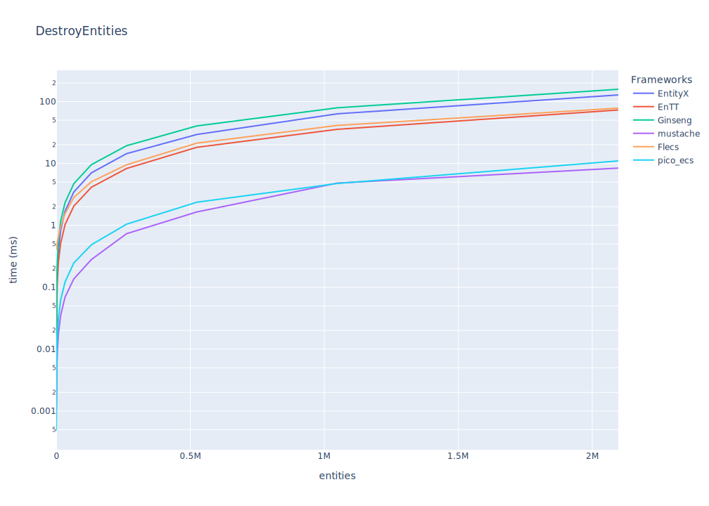

_(lower is better)_

|                                            | EntityX   | EnTT     | Ginseng   | Flecs    | pico_ecs   |
|:-------------------------------------------|:----------|:---------|:----------|:---------|:-----------|
| Destroy    16 entities with two components | 1377ns    | 1164ns   | 2010ns    | 474940ns | 1019ns     |
| Destroy    64 entities with two components | 3518ns    | 2578ns   | 5592ns    | 477761ns | 1390ns     |
| Destroy   256 entities with two components | 12282ns   | 8365ns   | 19809ns   | 492976ns | 2592ns     |
| Destroy   ~1K entities with two components | 47721ns   | 31180ns  | 76583ns   | 527769ns | 6934ns     |
| Destroy   ~4K entities with two components | 194602ns  | 123227ns | 305002ns  | 694052ns | 25251ns    |

|                                            | EntityX   | EnTT   | Ginseng   | Flecs   | pico_ecs   |
|:-------------------------------------------|:----------|:-------|:----------|:--------|:-----------|
| Destroy  ~16K entities with two components | 0ms       | 0ms    | 1ms       | 1ms     | 0ms        |
| Destroy  ~65K entities with two components | 3ms       | 1ms    | 4ms       | 4ms     | 0ms        |
| Destroy  262K entities with two components | 13ms      | 8ms    | 20ms      | 14ms    | 1ms        |
| Destroy   ~1M entities with two components | 59ms      | 35ms   | 83ms      | 59ms    | 9ms        |
| Destroy   ~2M entities with two components | 120ms     | 69ms   | 168ms     | 115ms   | 16ms       |

### Create entities at once

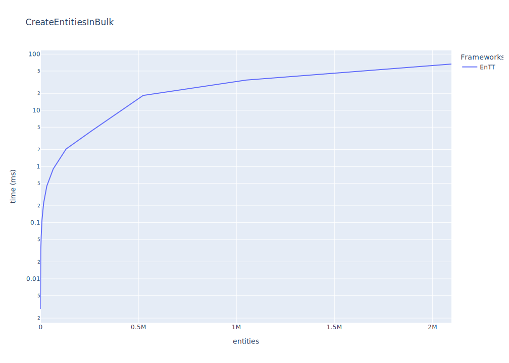

_(lower is better)_

|                                                   | EnTT    |
|:--------------------------------------------------|:--------|
| Create    16 entities with two components at once | 3033ns  |
| Create    64 entities with two components at once | 3851ns  |
| Create   256 entities with two components at once | 6995ns  |
| Create   ~1K entities with two components at once | 16873ns |
| Create   ~4K entities with two components at once | 57259ns |

|                                                   | EnTT   |
|:--------------------------------------------------|:-------|
| Create  ~16K entities with two components at once | 0ms    |
| Create  ~65K entities with two components at once | 0ms    |
| Create  262K entities with two components at once | 4ms    |
| Create   ~1M entities with two components at once | 34ms   |
| Create   ~2M entities with two components at once | 66ms   |

### Create empty entities at once

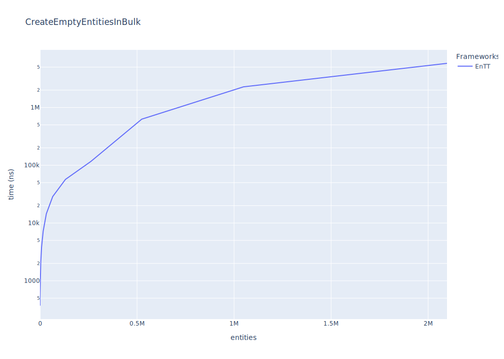

_(lower is better)_

|                                       | EnTT    |
|:--------------------------------------|:--------|
| Create    16 (empty) entities at once | 1077ns  |
| Create    64 (empty) entities at once | 1228ns  |
| Create   256 (empty) entities at once | 1835ns  |
| Create   ~1K (empty) entities at once | 3951ns  |
| Create   ~4K (empty) entities at once | 12028ns |

|                                       | EnTT   |
|:--------------------------------------|:-------|
| Create  ~16K (empty) entities at once | 0ms    |
| Create  ~65K (empty) entities at once | 0ms    |
| Create  262K (empty) entities at once | 1ms    |
| Create   ~1M (empty) entities at once | 5ms    |
| Create   ~2M (empty) entities at once | 15ms   |

### Destroy entities at once

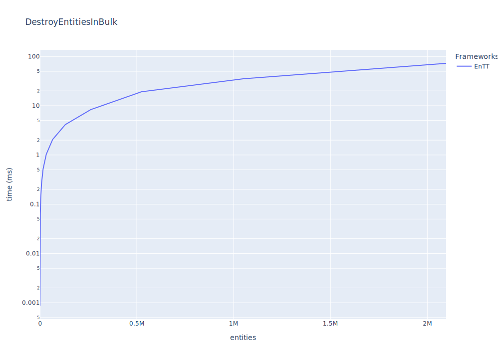

_(lower is better)_

|                                                    | EnTT    |
|:---------------------------------------------------|:--------|
| Destroy    16 entities with two components at once | 1075ns  |
| Destroy    64 entities with two components at once | 2032ns  |
| Destroy   256 entities with two components at once | 5474ns  |
| Destroy   ~1K entities with two components at once | 14110ns |
| Destroy   ~4K entities with two components at once | 53874ns |

|                                                    | EnTT   |
|:---------------------------------------------------|:-------|
| Destroy  ~16K entities with two components at once | 0ms    |
| Destroy  ~65K entities with two components at once | 0ms    |
| Destroy  262K entities with two components at once | 5ms    |
| Destroy   ~1M entities with two components at once | 41ms   |
| Destroy   ~2M entities with two components at once | 91ms   |

### Candidates

#### EntityX by @alecthomas 

> Entity Component Systems (ECS) are a form of decomposition that completely decouples entity logic and data from the entity "objects" themselves. The Evolve your Hierarchy article provides a solid overview of EC systems and why you should use them.

Version: 1.1.2 (Dec 2021)

#### EnTT by @skypjack 

> EnTT is a header-only, tiny and easy to use library for game programming and much more written in modern C++.

Version: v3.12.2

#### Ginseng by @apples 

> Ginseng is an entity-component-system (ECS) library designed for use in games.

The main advantage over similar libraries is that the component types do not need to be listed or registered. Component types are detected dynamically.

Any function-like object can be used as a system. The function's parameters are used to determine the required components.

Version: 1.1 (Dec 2021)

#### mustache by @kirillochnev 

> A fast, modern C++ Entity Component System

Version: 0.2 (Apr 2023)

#### OpenEcs by @Gronis 

> Open Ecs is an Entity Component System that uses metaprogramming, cache coherency, and other useful tricks to maximize performance and configurability. It is written in c++11 without further dependencies.

Version: Beta (Apr 2017)

#### Flecs by @SanderMertens 

> Flecs is a fast and lightweight Entity Component System that lets you build games and simulations with millions of entities.

Version: v3.2.4

#### pico_ecs by @empyreanx 

> A collection of cross-platform single header libraries written in C. Pure and simple ECS.

Version: 2.2 (Mai 2023)

### Environment

* **OS:** Linux
* **CPU:** 3.76GHz @ 12Cores
* **RAM:** 46.98GB

