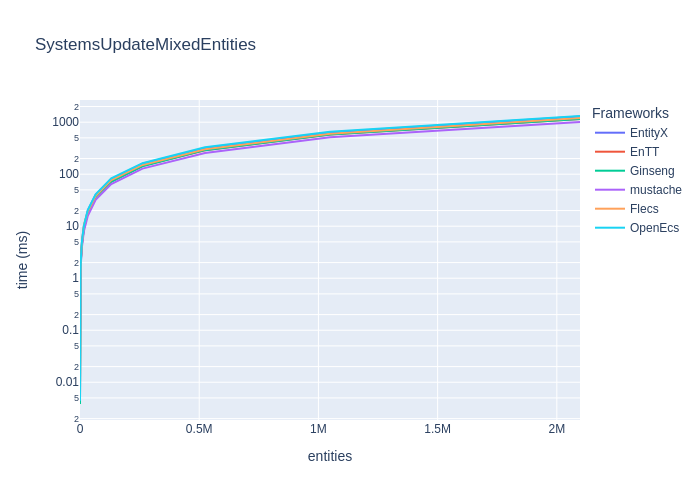

# Results

## TL;DR Results

_(lower is faster)_

|                                      | EntityX   | EnTT      | Ginseng   | mustache   | Flecs     | OpenEcs   |
|:-------------------------------------|:----------|:----------|:----------|:-----------|:----------|:----------|
| Update  ~16K entities with 2 systems | 9842ns    | 8006ns    | 9092ns    | 61807ns    | 12983ns   | 10405ns   |
| Update  ~65K entities with 2 systems | 39238ns   | 31195ns   | 35733ns   | 88060ns    | 41924ns   | 40771ns   |
| Update  262K entities with 2 systems | 154352ns  | 124750ns  | 162061ns  | 190305ns   | 157600ns  | 159449ns  |
| Update   ~1M entities with 2 systems | 622049ns  | 500859ns  | 595589ns  | 575610ns   | 617963ns  | 633379ns  |
| Update   ~2M entities with 2 systems | 2481847ns | 6317373ns | 2256297ns | 2060109ns  | 2474796ns | 2601191ns |

|                                      | EntityX   | EnTT   | Ginseng   | mustache   | Flecs   | OpenEcs   |
|:-------------------------------------|:----------|:-------|:----------|:-----------|:--------|:----------|
| Update  ~16K entities with 2 systems | 10ms      | 16ms   | 9ms       | 8ms        | 9ms     | 10ms      |
| Update  ~65K entities with 2 systems | 40ms      | 68ms   | 36ms      | 31ms       | 39ms    | 41ms      |
| Update  262K entities with 2 systems | 158ms     | 178ms  | 141ms     | 127ms      | 153ms   | 165ms     |
| Update   ~1M entities with 2 systems | 636ms     | 1065ms | 566ms     | 515ms      | 617ms   | 654ms     |
| Update   ~2M entities with 2 systems | 1270ms    | 1756ms | 1145ms    | 1011ms     | 1229ms  | 1319ms    |

## Benchmarks

### Update systems (for-each entities in 2 systems)

_(lower is better)_

|                                      | EntityX   | EnTT      | Ginseng   | mustache   | Flecs     | OpenEcs   |
|:-------------------------------------|:----------|:----------|:----------|:-----------|:----------|:----------|
| Update    16 entities with 2 systems | 9842ns    | 8006ns    | 9092ns    | 61807ns    | 12983ns   | 10405ns   |
| Update    64 entities with 2 systems | 39238ns   | 31195ns   | 35733ns   | 88060ns    | 41924ns   | 40771ns   |
| Update   256 entities with 2 systems | 154352ns  | 124750ns  | 162061ns  | 190305ns   | 157600ns  | 159449ns  |
| Update   ~1K entities with 2 systems | 622049ns  | 500859ns  | 595589ns  | 575610ns   | 617963ns  | 633379ns  |
| Update   ~4K entities with 2 systems | 2481847ns | 6317373ns | 2256297ns | 2060109ns  | 2474796ns | 2601191ns |

|                                      | EntityX   | EnTT   | Ginseng   | mustache   | Flecs   | OpenEcs   |
|:-------------------------------------|:----------|:-------|:----------|:-----------|:--------|:----------|
| Update  ~16K entities with 2 systems | 10ms      | 16ms   | 9ms       | 8ms        | 9ms     | 10ms      |
| Update  ~65K entities with 2 systems | 40ms      | 68ms   | 36ms      | 31ms       | 39ms    | 41ms      |
| Update  262K entities with 2 systems | 158ms     | 178ms  | 141ms     | 127ms      | 153ms   | 165ms     |
| Update   ~1M entities with 2 systems | 636ms     | 1065ms | 566ms     | 515ms      | 617ms   | 654ms     |
| Update   ~2M entities with 2 systems | 1270ms    | 1756ms | 1145ms    | 1011ms     | 1229ms  | 1319ms    |

### Update systems (for-each entities (with mixed components) in 2 systems)

_(lower is better)_

|                                      | EntityX   | EnTT      | Ginseng   | mustache   | Flecs     | OpenEcs   |
|:-------------------------------------|:----------|:----------|:----------|:-----------|:----------|:----------|
| Update    16 entities with 2 systems | 8816ns    | 11181ns   | 7760ns    | 62203ns    | 11364ns   | 8820ns    |
| Update    64 entities with 2 systems | 35742ns   | 44804ns   | 31729ns   | 86956ns    | 36511ns   | 36339ns   |
| Update   256 entities with 2 systems | 157779ns  | 191739ns  | 139098ns  | 191599ns   | 151039ns  | 157742ns  |
| Update   ~1K entities with 2 systems | 634325ns  | 783349ns  | 580538ns  | 591529ns   | 584928ns  | 638091ns  |
| Update   ~4K entities with 2 systems | 2485028ns | 2406099ns | 2264724ns | 2063344ns  | 2376301ns | 2595152ns |

|                                      | EntityX   | EnTT   | Ginseng   | mustache   | Flecs   | OpenEcs   |
|:-------------------------------------|:----------|:-------|:----------|:-----------|:--------|:----------|
| Update  ~16K entities with 2 systems | 9ms       | 9ms    | 8ms       | 8ms        | 10ms    | 10ms      |
| Update  ~65K entities with 2 systems | 40ms      | 36ms   | 36ms      | 32ms       | 37ms    | 41ms      |
| Update  262K entities with 2 systems | 160ms     | 145ms  | 142ms     | 127ms      | 150ms   | 162ms     |
| Update   ~1M entities with 2 systems | 635ms     | 582ms  | 580ms     | 512ms      | 602ms   | 651ms     |
| Update   ~2M entities with 2 systems | 1292ms    | 1151ms | 1145ms    | 1006ms     | 1200ms  | 1314ms    |

### Candidates

#### EntityX by @alecthomas 

> Entity Component Systems (ECS) are a form of decomposition that completely decouples entity logic and data from the entity "objects" themselves. The Evolve your Hierarchy article provides a solid overview of EC systems and why you should use them.

Version: 1.1.2 (Dec 2021)

#### EnTT by @skypjack 

> EnTT is a header-only, tiny and easy to use library for game programming and much more written in modern C++.

Version: 3.10.1

#### Ginseng by @apples 

> Ginseng is an entity-component-system (ECS) library designed for use in games.

The main advantage over similar libraries is that the component types do not need to be listed or registered. Component types are detected dynamically.

Any function-like object can be used as a system. The function's parameters are used to determine the required components.

Version: 1.1 (Dec 2021)

#### mustache by @kirillochnev 

> A fast, modern C++ Entity Component System

Version: 0.2 (Feb 2022)

#### OpenEcs by @Gronis 

> Open Ecs is an Entity Component System that uses metaprogramming, cache coherency, and other useful tricks to maximize performance and configurability. It is written in c++11 without further dependencies.

Version: Beta (Apr 2017)

#### Flecs by @SanderMertens 

> Flecs is a fast and lightweight Entity Component System that lets you build games and simulations with millions of entities.

Version: v2.4.8 (Mai 2022)

### Environment

* **OS:** Windows 10
* **CPU:** 2.30GHz @ 8Cores
* **RAM:** 16GB

